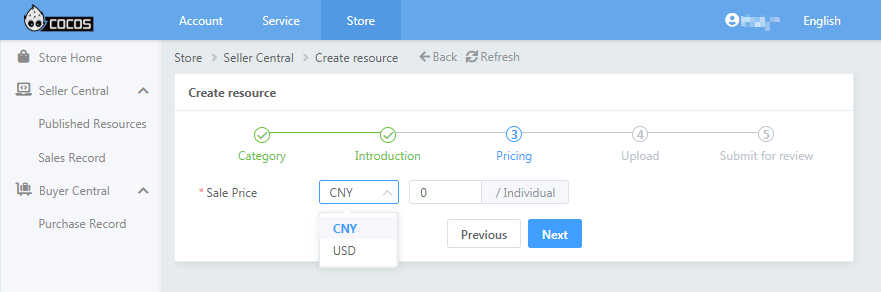

# Submitting Resources to Cocos Store

Cocos Creator has a built-in **Extension Store** for users to browse, download and automatically install official or third-party extensions and resources. Users can also submit their own extensions, art materials, music and sound effects to the extension store for sharing or selling. Here is an example of submitting an extension.


## Packaging the Extension

Suppose the developer completes a extension package with the following directory structure:

```
foobar
    |--panel
        |--index.js
    |--package.json
    |--main.js
```

Developers need to package the `foobar` folder into a `foobar.zip` file and submit it to the Cocos Developer Center.

For additional information on extension packages, please review the [Creating Extension Packages](../first.md) documentation.

### Third-party Libraries

There is currently no workflow for installing an included management system such as NPM in the extension package installation system, extension packages that use third-party libraries should be packaged in a zip package with folders such as `node_modules`.

## Submitting the Extension

Visit the [Cocos Developer Center](https://auth.cocos.com/#/) and login. Next, visit the [Store](https://store-my.cocos.com/#/seller/resources/) section and click **Create New Resource** on the top right.


- First, go to the **Category** page, fill in the **Name** and **Category**, and check the agreement checkbox.

  

    - **Name**: the name of the extension to be displayed in the extension store. Please note that the name cannot be changed once it is confirmed, please fill it in carefully.
    - **Category**: the category of the resource to be submitted, choose **Creator Extension -> Plugins** here.

  Click **Next** after the settings are done to enter the **Introduction** page.

- Second, fill in the relevant information on the **Introduction** page.

  

    - **Keyword**: facilitate users to search for your extension faster, support multiple keywords
    - **Supported Platforms**: including Android, iOS, HTML5
    - **Icon**: icon size of **256 * 256**, size no more than **500KB**, **PNG** format.
    - **Screenshots**: upload a maximum of **5** screenshots in **jpg**/**png** format. The size of each screenshot is limited to a minimum of **640px** and a maximum of **2048px**, and the size should not exceed **1000KB**.
    - **Description**: fill in the basic functions and usage of the extension. It includes **Chinese** and **English** languages, and will only be displayed in the extension store of the corresponding language version after filling it in.<br>The Extension Store has certain formatting requirements for the descriptions of plugins, please refer to the [plugin description template [cn]](https://store.cocos.com/document/zh/cocos-store-template-extension.html) documentation for details.

  Click **Next** to enter the **Pricing** page after filling out the form.

- Third, in the **Pricing** page, set the price of the extension, including **CNY** and **USD**, if it is free, please fill in **0**.

  

  Click **Next** to enter the **Upload** page after completing the form.

- Fourth, on the **Upload** page, upload the extensions and fill in the relevant information.

  

    - **Package**: zip format, max 100MB.
    - **Extension Name**: the name of the extension package, defined in the `package.json` file of the extension package.
    - **Version Number**: extension version number, defined in the `package.json` file of the extension package. Please follow the [semver specification](https://semver.org/) for the writing specification.
    - **Creator Minimum Version Requirement**: the extension's requirement for Creator version.

    > **Note**: since Creator 2.x and 3.x extensions are not compatible with each other, if there is no corresponding version of the supported extension package, the work will not be displayed in the corresponding version of the extension store of Creator.

  Click **Next** to go to the **Submit for Review** page after completing the form.

- Fifth, on the **Submit for Review** page, click the **Submit Review** button, or click the **View** button to re-edit the extension resource.

  

- Lastly, after submitting for review, the extension store management will review the extension content and information within **3** business days.
