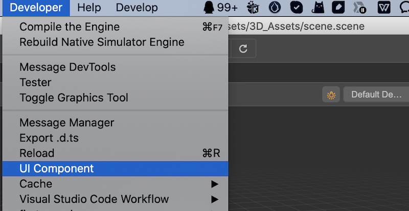

# UI Components

## UI Components Panel

To facilitate the layout, many pre-defined UI components are provided within the editor.

1. Find **Developer -> UI Components** in the main menu at the top of the editor to view them.

2. Click it to open the following panel.

! [ui component](image/ui-component.png)

The panel consists of two parts, the left column lists the UI types currently supported by the engine, and the right column provides some examples that developers can use as needed.

## Using in HTML

Using UI components in HTML is very easy, just copy the corresponding code into your HTML file and you are ready to use.

## Using in Extension Panel

When extending the editor panel, it can be configured using json. In theory, all UI components with `value` attribute can be used to extend the editor panel, here are some common ones.

### input-box

- Component: `ui-num-input`
- No additional properties

### ui-slider

- Component: `ui-slider`
- `attributes` component attributes
    - `min` minimum
    - `max` maximum value
    - `step` step length

### ui-checkbox

- Component: `ui-checkbox`
- No additional properties

### ui-select

- Component `ui-select`
- `items` list element
    - `value` value
    - `label` display label

For usage examples, please refer to the documentation [Custom Preferences Panel](./contributions-preferences.md) and [custom project settings panel](./contributions-project.md).
