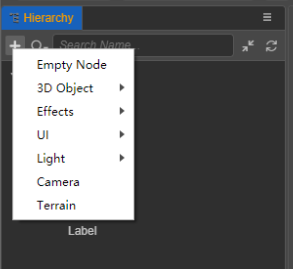
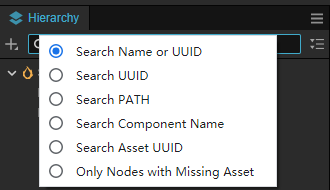
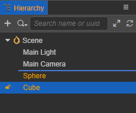
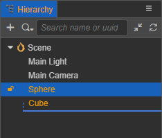

# Hierarchy Panel

The **Hierarchy** panel consists of two main sections, the **Toolbar** and the **Node List**, which are used to show the relationships between the nodes that are editable in the current scene. There are still some private nodes in the scene that are not visible and will not be displayed here.

You can single-select, multi-select, create, copy, move, delete and rename nodes. Any node can create a child node, whose coordinates are relative to the parent node and follow it.

- When a node is selected, it is highlighted in yellow on a blue background and its detailed properties are displayed in the **Inspector** panel. Click on the blank area of the panel to **unselect** it.
- Functions in the **Toolbar** include: **New Node(+)**, **Search Type**, **Search Box**, **All Collapse** and **Refresh**.
- The **Node list** mainly reflects the hierarchical relationship of nodes, the root node is **Scene**. When editing the Prefab file, its own node is used as the root node. Add or delete nodes is done here with the right-click menu or a drag-and-drop operation.
- The panel supports the following keyboard shortcuts:
    - **Copy**: Ctrl/Cmd + C
    - **Paste**: Ctrl/Cmd + V
    - **Clone**: Ctrl/Cmd + D, Ctrl + drag nodes
    - **Delete**: Delete
    - **Select up and down**: Up and Down arrows
    - **Collapse nodes**: Left arrow
    - **Expand nodes**: Right arrow
    - **Multi-select**: Ctrl or Cmd + click
    - **Multi-select Continuously**: Shift + click
    - **Rename**: Enter/F2
    - **Cancel input**: Esc

## New Node

Click the **New Node (+)** button in the upper left corner of the panel or right-click directly in the panel to create a node.

When creating a node, an **Input box** will appear asking for the name of the node, which is allowed to be empty and will be named by the default node name if it is empty.

- If there isn't a node selected in the tree list, the new node will be created under the current root node by default (`Scene`).
- If there are multiple nodes selected, the new node will be created under the first selected node.

### UI nodes

For a UI node to display properly, any of its parent nodes must have at least one **UITransform** component. When creating a UI node, if it does not meet the rules, a **Canvas** node will be automatically created as the root of the UI node, as described in the [UI Structure Description](../../2d-object/ui-system/index.md) documentation.

### Prefab nodes

For a Prefab node, drag a **Prefab** asset from the **Assets** panel directly into the **Hierarchy** panel to generate a Prefab node. Also, dragging a **Prefab** node from the **Hierarchy** panel into the **Assets** panel to generate a Prefab asset.

## Search Nodes

Search types include: **Search Name or UUID**, **Search UUID**, **Search Path**, **Search Component Name**, and **Search Asset UUID**.

**Search Component Name** will search out all nodes in the node list containing the specified component, which can be viewed in the **Inspector** panel, such as **MeshRenderer**.

The **Search box** will update the search results instantly based on the input content. When a node is selected in the search results and the search is cleared, the selected node will still be located in the asset list.

## Change the display order of nodes

The order of nodes in the list can be changed by dragging them up and down. Moving nodes are divided into **moved nodes** and **target placement nodes**.

- Drag the **moved node** on top of the **target placement node**, both are **level**.

    As shown below, select the Cube node and drag it above the Sphere node. The Sphere node will be highlighted in yellow and have a blue line above it indicating where the Cube node will be inserted.

    

- Drag the **moved node** onto the **target placement node**, and the **moved node** will be at the end as a child of the **target placement node**.

    In the following figure, select the Cube node and drag it to the Sphere node. The Sphere node will be highlighted in yellow on a light blue background, indicating that the Cube node will become a child of the Sphere.

    

- Drag the **moved node** below the **target placement node**, both are **level**.

    As shown below, select the Sphere node and drag it below the Cube node. The Cube node will appear highlighted in yellow and have a blue line below it indicating where the Sphere node will be inserted.

    

## Rename Nodes

Select a node, then right click and select **Rename** to change the node name, or just use the shortcut keys **Enter** or **F2**. Click elsewhere in the panel or press the shortcut **Esc** to cancel the renaming.

Different nodes can have the same name.

## Other Operations

The menu that pops up when right-clicking on a node also includes the following actions.

- **Copy/Paste**: Copy the node to the clipboard, then you can paste it to another location, or open another scene to paste the node that was just copied.
- **Duplicate**: Generate a copy of the node that is exactly the same as the selected node, with the generated node and the selected node in the same hierarchy.
- **Select All**: Select all nodes in the same hierarchy.
- **Copy and print UUID/PATH**: In complex scenarios, we sometimes need to get the UUID or full hierarchy path of a node in order to access it when the script is running. Click this option to see the UUID of the currently selected node and the node's hierarchical path in the **Console** panel.
- **Lock Node**: Mouse over the node and there will be a lock button on the left side, the node cannot be selected in the **Scene** panel once it is locked.

  Starting from v3.1.1, batch locking of nodes and their children is supported. Select any node, hold down the <kbd>Alt</kbd> and click the lock button, and the node and its children will all be locked.
