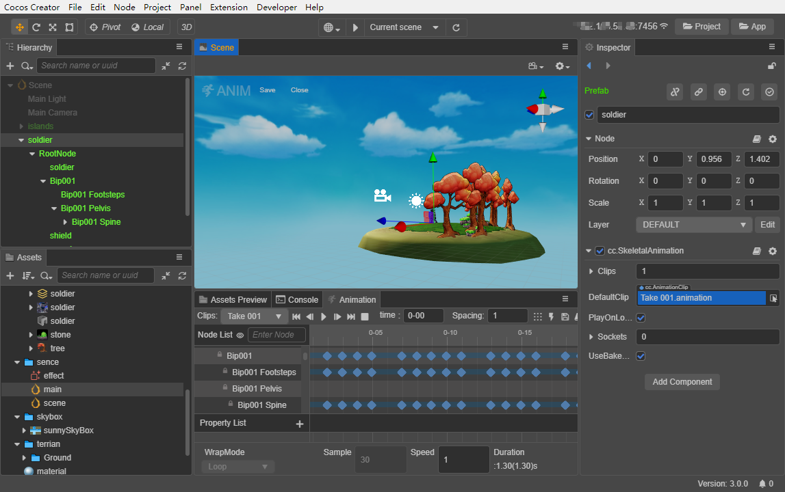

# Editor panel overview

This chapter will introduce the editor panel and get familiar with each of the panels, menus and functional buttons that make up the editor. The Cocos Creator 3.0 editor is composed of multiple panels which can be moved and combined freely to meet the needs of different projects and developers. Here we will take the default editor layout as an example to quickly browse the name and function of each panel:

## Scene

**Scene** panel is used to show and edit the visible working area in the scene. WYSIWYG scene building work is all done depending on the display in the **Scene**.

For further information please read the [Scene panel](scene/index.md).

## Hierarchy

**Hierarchy** panel displays all the nodes and their hierarchy in the form of a list tree. For all the content you can see in the **Scene**, the corresponding node entry can be found in the **Hierarchy**. The content in these two panels when editing the scene will synchronize the display and we normally use these two panels at the same time to build the scene.

For further information please read the [Hierarchy panel](hierarchy/index.md).

## Assets

**Assets** panel shows all the assets in the project asset file (`assets`). It will show the folder in a dendritic structure and auto-sync the content changes in the project resource folder from the operating system. You can drag files in or use the menu to import resources.

For further information please read the [Assets panel](assets/index.md).

## Inspector

**Inspector** panel is the working area where we view and edit the currently selected node and component property. This panel will display and edit the attribute data defined by the script in the most suitable way.

For further information please read the [Inspector panel](inspector/index.md).

## Console

**Console** panel will report errors, warnings or other log informations generated by Cocos Creator 3.0 editor and engine.

For further information please read the [Console panel](console/index.md).

## Animation

**Animation** panel is suitable for making some less complex animations that need to be linked with logic, such as UI animations.

For further information please read the [Animation panel](./animation/animation-editor.md).

## Preferences

**Preferences** panel provides various personalized global settings for editor, including native development environments, game previews, script editing tools, and so on.

For further information please read the [Preferences panel](preferences/index.md).

## Project Settings

**Project Settings** panel provides various project specific personalization settings, including grouping settings, module settings, preview runs, and so on.

For further information please read the [Project Settings](project/index.md).
