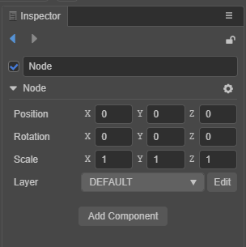
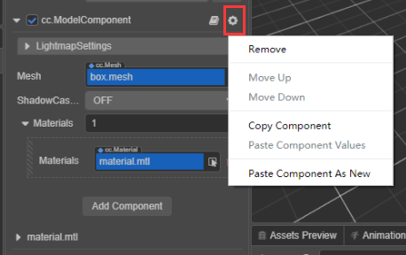

# Inspector panel

The **Inspector** is important for viewing and editing the properties of nodes or assets. You can edit the location of a node, components, pictures, materials, models and other assets of a node. 

The **Inspector** features many details and can seem complicated. To get started, aselect the node in **Scene** panel, **Hierarchy** panel, or select the asset in **Asset** panel. Properties can now be displayed or edited.

## Header area

The **two arrows** on the left are the historical records, click to switch the editing items. The **lock icon** on the right can lock the panel, fix the edited object, and prevent the panel from changing with the new selected item.

## Editing a Node

Nodes correspond to the nodes in the tree structure in the **Hierarchy** panel and display the same name.

1. The check box in the upper left corner indicates the activation state of the node. By default, the check box indicates that the node is in an inactive state. The node will be suspended from rendering, and the entire node, including child nodes, will be hidden when running.
2. In the input box is the name of the node. The name can be empty.
3. Next are several general properties of the node: **position**, **rotation**, **scale**, and **layer**.
4. The node menu on the right, the menu inside can be copied, paste the value of the node attribute, or you can paste a new component.

    

5. Use the **Add component** button, after clicking, a list of components will appear, including components provided by the system and custom script components.

    

The list of added components has a search box that supports the up and down arrows on the keyboard, or **Enter** can be used to confirm the selection.

## Editing Node Components

This panel can display node components and component properties.
Like the general properties of nodes, each component has a foldable or expandable header.

When multiple components are attached to a node, the scrolling range can be reduced by folding components that are not frequently modified, and improve editing efficiency.

To the right of the component name is a help document and a component menu button. The help document button can jump to the API document of the component. The component menu can be operated on: **removed**, **moved up**, **moved down**, **copied**, **pasted as a value**, or **pasted as a new component**.

The component created by the user through a script, when editing a node, can be directly dragged into the **Inspector** panel to generate a component.

The different properties in the script component are declared by the user in the script code. When the different types of properties are edited, the editor will automatically recognize the appropriate UI component.

The definition of properties is explained, in detail, in the [Declaring Properties](../../scripting/ccclass.md#property) documentation.

## How to use UI components

Properties are divided into **value types** and **reference types**.

### Value type properties

**Value type** includes simple variable types that take up very little memory, such as **numbers**, **strings**, **booleans**, and **enumerations**:

- **Number**: the keyboard is used to enter digits. The up and down arrows next to the input box can gradually increase or decrease the attributes value.
- **Vector (Vec2)**: The vector control is a combination of two numeric inputs, and the input box will identify the sub-property name corresponding to each numeric value with *x* and *y*.
- **String**: the keyboard is used to input strings directly in a text box. The string input control is divided into single line and multi-line. The multi-line text box can be changed by pressing **Enter**.
- **Boolean**: edited in the form of a check box. The selected state indicates that the attribute value is true, and the non-selected state indicates false.
- **Enum**: edited in the form of a pull-down menu. Click the enumeration menu, and then select an item from the pop-up menu list to complete the modification of the enumeration value.
- **Color**: click the color attribute preview box, and a **color picker** window will pop up. In this window, you can directly click the desired color with the mouse, or directly enter the designation in the RGBA color input box below s color. Click **Color Picker** anywhere outside the window to close the window and use the last selected color as the attribute value. For example, the color picker component:

  

### Reference type properties

**Reference types** include objects, such as **nodes**, **components**, or **assets**. You can select and assign values ​​by **dragging** or **popping up the asset panel**.

## Batch operationas

1. Multi-selectable nodes, inconsistent properties cannot be modified, and `-` in the input component indicates that they cannot be modified.

    

2. Batch assign materials, pictures, animations and other assets, which can be dragged multiple times.

    

## Editing Prefab Nodes

When editing a Prefab Node, the header area buttons are: **disassociate**, **associate**, **locate assets**, **restore from assets**, and **update to assets**.

1. **Disassociation** refers to disconnecting the prefab node from the asset and turning it into a normal node, the color is no longer green.
2. **Association** means that a Prefab asset is selected first and then associated with the current Prefab node. The new association between common nodes and Prefab assets can be found in the top menu of the editor **Edit**:

    

3. **Locating assets** refers to locating the Prefab asset on the assets panel and making it flash.
4. **Restore from asset** means to return an edited Prefab node, along with its child nodes, to the initial state.
5. **Update to asset** refers to updating the Prefab node data that has been edited to the Prefab asset.

## Editing Assets

When editing assets, please pay attention to the last click to save, the **green tick icon** in the figure below is the save button.

