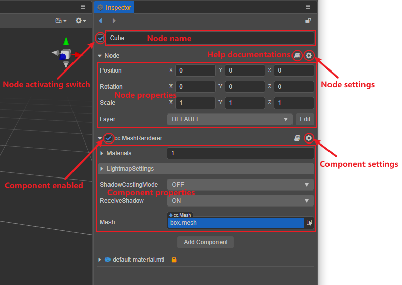
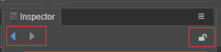
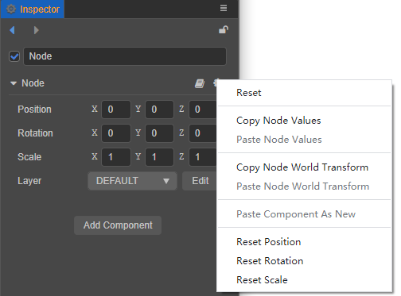
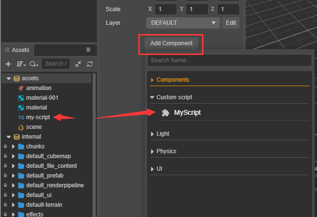
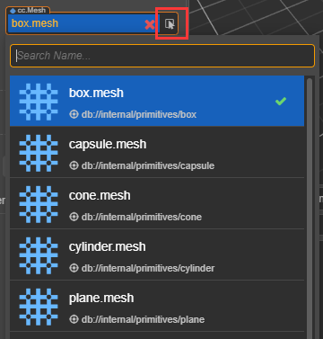
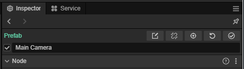
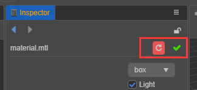

# Inspector Panel

The **Inspector** panel is the work area for viewing and editing the currently selected nodes, node components, and assets. Properties can be displayed and edited in the **Inspector** panel by selecting a node in the **Scene** panel or **Hierarchy** panel, or by selecting an asset in the **Assets** panel.

## Panel overview

The **Inspector** panel can be divided into two parts: **Toolbar** and **Property Settings**.

## Toolbar

The **two arrows** in the top left corner are the edit history, click on them to advance/reverse the selected nodes/assets.  
The **lock** button in the upper right corner can lock the panel, fixing the currently edited object and not allowing the panel to change with new selections.

## Property Settings

The **Property Settings** area allows setting node properties, component properties, asset properties, etc.

### Node name and activation switch

Node name, consistent with the node name displayed in **Hierarchy** panel.

The Node checkbox indicates the node's enabled/disabled status. When unchecked, the node is disabled and rendering of the node will be suspended, and the node's children will be hidden (grayed out).

### Node properties

Click `Node` below the node name to collapse or expand the node's properties. To the right of `Node` are the **Help Documentations** and **Node Settings** buttons.
- The Help button jumps to the official documentation about the node.
- The Node Settings button allows resetting the node properties, copy/paste the node values, and reset the `Position`/`Rotation`/`Scale` properties of the node respectively.

    

The transformation properties of nodes include **Position**, **Rotation** and **Scale**. Modifying the properties of a node will usually result in immediate changes in the appearance or position of the node in the **Scene** panel. For details, please review the [Coordinate Systems and Transformations](../../concepts/scene/coord.md#transformation-properties) documentation.

To modify node properties in a batch, press Shift in the **Hierarchy** panel to select multiple nodes and then set them in batch in the **Inspector** panel. The batch setting of node properties is similar to that of assets, please refer to the Batch Setting of Assets Multiple Selection section at the end of this article for details.

### Component property settings

The Component checkbox indicates the enabled/disabled state of the component. When unchecked, the component is disabled and will not participate in rendering.

Below the node properties, all the components attached on the node and the component properties are listed. As with the node properties, clicking on a component's name toggles the collapsed/expanded state of that component's properties. In the case of many components attached on the node, collapese infrequently modified component properties to get a larger working area.

To the right of the component name are buttons for **Help Documentations** and **Component Settings**.
- The Help Documentations button jumps to the official documentation page for the component.
- The Component Settings button allows resetting, deleting, moving up, moving down, copying the component, paste the component's value, paste it as a new component, etc. for the component.

The properties and settings of each component are different, please refer to the [Components](../../editor/components/index.md) documentation for details.

## Adding components

Clicking the **Add Component** button brings up a list of components, including system-provided components and custom script components. The list of added components has a search box that supports toggling with the up and down keys and confirming the selection with **Enter**. The prerequisite is to enable the **Add components using popups** feature in **Preferences -> Laboratory**.

Developers' script in the **Assets** panel can be dragged and dropped directly into the **Inspector** panel to generate a script component, or added via **Add Component -> Custom Script**. The properties of a script component are declared by the script. Different types of properties have different control appearance and editing in the **Inspector** panel. We will add the properties in [Declare Properties](../../scripting/decorator.md) section for details on how properties are defined.

## Property types

**Property** is a publicly available variable declared in the component script that can be serialized and stored in the scene and animation data. The **Inspector** panel allows quickly modifying property settings for the purpose of adjusting game data and gameplay without modifying the script.

**Property** can usually be divided into two categories, **value type** and **reference type**, depending on where the variable uses memory.

### Value type properties

**Value Types** include simple variable types that take up very little memory, such as numbers, strings, booleans, enumerations, etc.

- `Number`: can be entered directly using the keyboard or incremented or decremented by pressing the up and down arrows next to the input box.
- `Vec2`: the control of a vector is a combination of two numeric inputs, and the input box is marked with x and y to identify the sub-property name corresponding to each value.
- `String`: entered directly into the text box using the keyboard.
- `Boolean`: edited in the form of a checkbox, the selected state means the property value is true, the non-selected state means false.
- `Enum`: edited in the form of a drop-down menu. Click the enumeration menu, and then select an item from the pop-up menu list to finish modifying the enumeration value.
- `Color`: click on the color property preview box, the **Color Picker** window will pop up, in this window use the mouse to directly click on the desired color, or directly enter the specified color in the RGBA color input box below. Clicking anywhere outside the **Color Picker** window will close the window and use the last selected color as the property value. For example, the color picker component.

  

### Reference type properties

**Reference Types** include `object` objects, such as nodes, components, or assets. They can be selected and assigned by **dragging the node or asset into the property bar** or by **popping up the asset panel**.

## Batch operations

When needing to set asset properties of the **same type** in a batch, press Shift in the **Asset** panel and select multiple assets, the **Inspector** panel will show the number of assets selected and the editable asset properties. Click the **Apply** button at the top right when you are done.

Batch modification of node properties is the same. However, if an property in the **Inspector** panel displays one of the following states, it means that the property has inconsistent property values across the multiple assets selected, and choose whether to continue to batch modify the property as needed:

- The check box displays **Grey**.
- The input box displays **-**.
- The selection box displays **blank**.

> **Notes**:
> 1. Batch setting operations are not currently supported for Material assets.
> 2. Assets of **different types** can be selected at the same time, but they do not support setting properties in batch.

## Edit Prefab node properties

The Prefab node functions in the top toolbar of the **Inspector** panel include: disassociate, locate asset, restore from asset, and update to asset. For details, please refer to the [Prefab](../../asset/prefab.md) documentation.

> **Note**: when editing the asset, please remember to save it by clicking the **green tick** button in the upper right corner.
>
> 
