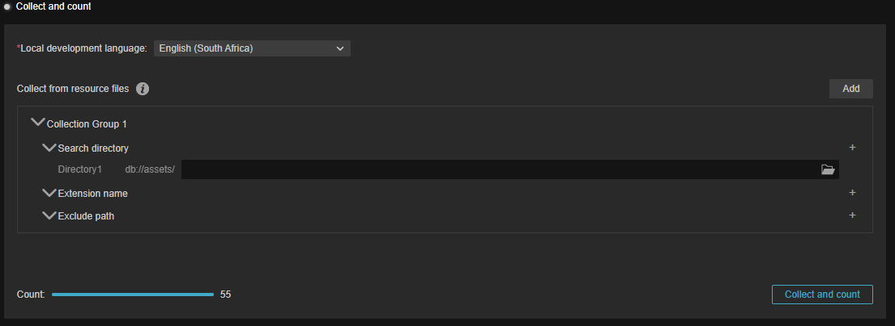
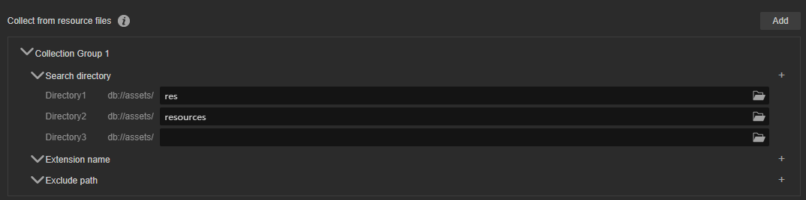
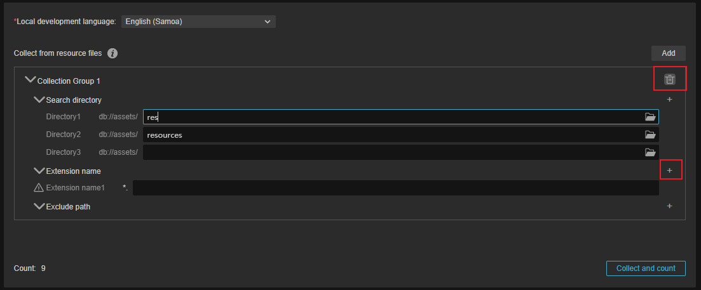

# Collect and Count

The Collect and Count feature collects files such as text, Typescript scripts, scene resources, Prefab, videos and images from within the project and allows developers to localize and configure them.

## Properties and Descriptions

- **Local development language**: The local development language, the language used by the developer during development. The language selected here will be used as the source language and provided to the translation service provider for translation. Developers can select it according to their current preferences via the drop-down menu at.

    

    This option is required.

- **Collecting from resource files**: The localization editor feature allows you to collect text information from different resource directories for the desired translation, as well as the option to filter or exclude certain files/folders.

    

    - **Collection groups**: Multiple can be added, different collection groups can be added by the **+** button, for the added items, **delete** button will be displayed when mouse slide over.

      

        - **Search directory**: You can specify a specific directory within the current resource database for collecting resources to be translated, with a minimum of 1 i.e. `db://assets`. To reduce the collection time, we recommend developers to store the resources to be translated in a separate directory. Then sort them by this option.
        - **Extension name**: Specify to collect by a specific file extension, or if none, collect all files.
        - **Excluded path**: excluded paths will not be collected.

Once the directory to be collected is configured, the data is recorded by clicking the **Collect and Count** button and can be compiled and organized by [Compile Language](compile-language.md).
