# Compile Language

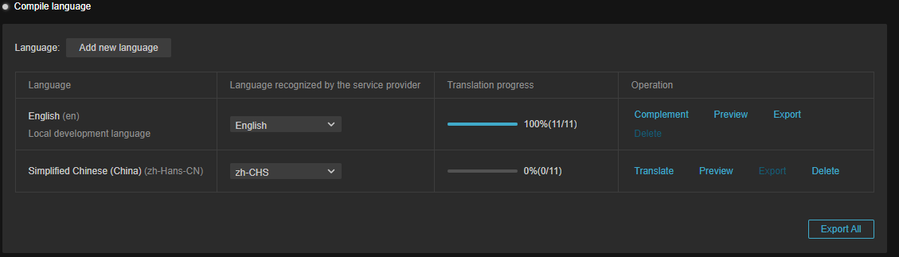

Once the local development language is selected in the [Collect and Count](collect-and-count.md) view, the compilation process can be configured. This will include features such as **automatic translation**, **manual translation**, **variants**, etc.

## Language

Developers can choose to add a new language here.

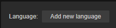

The language in the first row is **Local Development Language**, which records the local language used in the current development process, and can usually be chosen as a language familiar to the developer. Under this language, **Operation** column appears **Complete** function, which is used to record the original text of the Label component and should be used with [L10nLabel](l10n-label.md). Please refer to the following for details.

Starting from the second line, the language used in the target country/region, developers need to select at least one language of the target country/region for the translation option to appear.

## Languages recognized by translation service providers

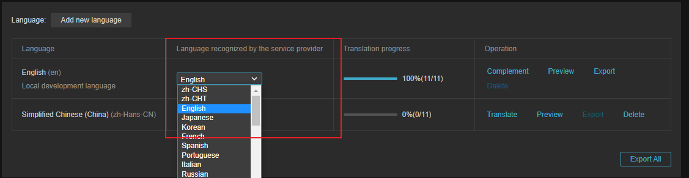

The above chart is used to select the input/output language type of the translation service provider at the time of automatic translation.

- For native development languages, the input language type is selected.

- For the translation language, the selection is for the output language type.

For example, in the above figure, the local development language is English (en), then the drop-down menu needs to select **English**.

And the translation language is **Simplified Chinese (zh-Hans-CN)**, then in the drop-down menu, please select **zh-CHS**.

> **Note**: If the drop-down menu is not available, please check if [AppKey/AppSecret](translation-service.md) is configured correctly.

## Translation Progress

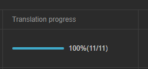

Shows current translation progress.

## Operations

The actions field provides **Complement** functionality for native development languages and **Translation** functionality for target translation languages. Common functions for both include **Preview**, **Export** and **Delete**.

### Complement

**Complement** for only taking effect when the current language is set to **Local Development Language**. The purpose of the complement feature is to record the original text of the content to be translated in the current development language. All the original text data obtained by the **Collect and Count** function will be displayed here. When you click on it, you can view all the results.

When adding a key via the [L10nLabel](l10n-label.md) component within a prefab or scene:

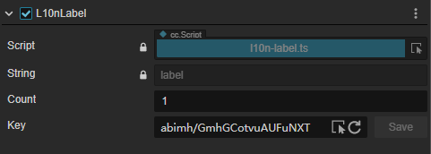

You can find the corresponding key in the **Complement** panel, enter the value of the key in the Original field, and click the **Save** button to save the original text, which will be automatically filled if the Label's String property has a value.

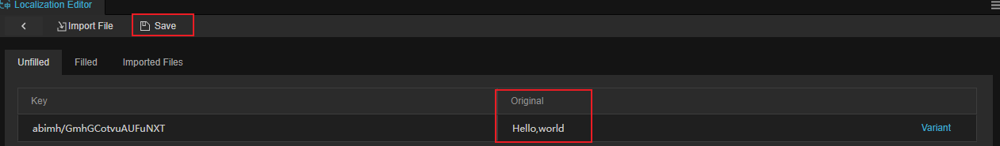

Non-text resources such as images and audio are also complemented, see the **Non-Text Resources** section below for details.

### Variants

The variant function is specially used to solve the plural problem encountered in translation. The system will automatically adjust the translation content according to the rules of variants, and users can also freely set the rules of variants.

In the **Complement** panel, click the **Variant** button to enter a new variant.

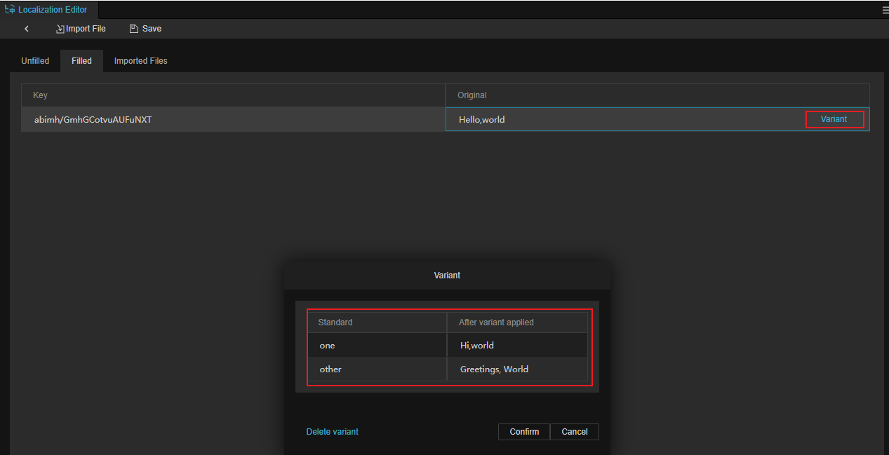

After the **Complement** is done, remember that you need to click the **Save** button above to save it.

The number of variants is language dependent and is one of the international rules, which interested users can check by moving to [https://cldr.unicode.org/](https://cldr.unicode.org/).

For more information, see [L10nLabel Variant Count](l10n-label.md).

### Translation

Once the key value and the original text have been added to the **Complement** function, you can use the translation service provider's translation service to translate by clicking on the **Translat** button to bring up the translation interface.

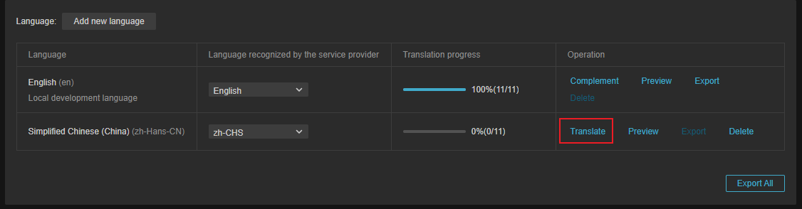

Click on the **Translate** button at the top right to translate.

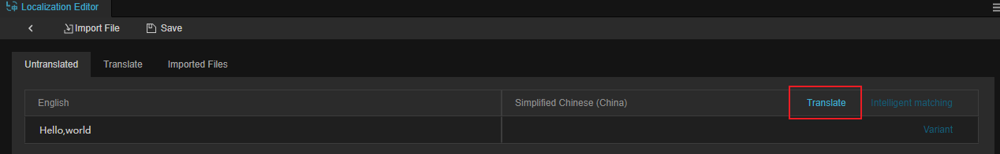

Once the translation is complete, the results can be viewed in the **Translation** sub-page.

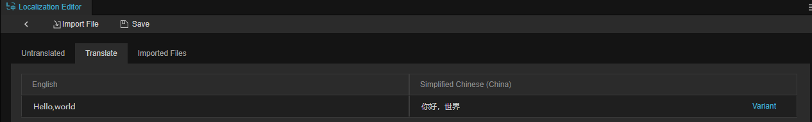

For translated text, different translations can also be added by clicking on **Variant**:.

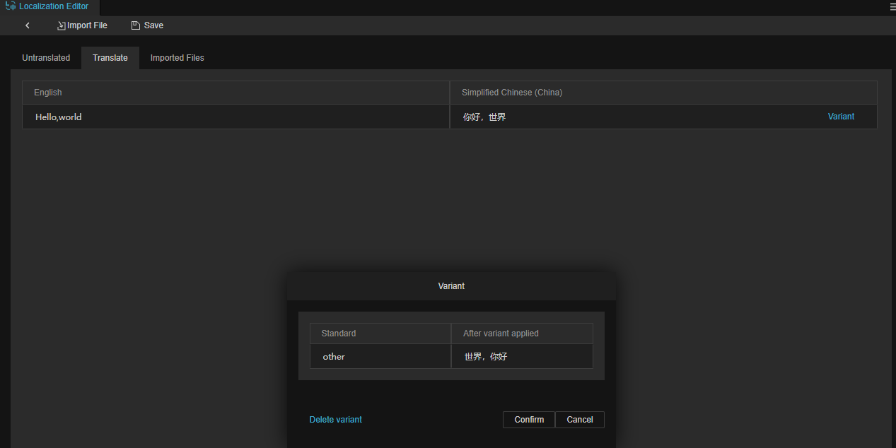

> **Note**: This feature only works if the **Translation Service Provider** is properly configured.

### Preview

Click Preview to get a quick preview of how the nodes/image resources etc. of the [L10nLabel](l10n-label.md) component are displayed in that language for the current scene:

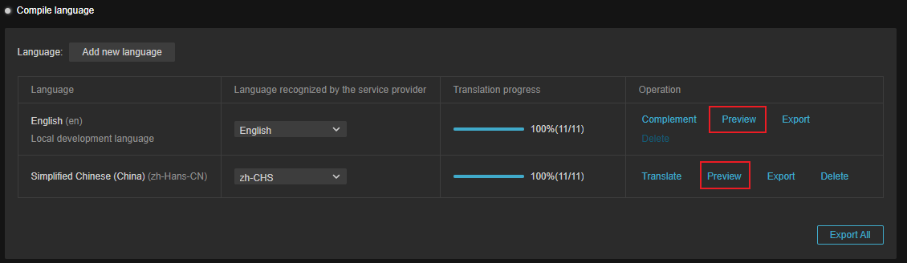

Before translation:

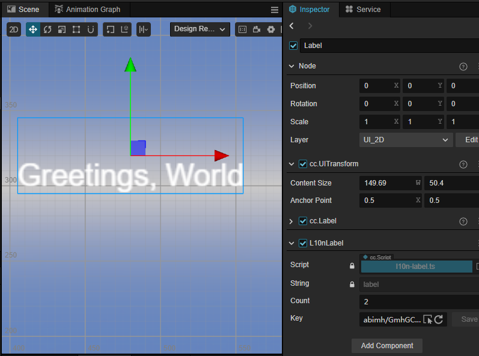

After translation:

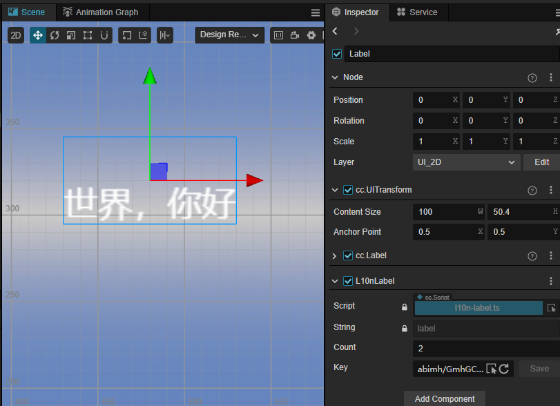

### Export

Click the **Export** button to export the original/translated content to a PO file.

> PO file is a common text-based object file in software development, usually used to record the result of interface translation.

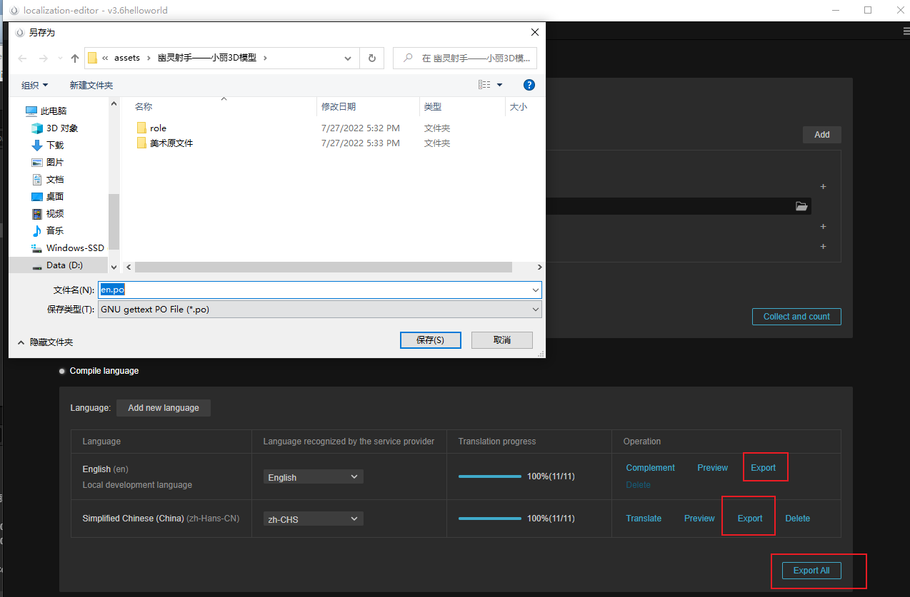

The following are some supplementary translation tools, which developers can choose according to their needs.

- Manipulating PO Files
- [https://poedit.net/](https://poedit.net/)
- [https://github.com/translate/translate](https://github.com/translate/translate)
- [OmegaT - The Free Translation Memory Tool - OmegaT 3](https://omegat.org/)

### Delete

Delete the translated progress of the current language. The result will not be saved after confirmation, so please operate with caution. Local development languages cannot be deleted.

## Non-text resources

Localization may also be required when there is text drawn on images, video and audio dubbed in different languages in the project. In this case, the translation interface will provide the **Import** button, and here is an example of how to configure localization using images.

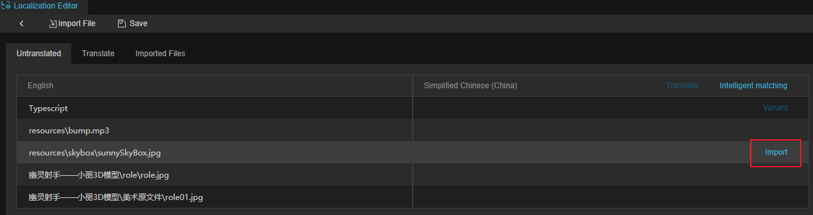

When **Collection and Count** is complete, the detected resources will be in the form of paths as key values.

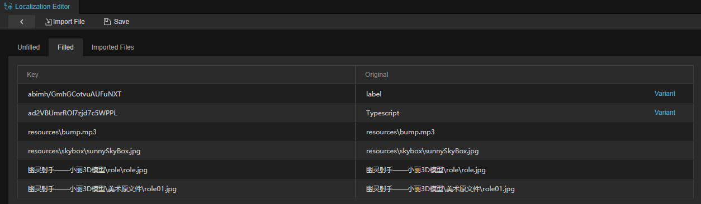

Import the images required for the target language by clicking on the **Import** button to.

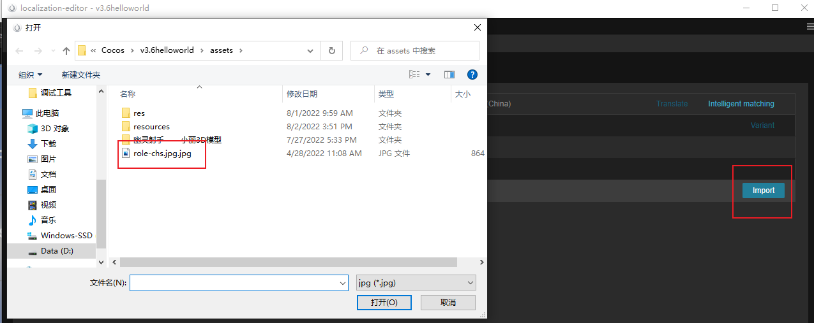

> **Note**.
> 1. When importing, you can only import the files in the project.
> 2. Since auto-atlas will modify the uuid of the resource, it will cause the redirection failure, so the images that need to be translated cannot be checked for auto-atlas function.

### Intelligent Matching

The Intelligent Matching button will bring up a secondary confirmation menu, clicking on it will enable intelligent matching. Intelligent matching will be modified by the file name and match the corresponding language. Example.

The source file is: assets/aassb/cn-abc001.jpg and needs to be translated into English, its translation file is: assets/aassb/en-abc001.jpg, we will automatically replace cn in assets/aassb/cn-abc001.jpg with en.

Operation steps.

- For example, when our local development language is Chinese (zh) and the language to be translated is English (en), the following resources may be prepared as shown in the figure below:

    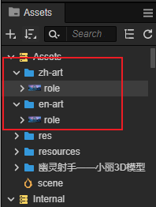

- After clicking **Intelligent Matching**, select Confirm in the secondary menu that pops up:

    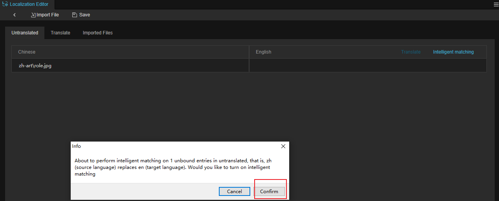

- Developers do not need to import them manually, and role.jpg in different languages will be automatically matched with:

    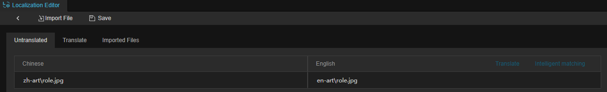

## Import Files

The **Import File** button allows you to import external data files, supporting PO, CSV and XLSX formats.

The format requirements for CSV and XLSX are as follows.

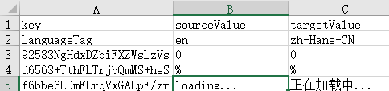

The file should be in UTF-8 encoding format.

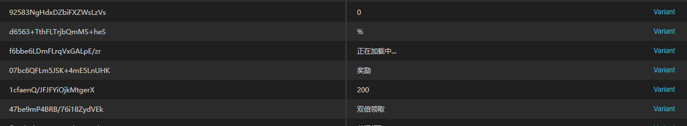

After importing, if you need to translate manually, the process is the same as the above document.

### Conflict resolution

If you import the same external file repeatedly, a conflict will occur, and you will need to resolve the conflict manually at this point: !

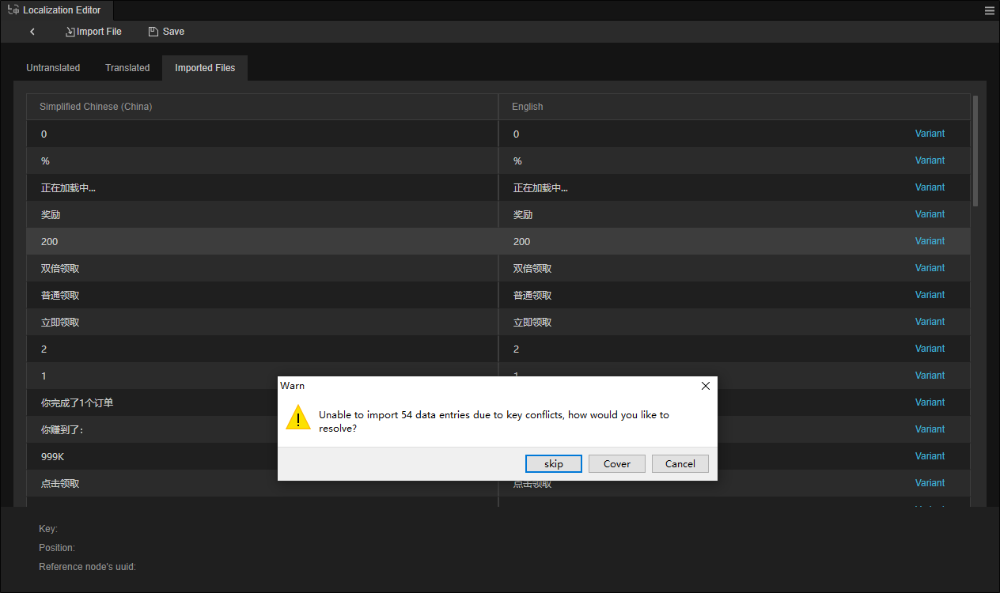

- **Skip**: skip the conflicting key value, no additional processing.
- **Cover**: Overwrite the existing key value, the old data will be discarded.
