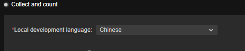
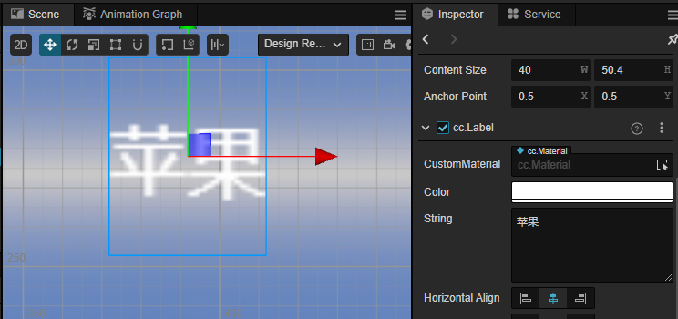
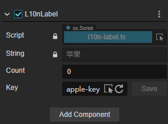
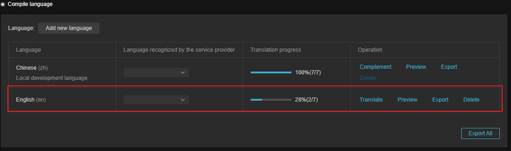
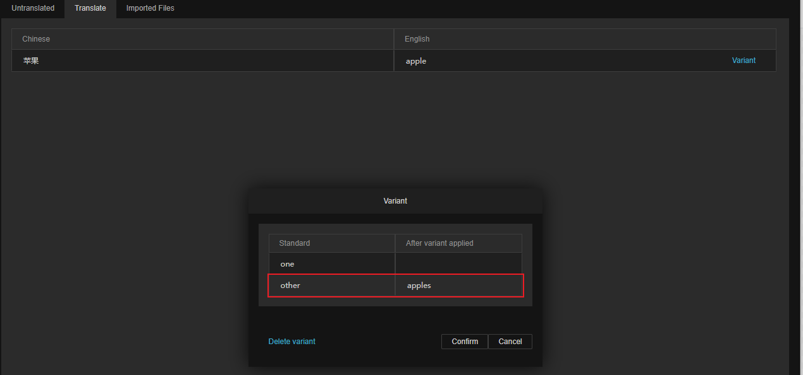
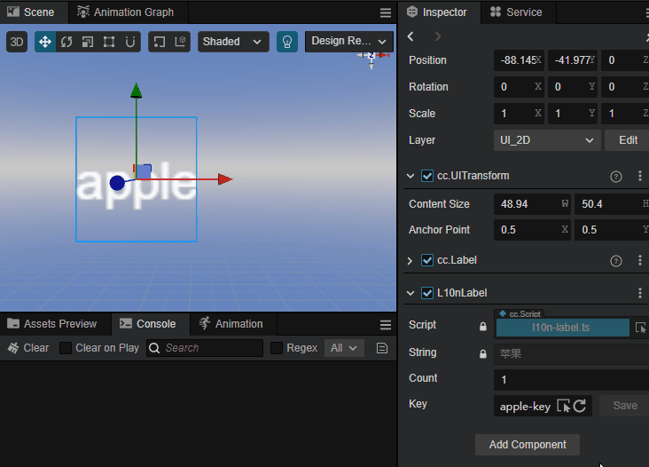
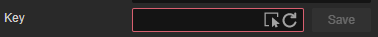
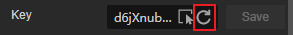
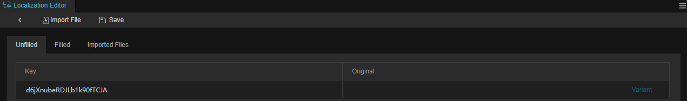
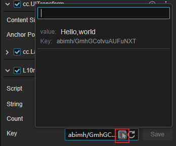

# L10nLabel

L10nLabel is a component that can be customized to translate content. Used in conjunction with a text component, the content of the text component can be translated.

## Adding Components

Users can click **Add Component** on the **Inspector** panel and select L10nLabel to add.

> **Note**: L10nLabel must be paired with a Label component to work, if there is no Label component on the node, one will be created automatically.

## Properties and descriptions

|  Properties | Description |
| :-- | :-- |
| **String** | Text within Label component   not editable|
| **Count** | Number of variants   See below for details |
| **Key** | Localized key |

### Count

By entering a different number, the localization will switch between different variants.

In some languages, different formats are used to represent singular and plural, for example, in English, one apple is expressed as one apple, while two apples is used in the plural form of apples: two apples.

In order to be able to use the correct format after translation, we can fill in **Count** exactly how many objects are specified in the current sentence.

As a rule, the number of variants in different languages is related to the local language, and developers can consult with native speakers.

For example, English has a singular/plural distinction, so there are two variants in configuration `one` and `other`. Some languages like Arabic have 5 variants while Russian has 3 variants. The engine generates the number of variants by adapting international rules, which can be found at the following URL if you wish to know them.

- ECMAScript Internationalization API：[https://developer.mozilla.org/en-US/docs/Web/JavaScript/Reference/Global_Objects/Intl/PluralRules](https://developer.mozilla.org/en-US/docs/Web/JavaScript/Reference/Global_Objects/Intl/PluralRules)
- Unicode CLDR Project：[https://cldr.unicode.org/](https://cldr.unicode.org/)

We'll walk through a detailed example below, for those unfamiliar with the **Localized Edit** panel, you can start by referring to [Localization](./overview.md).

- First enable **localization editing** and select Chinese as the development language:.

    

- Add a node with a Label component within the scene.

    

- Add a L10nLabel component to this node and change the Key to: apple-key:

    

- Add the language to be translated to English:

    

- Adding variants within the **translation** panel:

    

- The translated result can be previewed by clicking on the **Preview** action in the **Localization Editor** panel, and different variants will be displayed when switching between singular/plural in the Count property.

    

### Key

Globally unique keys, localization will get the result of that key in localization depending on the key. Developers can enter their own custom keys. New keys can also be added by the **reset** button.

#### Reset Key

If you need new keys you can click on the reset button shown, at which point the L10N will generate new keys, which can then also be edited in the **Localization Editor** in the panel opened by the **Compile** operation:

For details, please refer to [Compile Language](compile-language.md)

#### Select Key

The drop-down menu shown allows you to select existing keys:

