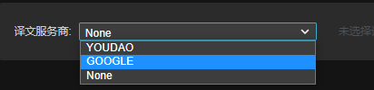
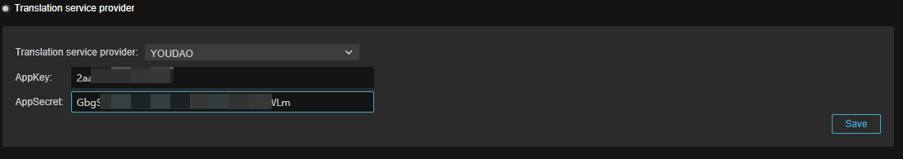

# Translation Service Provider

Translation service providers are third-party software vendors that the engine integrates with by smoothing out the differences in APIs between them. Usually the developer needs to register the service provider's account and enable the corresponding API in order to start the automatic translation function.

Don't worry if you don't have a corresponding developer account, L10N supports manual translation.

- **Translation Service Provider**: This drop-down menu allows developers to select a different translation service provider. If **None** is selected, the automatic translation function is not available, and the manual translation function is not affected:

    

    The URL of the currently supported service providers are as follows:

    - [有道智云平台](https://ai.youdao.com/gw.s#/)
    - [Google Cloud](https://cloud.google.com)

- **AppKey**/**AppSecret**: After selecting different service providers, developers need to enter AppKey and AppSecret to continue the subsequent operation. Usually these information need to be obtained on the website of the translation service provider:

    

    Once you have finished entering, just click the **Save** button.
