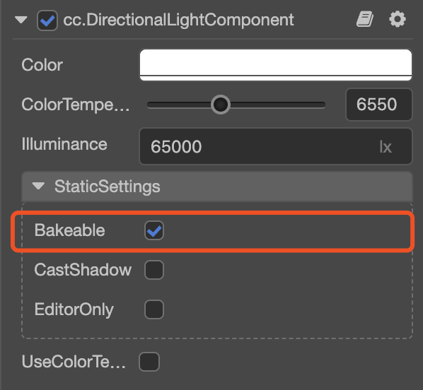

# Lightmap

The __baking system__ is the process of finally generating light maps and applying them in the scene by calculating the influence of all light sources on the object in the engine scene. The purpose of this system is to reduce the calculation of real-time light sources, thereby improving the efficiency of the scene.

## Creating

The following three steps are required to turn on the baking system:

1. Click the menu button in the top menu bar `Project (Project)`, click the `Lightmap (light map)` button in the pop-up menu bar to pop up the lightmap panel.
   
    

2. Before baking, you need to set the `Bakeable` property of the light source component to `true` in the editor, 

    > **Note**: currently only one main direction light source is supported.
   
    

3. In the lightmap panel that pops up, after setting the corresponding parameters, click the `Lightmap Generate` button and select the corresponding storage folder to generate the lightmap 

    > **Note**: the storage folder must be under Effective Assets.
   
    

## Using

During the process of generating baked maps, there will be a generated progress prompt. After the generation, you can view it in the `Baked` tab in the `lightmap` panel.

Among them, `Baked result (baked result display panel)` shows the lightmap texture after baking, `Lightmap clear (clear button)` can delete the generated result of baking, and `information output panel` shows the information of each baked image (file name, size, etc.).

> **Note**: before the lightmap is enabled, the model needs to include two sets of uv, the second set of uv is used to access the lightmap, and Materials also need to check the lightmap option to apply the shadow information after the model is baked.

## Editing

The baking process is to calculate the generated results according to the parameters set on the panel, as shown below:

The following table describes the specific meaning of each parameter:

| Parameter | Description |
| :--- | :--- |
| MSAA | Multisampling. Has the following values: 1, 2, 4, 8 |
| Resolution | Baking map size. Has the following values: 128, 256, 512, 1024, 2048 |
| Gamma      | Gamma correction value |
| GIScale    | Global illumination scaling factor |
| GISamples  | Global illumination sampling coefficient |
| AOLevel    | AO Level |
| AOStrength | AO Strength |
| AORadius   | AO Radius |
| AOColor    | AO Color |
