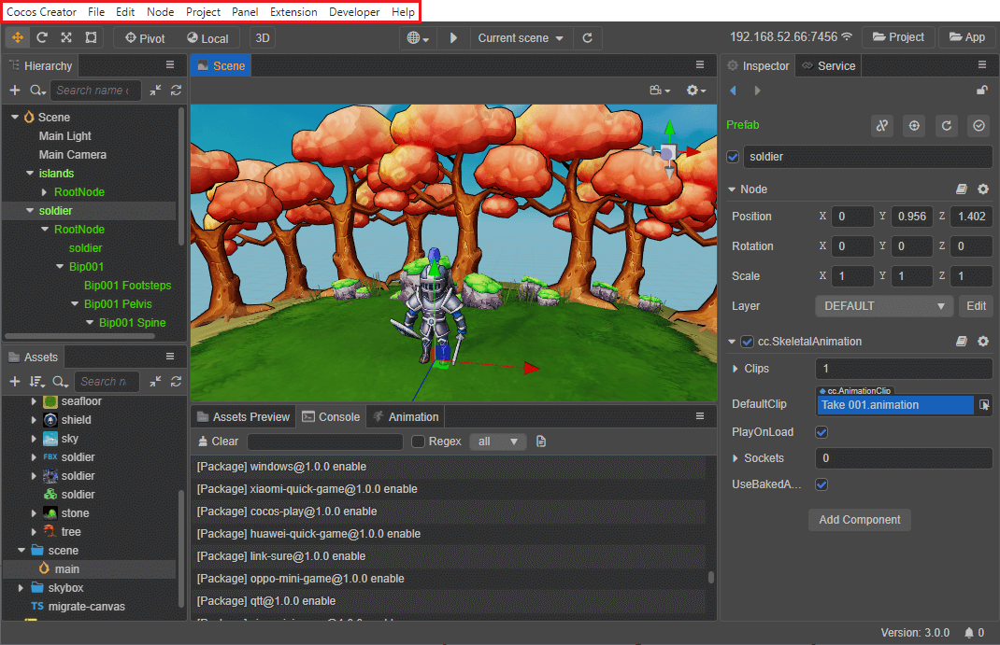
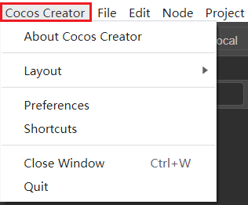
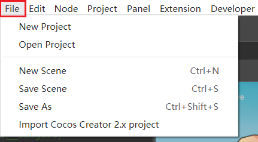
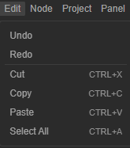
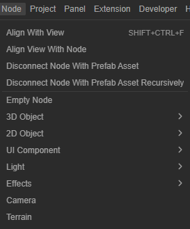
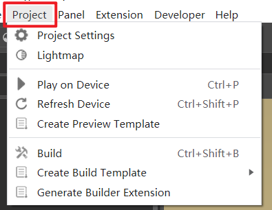
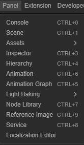
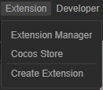
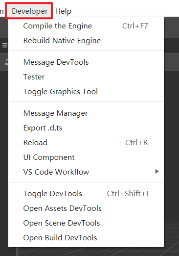
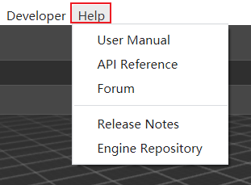

# 主菜单

Cocos Creator 顶部的主菜单栏中包括 **Cocos Creator**、**文件**、**编辑**、**节点**、**项目**、**面板**、**扩展**、**开发者** 和 **帮助** 9 个菜单项，集成了 Cocos Creator 大部分的功能点。

## 关于 Cocos Creator

该项主要包括软件信息、设置、窗口控制等功能：

| 选项 | 说明 |
| :--- | :-- |
| 关于 Cocos Creator | 显示 Cocos Creator 相关版本号以及版权信息 |
| 布局 | 设置编辑器界面布局，暂时只支持默认布局 |
| 偏好设置 | 打开 [偏好设置](../preferences/index.md) 面板，对编辑器进行个性化设置 |
| 快捷键 | 打开快捷键设置面板，查看编辑器各面板或功能模块默认使用的快捷键，支持自定义 |
| 关闭窗口（<kbd>Ctrl</kbd>/<kbd>Cmd</kbd> + <kbd>W</kbd>）| 关闭当前窗口|
| 退出 | 关闭当前编辑器，并自动打开 Dashboard |

## 文件

该项主要用于项目或场景的新建、打开、保存等操作，以及导入 Cocos Creator 2.x 项目。

| 选项 | 说明 |
| :--- | :-- |
| 新建项目 | 打开 Dashboard 的 [项目](../../getting-started/dashboard/index.md#%E9%A1%B9%E7%9B%AE) 分页，以新建一个项目。若使用的 Dashboard 版本是 v1.0.19，则会打开 Dashboard 的 [新建项目](../../getting-started/dashboard/index.md#%E6%96%B0%E5%BB%BA%E9%A1%B9%E7%9B%AE) 分页 |
| 打开项目 | 打开 Dashboard 的 [项目](../../getting-started/dashboard/index.md#%E9%A1%B9%E7%9B%AE) 分页 |
| 新建场景（<kbd>Ctrl</kbd>/<kbd>Cmd</kbd> + <kbd>N</kbd>） | 关闭当前场景并创建一个新场景，新创建的场景需要手动保存才会添加到项目目录下 |
| 保存场景（<kbd>Ctrl</kbd>/<kbd>Cmd</kbd> + <kbd>S</kbd>） | 保存当前正在编辑的场景，如果是使用 **文件 -> 新建场景** 创建的场景，在第一次保存时会弹出对话框，需要选择场景文件保存的位置并填写文件名，然后点击 **保存** 即可。场景文件以 `.scene` 作为扩展名 |
| 另存为（<kbd>Ctrl</kbd>/<kbd>Cmd</kbd> +<kbd>Shift</kbd>+ <kbd>S</kbd>） | 生成当前场景文件的副本，并保存在项目中|
| 导入 Cocos Creator 2.x 项目 | v2.x 资源导入工具，支持旧项目资源完美导入，以及代码的辅助迁移。详情请参考 [v3.0 升级指南](../../release-notes/upgrade-guide-v3.0.md) |

## 编辑

该项主要包括撤销、重做、复制和粘贴等常用编辑功能。

| 选项 | 说明 | 默认快捷键 |
| :--- | :-- | :--|
| 撤销 | 撤销上一次对场景的修改 |  <kbd>Ctrl</kbd>/<kbd>Cmd</kbd> + <kbd>Z</kbd>
| 重做 | 恢复上一步骤的撤销动作 |  <kbd>Ctrl</kbd>/<kbd>Cmd</kbd> + <kbd>Shift</kbd> + <kbd>Z</kbd>
| 剪切 | 剪切当前选中的节点或字符到剪贴板| <kbd>Ctrl</kbd>/<kbd>Cmd</kbd> + <kbd>X</kbd>
| 复制 | 复制当前选中的节点或字符到剪贴板 | <kbd>Ctrl</kbd>/<kbd>Cmd</kbd> + <kbd>C</kbd>
| 粘贴 | 将剪贴板中的内容粘贴到相应的位置| <kbd>Ctrl</kbd>/<kbd>Cmd</kbd> + <kbd>V</kbd>
| 全选 | 焦点在层级管理器内为选中同一层级中的所有节点，焦点在资源管理器则选中同一层级中的所有资源 | <kbd>Ctrl</kbd>/<kbd>Cmd</kbd> + <kbd>A</kbd>

> **注意**：节点的 **复制**、**剪切** 和 **粘贴** 请使用快捷键进行操作。

## 节点

该项包含调整视角、取消关联预制节点和创建节点等功能。

| 选项 | 说明 |
| :--- | :-- |
| 视角对齐（<kbd>Ctrl</kbd>/<kbd>Cmd</kbd> + <kbd>Shift</kbd> + <kbd>F</kbd>） | 将当前选中节点移动到 **场景编辑器** 的视角中心 |
| 将视角和节点对齐 | 将 **场景编辑器** 中的视角设置为以当前选中节点为中心 |
| 取消关联当前的 Prefab 资源 | 用于将选中的预制节点转化成普通节点，详情请参考 [Prefab](../../asset/prefab.md) |
| 递归地取消关联当前的 Prefab 资源 | 用于将场景中包含嵌套的预制节点递归地转化为普通节点，详情请参考 [Prefab](../../asset/prefab.md) |
| 空节点 | 在场景中创建一个空节点，如果执行命令前场景中已经选中了节点，新建的节点会成为选中节点的子节点|
| 3D 对象 | Creator 提供了一些比较基础的静态模型控件以便使用，目前包括 **立方体**、**圆柱体**、**球体**、**胶囊**、**圆锥体**、**圆环体**、**平面** 和 **四方形**。若需要创建其他类型的模型，可参考 [MeshRenderer 组件](../../engine/renderable/model-component.md)|
| 2D 对象 | 在场景中创建 Creator 预设好的包含基础渲染组件的 2D 节点，目前包括 **Graphics**（绘图）、**Label**（文本）、**Mask**（遮罩）、**ParticleSystem2D**（粒子）、**Sprite**（精灵）、**SpriteSplash**（单色）和 **TiledMap**（地图），详细情况可参考 [2D 渲染组件介绍](../../ui-system/components/editor/render-component.md)|
| UI 组件 | 在场景中创建 Creator 预设好的包含基础 UI 组件的节点，目前包括 **Button**（按钮）、**Widget**（对齐挂件）、**Layout**（布局）、**ScrollView**（滚动视图）、**EditBox**（输入框）等节点在内的常用 UI 控件。更多 UI 组件介绍，可以查看 [UI 基础组件](../../ui-system/components/editor/base-component.md)|
| 光线 |  在场景中创建 Creator 预设好的包含基础光源组件的节点，目前包括 **平行光**、**球面光** 和 **聚光**，详情请参考 [光照](../../concepts/scene/light.md)|
| 特效 | 在场景中创建 Creator 预设好的包含 [粒子系统](../../particle-system/overview.md) 组件的节点。更多特效组件可在 **属性检查器** 面板点击 **添加组件 -> 特效** 进行添加。|
| 摄像机 | 在场景中创建 Creator 预设好的包含 Camera 组件的节点。具体的使用方式，详情请参考 [Camera 组件](../components/camera-component.md)|
| 地形 | 在场景中创建 Creator 预设好的包含地形组件的节点。具体的使用方式，详情请参考 [地形系统](../terrain/index.md)|

## 项目

该项主要用于执行预览运行构建项目、项目配置和自定义构建等。

| 选项 | 说明 |
| :--- | :-- |
| 项目设置 | 打开 [项目设置](../project/index.md) 面板，设置特定项目的相关配置项 |
| 光照贴图 | 打开 [光照贴图](../../concepts/scene/light/lightmap.md) 面板，配置生成光照贴图的烘焙参数 |
| 运行预览（<kbd>Ctrl</kbd>/<kbd>Cmd</kbd> + <kbd>P</kbd>） | 点击该项即可在选择的浏览器/模拟器/预览窗口中预览项目效果，详情请参考 [预览调试](../preview/index.md)|
| 刷新预览（<kbd>Ctrl</kbd>/<kbd>Cmd</kbd> + <kbd>Shift</kbd> + <kbd>P</kbd>） | 刷新已经打开的预览窗口  |
| 生成预览模板 | 该项用于自定义想要的预览效果，详情请参考 [自定义预览模板](../preview/browser.md)|
| 构建发布（<kbd>Ctrl</kbd>/<kbd>Cmd</kbd> + <kbd>Shift</kbd> + <kbd>B</kbd>） | 打开 [构建发布](../publish/index.md) 面板，将游戏打包发布到目标平台上 |
| 构建项目构建模板 |  该项用于定制项目的构建模板，详情请参考 [自定义构建模板](../publish/custom-project-build-template.md)|
| 新建构建扩展包 | 该项用于扩展构建流程，详情请参考文档 [扩展构建流程](../publish/custom-build-plugin.md)|

## 面板

该项主要用于打开编辑器中的各式面板。

| 选项 | 说明 |默认快捷键 |
| :--- | :-- |:-- |
| 控制台 | 打开 [控制台](../console/index.md)，用于查看输出的日志信息 |<kbd>Ctrl</kbd>/<kbd>Cmd</kbd> + <kbd>0</kbd>
| 场景编辑器 | 打开 [场景编辑器](../scene/index.md) 面板。用于选择和摆放场景图像、角色、特效、UI 等各类游戏元素 |<kbd>Ctrl</kbd>/<kbd>Cmd</kbd> + <kbd>1</kbd>
| 资源管理器 | 打开 **资源管理器**/**资源预览** 面板，用于访问/管理/查看项目资源，详情请参考 [资源管理器](../assets/index.md) |资源管理器为 <kbd>Ctrl</kbd>/<kbd>Cmd</kbd> + <kbd>2</kbd>
| 属性检查器 | 打开 [属性检查器](../inspector/index.md) 面板，用于查看并编辑当前选中节点、节点组件和资源的工作区域  |<kbd>Ctrl</kbd>/<kbd>Cmd</kbd> + <kbd>3</kbd>
| 层级管理器 | 打开 [层级管理器](../hierarchy/index.md) 面板，该面板以树状列表的形式展示了场景中所有节点之间的层级关系 |<kbd>Ctrl</kbd>/<kbd>Cmd</kbd> + <kbd>4</kbd>
| 预览 | 打开 **摄像机预览** 面板，该面板展示的画面与在场景中选中对应 Camera 节点时，**场景编辑器** 右下角展示的画面一致。当调整场景时，摄像机预览面板中的画面也会实时同步  |<kbd>Ctrl</kbd>/<kbd>Cmd</kbd> + <kbd>5</kbd>
| 动画 |  可以打开 [动画编辑器](../../animation/index.md) 面板或者 [Joint Texture Layout（骨骼贴图布局）](../../animation/joint-texture-layout.md) 面板，用于对帧动画或者骨骼动画进行编辑、查看等功能 |动画编辑器为 <kbd>Ctrl</kbd>/<kbd>Cmd</kbd> + <kbd>6</kbd>
| 节点预制库 | 打开节点预制库面板。该面板是一个非常简单直接的可视化控件仓库，开发者可以将这里列出的控件拖拽到 **场景编辑器** 或 **层级管理器** 中，快速完成预设控件的创建|<kbd>Ctrl</kbd>/<kbd>Cmd</kbd> + <kbd>7</kbd>
| 服务 | 打开 [服务](https://service.cocos.com/document/zh) 面板，该面板提供了一些优质的官方以及第三方服务，方便开发者获得更多引擎之外的扩展能力，让游戏开发工作变得更加简单 |<kbd>Ctrl</kbd>/<kbd>Cmd</kbd> + <kbd>8</kbd>
| Cocos 小秘书 | 打开 [Cocos 小秘书](https://www.cocos.com/assistant) 面板，该面板与 Cocos Creator 编辑器紧密结合，⽆缝嵌⼊开发环境，⽆论开发者遇到任何问题，随时可以向官方技术人员发起交流。目前仅支持 Creator 中文版 |

## 扩展

该项主要包括扩展管理器、商城和创建扩展等，详情请参考 [编辑器扩展](../extension/readme.md) 一章。

| 选项 | 说明 |
| :--- | :-- |
| 扩展管理器 | 打开 **扩展管理器** 面板，其中包括了编辑器内置扩展、项目目录及全局目录下安装的扩展，详情请参考 [编辑器扩展](../extension/readme.md) |
| 商城 | 点击该项即可进入 Cocos Creator 内置的 [扩展商城](https://store.cocos.com/app/)，可供用户浏览、下载和自动安装官方或者第三方扩展和资源。同时用户也可以将自己开发的扩展插件、美术素材、音乐音效等资源提交到扩展商店以便分享或者售卖。详情请参考 [提交资源到商店](../extension/store/upload-store.md) |
| 创建扩展 | 该项用于在项目/全局目录下生成一个 [扩展包](../extension/first.md)，以便对编辑器进行功能扩展  |

## 开发者

该项主要包含脚本、引擎和调试工具等开发相关的菜单功能。

| 选项 | 说明 |
| :--- | :-- |
| 编译引擎（<kbd>Ctrl</kbd>/<kbd>Cmd</kbd> + <kbd>F7</kbd>） | 编译自定义引擎，详情请参考 [引擎定制工作流程](../../advanced-topics/engine-customization.md) |
| 编译原生模拟器引擎 | 编译自定义原生引擎模拟器，详情请参考 [定制原生模拟器引擎](../../advanced-topics/engine-customization.md#25-%E5%AE%9A%E5%88%B6%E5%8E%9F%E7%94%9F%E5%BC%95%E6%93%8E%E6%A8%A1%E6%8B%9F%E5%99%A8) |
| 消息调试工具 | 打开消息调试工具，用于调试编辑器内部运行时的 IPC 交互|
| Tester | 编辑器内置扩展的测试工具，目前暂未开放全部功能 |
| 开关图形工具 | 打开开关图形工具面板，用于调试场景渲染|
| 消息列表 |  打开 [消息管理器](../../extension/contributions-messages.md) 面板，用于显示编辑器每个功能定义的公开消息及其说明|
| Export.d.ts |导出编辑器相关的 API |
| 重新加载（<kbd>Ctrl</kbd>/<kbd>Cmd</kbd> + <kbd>R</kbd>） | 重新加载编辑器界面|
| UI 组件 | 打开 UI 组件面板，该面板列举了编辑器内提供的预设 UI 组件的使用方式，详情请参考 [UI 组件](../extension/ui.md) |
| VS Code Workflow | VS Code 代码编辑器的工作环境相关功能，目前支持 **添加 Chrome debug 配置** 和 **添加编译任务** |
| 开关开发人员工具（<kbd>Ctrl</kbd>/<kbd>Cmd</kbd> +  <kbd>Shift</kbd> + <kbd>I</kbd>） | 打开开发者工具窗口，用于编辑器界面扩展的开发。同时也可以自定义输出到 **控制台** 的日志，详情请参考 [自定义输出消息](../console/index.md#%E8%87%AA%E5%AE%9A%E4%B9%89%E8%BE%93%E5%87%BA%E4%BF%A1%E6%81%AF)|
| 打开资源调试工具 | 打开资源调试面板，用于查看修改 asset-db 进程期间的日志消息|
| 打开场景调试工具 | 打开场景调试面板，用于查看修改场景时的日志消息|
| 打开构建调试工具 | 打开构建调试工具，用于查看在构建过程中产生的全部日志信息包括调用栈|

## 帮助

| 选项 | 说明 |
| :--- | :-- |
| 使用手册 | 在默认浏览器打开 [用户手册文档](https://docs.cocos.com/creator/3.0/manual/zh/) |
| API 文档 | 在默认浏览器打开 [API 参考文档](https://docs.cocos.com/creator/3.0/api/zh/) |
| 论坛 | 在默认浏览器打开 [Cocos Creator 论坛](https://forum.cocos.org/c/58)|
| 更新日志 |  在默认浏览器打开 [Cocos Creator 版本更新日志](https://www.cocos.com/creator)  |
| 引擎仓库 |  在默认浏览器打开 [TypeScript 引擎仓库](https://github.com/cocos-creator/engine) |
