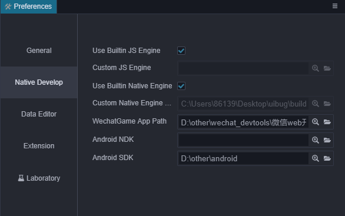
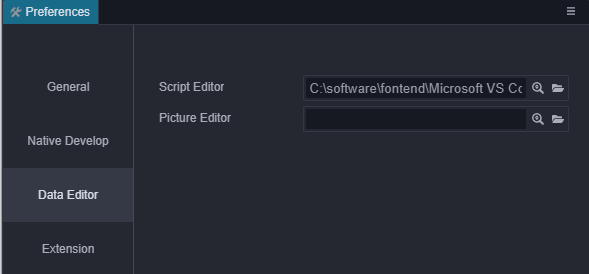

# Preferences

The personalized settings of the editor are provided in the **Preferences** window. You can click the **Preferences** menu to open the **Preferences** window.

Preferences is divided into the following pages:

## General

General page are mainly configured for some basic data related to the editor.

- **Language**: Can choose `中文` or `English`.

- **IP Address**: Case the user may have multiple IP addresses on this computer. Manually select one and two-dimensional code as a default when previewing address. This will list all native IP, editor will picked one for you automatically.

- **Spin step**: In the Properties, all numeric property has a set of UP and DOWN arrows next to the input box, values that can be used to step Input:

    

    When hovering close to the value of the property name, the cursor will turn into  such a shape, then Drag the mouse, can also according to a continuous increase or decrease the value of step amplitude.

    The above two ways to modify the value, the default step is **0.1**, spin step says each time you click the step button or drag the mouse to change the step amplitude. For example, if you mainly use numbers to integers in the script, you can take the step size is set to **1**, can be adjusted more easily.

## Native Develop

This page is used to set the path of the development environment required when the game is published to the native platform (iOS, Android, Mac, Windows).

- **Use Builtin JS Engine**: Whether to use the engine path that comes with the __Cocos Creator__ installation path as the JavaScript engine path.This engine is used for scene rendering in the scene panel of editor, declaration of built-in components, and engine modules in other Web environments such as `preview` or `publish`.

- **Custom JS Engine**: In addition to using the built-in engine, you can also go to [engine repository](https://github.com/cocos-creator/engine) to clone or fork a copy of the engine to the local anywhere, then uncheck `Use Builtin JS Engine`, then set the JavaScript engine path to your customized engine path. Use the editor to customize your engine.

- **WeChatGame APP Path**: Set the WechatGame App Path, See [WeChat Mini Games](../publish/publish-wechatgame.md).

- **Android NDK Path**: Set the NDK Path, See [Setup Native Development Environment](../publish/setup-native-development.md).

- **Android SDK Path**: Set Android SDK Path, See [Setup Native Development Environment](../publish/setup-native-development.md).

## Data Editor

This category is used to set the default open mode for assets.

- **Script Editor**: Use the executable file of any external text editing tool as the opening method when you double-click the script file in `Assets`.

- **Picture Editor**: Similar to the above option, used here to set when `Assets`, double-click the picture file, open the picture with the default application path.

## Extension

The plugin allows directly registering configuration items into preferences. The configuration items registered in the preferences will be displayed here. For details, please refer to the documentation of each plug-in.

## Laboratory

About Laboratory:

1. The laboratory provides some new technical solutions or experimental features, you can turn each feature on with the on/off switch.

2. Non-backward compatible changes or removal may occur in any future release. Use of the feature in production environments should be well tested and pay attention to the publish notes of future versions.

3. We welcome users to try out and give us your feed backs via our [forum](https://discuss.cocos2d-x.org/c/33), you can make those features more powerful and easier to use in your own projects.

-**Turn on baking function**: Used to turn on the baking function, for details, please refer to [Light Map](./../../concepts/scene/light/lightmap.md)。
-**Scene Instant Cache**: Used to turn on the scene instant cache function, which is enabled by default. After opening, the scene file will be cached to the `temp/scene/[SCENE_UUID]/[TIME].json` location in the project directory at intervals during the scene editing process. In case of emergencies such as scene crash, progress Stuck, etc. Next time you open the editor, a pop-up window will ask whether to apply the latest scene file in the cache. It should be noted that once the scene is opened normally, the cache files before opening will be cleaned up. If you have special needs and need to browse the specified cached scene files by yourself, please operate with the corresponding scene closed.
