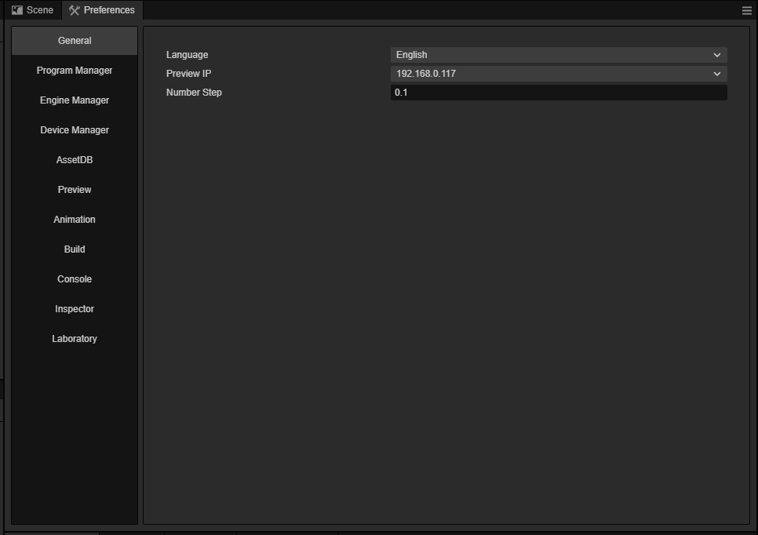
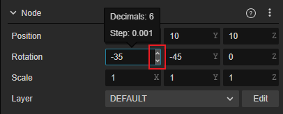
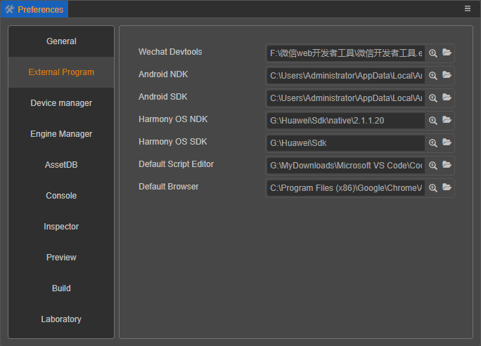
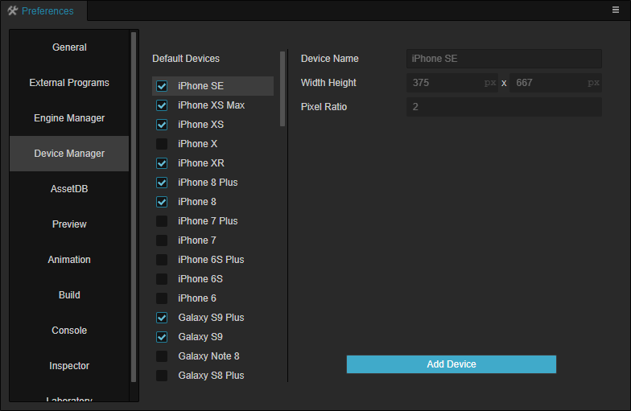
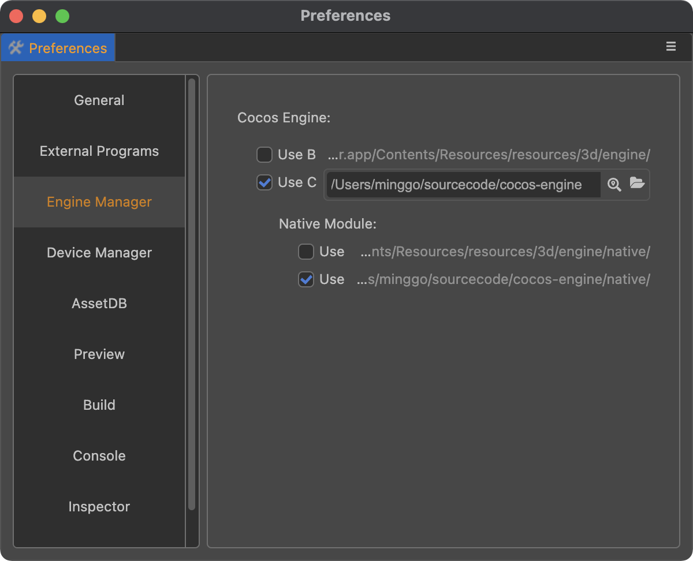
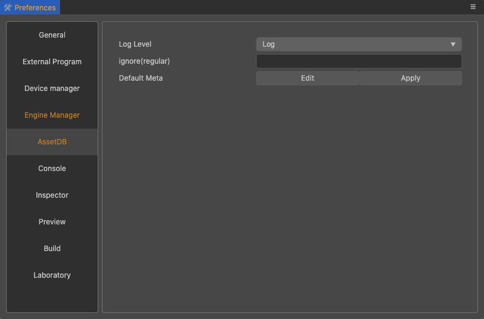
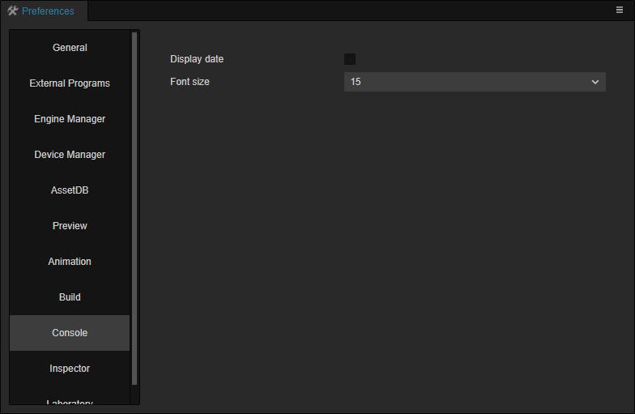
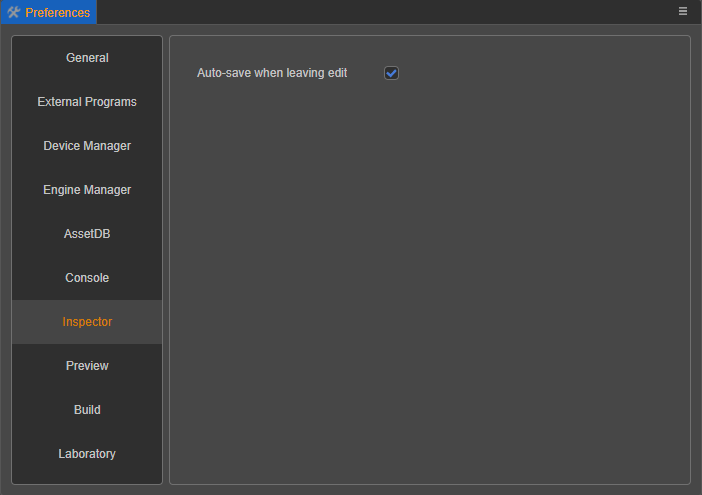
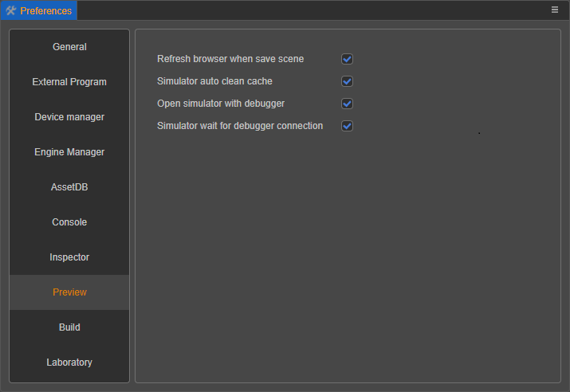
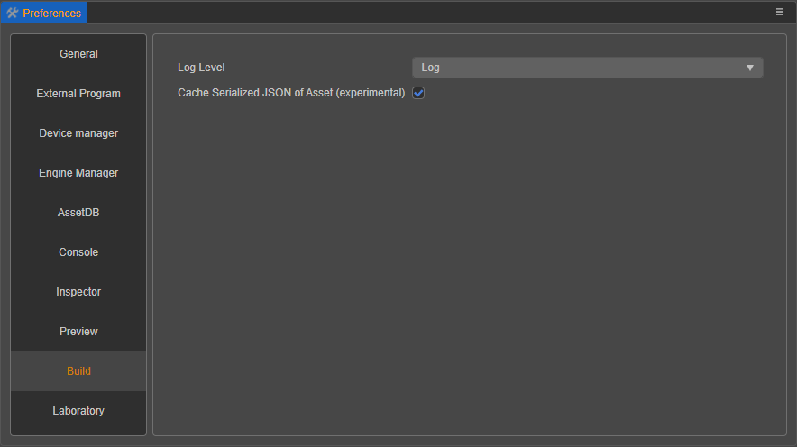

# Preferences

The **Preferences** panel provides personalized settings for the editor, which can be opened by clicking **Cocos Creator -> Preferences** in the editor's main menu bar.

**Preferences** consists of several different tabs, including **General**, **External Program**, **Device Manager**, **Engine Manager**, **AssetDB**, **Console**, **Inspector**, **Preview**, **Build** and **Laboratory**. The **Preferences** panel will automatically save the changes after you modify them.

## General



The **General** tab is mainly for configuring some basic information related to the editor, including:

**Language**: choose Chinese or English, the editor will automatically switch the language after modifying the language setting, if some texts are not switched, refresh the editor.

- **Preview IP**: users can manually select one of them as the default address and QR code address when previewing if there are multiple IP addresses on the local machine. All the local IPs will be listed here, and the editor will pick one IP automatically by default.

- **Preview Server Port Number**: modify the port number used by the editor when previewing the game. Restart the editor to take effect after the modification is finished.

- **Number Step**: used to set the step size when adjusting the numeric properties by step button in the **Inspector** panel. The default step size is 0.001. The step buttons in the **Inspector** panel include the following two types:

    - When the mouse is moved to the right of the numeric property input box, a set of up and down arrows will appear, which can continuously increase or decrease the value by a certain step magnitude.

       

    - When the mouse is hovered near the name of a numeric property, the cursor will change to , and then drag the mouse left and right to increase or decrease the value continuously in a certain step.

- **Theme Color**: set the editor display color, currently including **creator** and **dark**.

## External Program

The **External Program** tab is used to set up the development environment required to build for publishing to the native platform, as well as to configure some third-party programs. When the mouse is moved over a specific configuration item, a gray circular question mark icon is displayed on the left side. Clicking on this icon allows setting the configuration item to be applied to the current project or to all projects globally. When set to apply to the current project, the gray icon will turn yellow.



- **WeChat DevTools**: used to configure the Developer tools of WeChat Mini Game, please refer to the [Publishing to WeChat Mini Game](../publish/publish-wechatgame.md) documentation.

- **Android NDK**: used to set up the Android NDK path, please refer to the [Setup Native Development Environment](../publish/setup-native-development.md) documentation.

- **Android SDK**: used to set the Android SDK path, please refer to the [Setup Native Development Environment](../publish/setup-native-development.md) documentation.

- **HarmonyOS NDK**: used to set the HarmonyOS NDK path, please refer to the [Publish for the Huawei HarmonyOS](../publish/publish-huawei-ohos.md) documentation.

- **HarmonyOS SDK**: used to set the HarmonyOS SDK path, please refer to the [Publish for the Huawei HarmonyOS](../publish/publish-huawei-ohos.md) documentation.

- **Default Script Editor**: choose any executable file from an external text editing tool (e.g.: [VS Code](../../scripting/coding-setup.md)) as the way to open the script file when you double-click it in the **Assets** panel. The executable file of the preferred text editor can be selected by clicking the **Search** button after the input box. The folder icon is used to open the path to the text editor that has been set up.

- **Default Browser**: used to select the browser to be used when previewing the editor. A browser path can be specified by clicking the **Search icon** button behind the input box.

## Device Manager

The **Device Manager** tab is used to manage the device resolution when using the simulator or browser preview, and supports adding/modifying/deleting custom device resolutions manually on the right side of the panel. The editor's default device resolution does not support modification/deletion.



## Engine Manager

The **Engine Manager** tab is used to configure the engine path when customizing the engine.



- **Use built-in TypeScript engine**: whether to use the engine path that comes with the Cocos Creator installation path as the TypeScript engine path. This engine is used for scene rendering in the scene editor, declaration of built-in components and other engine modules in the web environment.

- **Custom TypeScript engine path**: in addition to using your own engine, an engine can also be cloned from the [engine repository](https://github.com/cocos-creator/engine/) or forked to any local location for customization, uncheck **Use built-in TypeScript engine** and specify **Custom TypeScript engine path** as the customized engine path, then it's ready to use.

- **Use built-in native engine**: whether to use the `engine-naive` path that comes with the Cocos Creator installation path as the native engine path. This engine is used to build and compile projects for all native platforms (iOS, Android, Mac, Windows) when building.

- **Custom native engine path**: after unchecking the previous item **Use built-in native engine**, the native engine path can be specified manually.

> **Note**: the native engine used here must be from [engine-native](https://github.com/cocos-creator/engine-native) or the fork of that repository.

For details on customizing the engine, please review the [Engine customization workflow](../../advanced-topics/engine-customization.md) documentation.

## Asset Database

The **Asset database** tab is used to set the [Assets](../assets/index.md) panel with information about the asset database, including **Log Levels**, **Ignore (regular)** and **Default Meta**.



- **Log Level**: used to set the type of information output to the **console** from the asset database in the **Assets** panel. This currently includes **Error Only**, **Error and Warning Only**, **Error, Warning, and Log**, and **Output All Information**.
- **Ignore (Glob)**: use the Glob expression and fill in the path match of the asset to be ignored, then the asset will be ignored. For example, `! **/*.txt` means that all `.txt` files are ignored.
- **Default Meta**: used to set the default configuration when importing assets within a project. Please refer to the description below for details.
- **Update resources automatically**: automatically refresh resources when returning to the editor from outside. See below for details.

### Update resources automatically

If this option is enabled, all resources will be automatically checked when returning to Creator, regardless of whether resources have been manipulated outside of Creator. Then when the number of files in the project is too high, or the random read and write speed of the hard disk is too low, it will cause the resource system response lag. For example, if a resource is selected in **Assets** panel, the **Inspector** panel will take a while to show the resource-related properties.

At this point, please disable the automatic refresh feature of Creator. After disabling this feature, if resources are manipulated, then manually click the **Refresh** button at the top right of the **Assets** panel to refresh the resources.

> **Note**: it is not recommended to turn this option off if not experiencing resource system response problems.

### Default Meta

This option is used to set the default configuration when importing assets into the project. For example, if want the imported image to be `sprite-frame` by default, then click on the **Edit** button to the right of this option and fill in the following in the `json` file that opens:

```json5
{
    // 'image' indicates that the type of the asset is an image.
    "image": {
        "type": "sprite-frame"
    }
}
```

After editing and saving, return to the editor and click the **Apply** button to take effect.

The asset type is `key`, and the key value `value` needs to be an **object**, which is the default configuration used when the asset is imported.<br>
For example, in the above sample code, the `key` is `image`, the `value` is the content configured in `image`, and the configuration information of the asset database will be refreshed after clicking the **Apply** button, and the content in `image` will be configured into the `userData` field of the asset `meta` file one by one. For example, if `image.type` is set to `sprite-frame`, the default `userData.type` will be set to `sprite-frame` when importing image assets. So the default import configuration of various assets can be set dynamically according to project needs.

If want to get the asset type, just right-click on the asset in **Assets** panel, select **Reveal in Explorer**, then find the meta file corresponding to the asset in the opened folder and open it, the asset type will be marked in the `importer` field.

For example, the meta file for a material asset is as follows, and the `material` in the `importer` field is the asset type.

```json
{
  "ver": "1.0.9",
  "importer": "material",
  "imported": true,
  "uuid": "482a5162-dad9-446c-b548-8486c7598ee1",
  "files": [
    ".json"
  ],
  "subMetas": {},
  "userData": {}
}
```

## Console

The **Console** tab is used to set the [Console](../console/index.md) panel output log, including **Display date** and **Font size**.



- **Display date**: whether to display the date in front of the log output from the **Console** panel.
- **Font size**: used to set the text size of the log output from the **Console** panel.

## Inspector

The **Auto-save when leaving edit** option in the **Inspector** tab is used to set the [Inspector](../inspector/index.md) panel to automatically save changes after the property edit is complete.



## Preview

The **Preview** tab is mainly used for the various options that can be set when using the [Preview](../preview/index.md) button on the top of the editor, but is only available for the current project.



- **Auto refresh preview when saving scene**: if this option is checked, the opened preview page will be automatically refreshed when saving the scene in the editor. Currently the preview using the simulator is not supported for now.
- **Auto clear cache when using simulator**: if this option is checked, the cache will be automatically cleared when using the simulator preview.
- **Open simulator debugger**: if this option is checked, the debugger will be opened automatically when previewing the project with the simulator.
- **Simulator wait for debugger to connect**: this option will take effect when **Open the simulator debugger** is checked, and it is used to pause the simulator startup process until the debugger is connected, which is used for debugging the loading process.

## Build

The **Build** tab is used to set up the execution of the [Build](../publish/build-panel.md), including **Log file opening method** and **Cache Serialized JSON of Assets**.



- **Log file opening method**: This option is used to set whether to open the build log file directly or to open the directory where the log file is located, when clicking the **Open Log** button at the bottom left of the [platform build task](../publish/build-panel.md). The default is to open the log file directly.

- **Cache Serialized JSON of Assets**: in order to speed up the build and reduce the repeated deserialization of unmodified assets, the serialized JSON of assets will be cached during the asset build process, which will be placed in the `temp/asset-db/assets/uuid/build` directory of the project and divided into `debug.json` and `release.json` according to **debug** and **release** mode.

  

  When a cached asset exists the build will take it directly, and this part of the cached asset will be re-updated after each asset import. This option is checked by default, but if some special requirements are encountered and want to build without storing this serialized build cache asset, just uncheck it.

## Laboratory

The **Laboratory** tab will occasionally provide some new technical solutions or experimental features that can be selected via a switch option to be used or not, and in most cases are turned on by default. Currently these include **Scene Real-time Cache** and **Enable baking feature**.


- **Scene Real-time Cache**: This option is enabled by default and is mainly used to cache scene data to the `temp/scene/[SCENE_UUID]/[TIME].json` file in the project directory at regular intervals (currently 5s) during scene editing. In case of emergencies such as scene crash, process stuck, etc., a popup window will be displayed when the editor is opened again to indicate whether to apply the most recent scene file in the cache.

  > **Note**: in daily use, as long as the scene is opened normally, all the scene files cached before the current scene is opened will be cleared. If you have special needs to view the specified scene files in the cache, please close the corresponding scene in the editor first.

- **Turn on baking feature**: Used to turn on the Lightmapping. For details, please refer to the [Lightmapping](./../../concepts/scene/light/lightmap.md) documentation.

### Caution

In future releases, these features in **Laboratory** may be merged, but there is also a chance that compatibility-breaking changes may occur, or may even be removed. If needing to use these features in a development environment, please be sure to test them rigorously and keep an eye out for update announcements for new releases.

We welcome users to turn on the trial of these features and provide valuable feedback in our [Forum](https://discuss.cocos2d-x.org/c/33) to make these features more suitable for their own usage scenarios and provide more powerful help for projects.

## Extending the Preferences Panel

Creator supports adding custom functional pages on the right side of **Preferences**, please refer to the [Extended Preferences](../../editor/extension/contributions-preferences.md) documentation for details.
