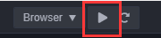
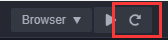
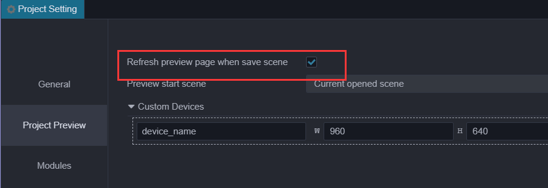
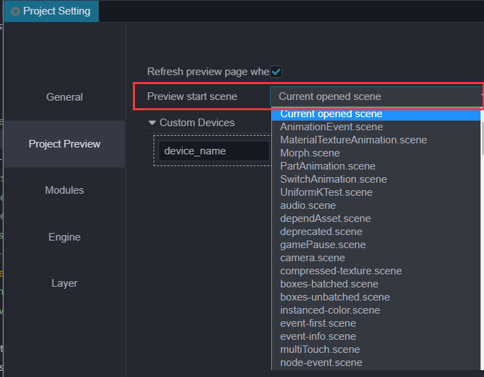

# Preview In Browser

## How To Preview



Click the **Preview** button on top of editor window to see the game in action. After clicking, editor will launch the game in your default browser. We recommend [Chrome](http://google.com/chrome) as the browser of choice, since the developer tools in Chrome are most advanced in web debugging and inspecting.

There are a number of control in **Preview** page:

- On the left are viewport size presets to simulate how your game look on mobile devices.
- **Rotate** button to toggle between landscape and portrait view.
- **Debug Mode** let you control the severe level of logs to be shown.
- **Show FPS** toggle framerate and draw call stats display.
- **FPS** framerate cap.
- **Pause** to pause game.


## Refresh Preview Page



If we want to refresh the preview page after some modified, just refresh in browser or click the refresh button in editor.<br>
The difference is that click refresh button in editor will **refresh all preview pages**.If you want the preview page to refresh automatically, just save the scene.The settings for saving scene auto-refresh can be enable in __Project Settings -> Project Preview__.



## Scene of Preview

The editor will use **the current scene** as start-scene of preview, we can modified it in `Project Settings-> Project Preview`. For more information, please refer to the [Project Settings](../project/index.md) documentation.



## Preview In Mobile

There are the following ways to debug the preview page on the mobile phone:

- **Use the mobile browser preview mode of Browser Developer Tools**

- **Scan preview QR code**

    Move the mouse to the ip preview address on the left side of the editor toolbar, and a preview QR code will be displayed, which can be scanned with your mobile phone.

- Directly **Enter the preview address in the mobile browser**

  

> **Note**: make sure the mobile phone and the computer is **on the same network segment**.Since there will be multiple networks on the computer, if the IP address of the preview URL in the editor is incorrectly, you can modify it in **Preferences-> General Settings-> Select Local Preview Address**. Please refer to the description of the [preference settings](../preference/index.md) documentation.

## Custom Preview Template

We can add custom preview template to change the preview result, just put your template in `preview-template` folder in the project dictionary. Editor also use template to render to `index.html`. If there is a file named `index.ejs` in this dictionary, editor will use it as the template that render to `index.html`. You can click the menu in editor **Project —> Generate Preview Template** to get the latest template used in editor.

```
project-folder
 |--assets
 |--build
 |--preview-template
        |--index.ejs
```

> **Note**: there are some preview menu items and preview debugging tools in the preview template, We recommended you keep all the content and **just add what you need** or modified code carefully to avoid some unexpected errors.. In addition, if `index.html` and `index.ejs` coexist, `index.html` **will replace** `index.ejs` as the render-template for preview page.

### Examples of Use

Code of this example is stored in the [test-case-3d](https://github.com/cocos-creator/test-cases-3d) repository.

1. **Get lasted preview template**

     Click the menu **Project-> Generate Preview Template** to generate a preview template, and the address generated by the preview template will be printed in the console.

2. **Add script in folder**

    Add the scripts you need to use in folder, such as `test.js`, where `<%-include (cocosTemplate, {})%>` contains the default logic for starting the game. `test.js` in the example below will be loaded after the game starts.

3. **Modify `index.ejs`**

    Open `index.ejs` and modify as follows:

    ```html
    <html>
        ...
        <body>
            ...
            <%- include(cocosTemplate, {}) %> // Game start processing logic
            <script src="/test.js"></script> // New script
        </body>
    </html>
    ```

4. **Place `test.js` in the `preview-template` folder like blow**

    ```
    |--preview-template
            |--index.ejs
            |--test.js
    ```

5. **Preview**

    Now, you can refresh your preview game to see changes.

## Add Custom Devices Info

Open __Project —> Project Preview__. Custom device info can be modified on this page, and changes will work after refreshing the preview page.


## Debugging with browser Developer Tools

Take Chrome for example, open menu and choose __Developer/Developer Tools__ to open the __Developer Tools__. It is possible to debug source code, add breakpoints, check the call stack and use step control during debugging.

To learn more about using DevTools, please read the [Chrome Dev Tools User Guide](https://developer.chrome.com/devtools) documentation, or other browser's developer documentation.

## Browser compatibility

The desktop browsers tested during __Cocos Creator__ development include: **Chrome**, **Firefox (Firefox)**. Other browsers can be used as long as the kernel version is high enough, for some browsers do not enable IE6 compatibility mode.

Browsers tested on mobile devices include: **Safari (iOS)**, **Chrome**, **QQ browser**, **UC browser**, and **WeChat built-in Webview**.
