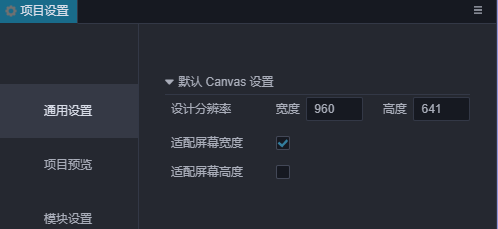
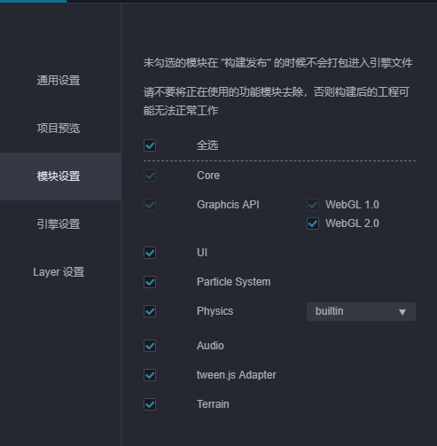
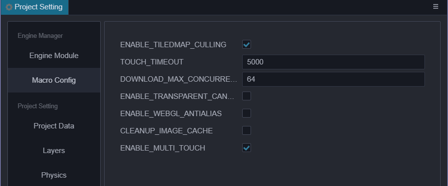
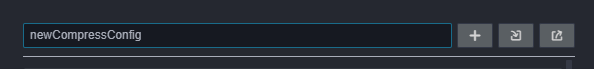
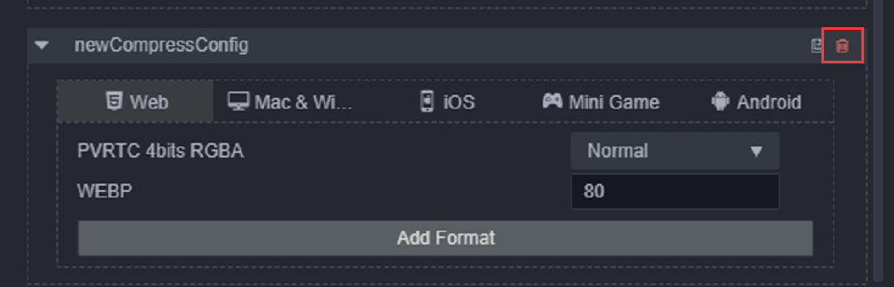
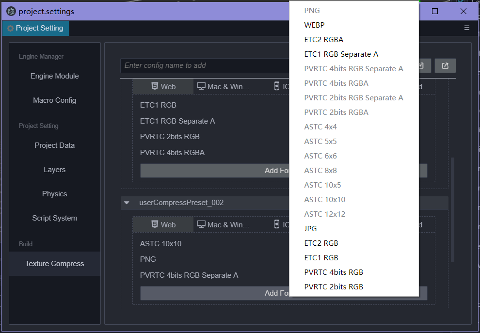
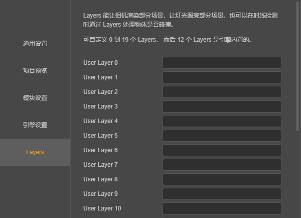
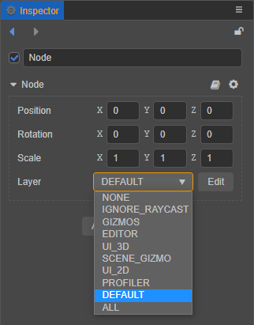
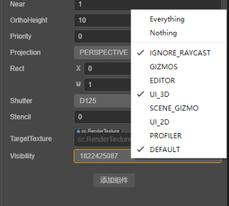

# Project Settings

The **Project Settings** windows are available from Cocos Creator’s main menu (**Project > Project Settings**) which includes all the settings related to your project. These settings will be saved in the project's `settings / packages` folder. If you need to synchronize project settings between different developers, this folder should be added in your source control system.

## General



### Default Canvas settings

The default Canvas settings include design resolution and adapted screen width/height, which are used to specify the default design resolution value in Canvas when creating a new scene or Canvas component, as well as the `Fit Height, Fit Width` options.

For more information, please refer to the [Multi-resolution adaptation scheme](../ui-system/components/engine/multi-resolution.md) documentation.

## Engine Modules



The setting here is to crop the modules used in the engine to reduce the size of the released engine. Modules not selected in the panel will be cropped when they are packaged and previewed. It is recommended to perform a complete test after released to avoid using cropped modules in scenes and scripts.

## Macro Config

For more information and code of the engine macro module, please refer to the [Engine macro](https://github.com/cocos-creator/engine/blob/3d/cocos/core/platform/macro.ts#L824) documentation.

This panel here provide the convenience to modify the macro configuration. The **Macro Config** will take effect during preview and build. At the same time, the default value of the current macro configuration will be updated with the configuration of the custom engine.



## Texture Compress

> In Cocos Creator 3.0, the editor has modified the use of compressed texture configuration to configure presets in project settings and select presets for image asset's inspector. After the old version of the project is upgraded, the editor will automatically scan all the compressed texture configurations in the project and sort out as several presets.

Used to add compressed texture preset configuration, you can directly select the compressed texture preset to quickly add in the inspector of image asset. At the same time, after adding presets, you can also directly modify the presets to update batch texture compress configuration. Project settings allow users to add multiple compressed texture configurations, and each compressed texture configuration allows to add different format for different platform categories.

Platform is rough devised as following:

1. Web: refers to the two platforms Web-Mobile and Web-Desktop
2. Mac & Windows
3. iOS
4. Mini Game: Refers to the mini-games of various manufacturers' platforms, such as WeChat Mini Games and Huawei Quick Game Waiting;
5. Android

For the detail of the texture compression support of the platforms, please refer to the [Compressed Texture Chapter](../../asset/compress-texture.md) documentation.

### Add / remove texture compression presets

Enter the name of the compressed texture preset in the input box and press **Enter** or the plus button on the left to add it.



After adding the compressed texture preset, if you need to delete it, you can directly move the mouse to the preset name and click the delete button on the right.



### Add / remove texture compression format

Click the `Add Format` button, select the desired texture format, and configure the corresponding quality level. Currently, only one image format of the same type can be added at the same time.



To delete, move the mouse over the texture format and click the red delete button.

### Modify compressed texture preset name

The name of the compressed texture is only used for display. When adding a compressed texture preset, uuid will be randomly generated as the ID of the preset, so directly modifying the preset name will not affect the reference to the preset in the image asset.


### Export / import compressed texture presets

The compressed texture configuration page allows developers to import and export compressed texture presets for better cross-project reuse. It is also possible to edit the compressed texture presets externally and import them into the editor.

In most cases, importing and exporting directly works well. If, however, the configuration needs to be customized, please refer to the following interface definitions and examples:

```ts
type IConfigGroups = Record<ITextureCompressPlatform, IConfigGroupsInfo>;
type ITextureCompressPlatform = 'miniGame' | 'web' | 'ios' | 'android' | 'pc';
type ITextureCompressType =
    | 'jpg'
    | 'png'
    | 'webp'
    | 'pvrtc_4bits_rgb'
    | 'pvrtc_4bits_rgba'
    | 'pvrtc_4bits_rgb_a'
    | 'pvrtc_2bits_rgb'
    | 'pvrtc_2bits_rgba'
    | 'pvrtc_2bits_rgb_a'
    | 'etc1_rgb'
    | 'etc1_rgb_a'
    | 'etc2_rgb'
    | 'etc2_rgba'
    | 'astc_4x4'
    | 'astc_5x5'
    | 'astc_6x6'
    | 'astc_8x8'
    | 'astc_10x5'
    | 'astc_10x10'
    | 'astc_12x12';
type IConfigGroupsInfo = Record<ITextureCompressType, IQuality>
interface ICompressPresetItem {
    name: string;
    options: IConfigGroups;
}
```

Example:

```json
{
    "default": {
        "name": "default",
        "options": {
            "miniGame": {
                "etc1_rgb": "fast",
                "pvrtc_4bits_rgb": "fast"
            },
            "android": {
                "astc_8x8": "-medium",
                "etc1_rgb": "fast"
            },
            "ios": {
                "astc_8x8": "-medium",
                "pvrtc_4bits_rgb": "fast"
            },
            "web": {
                "astc_8x8": "-medium",
                "etc1_rgb": "fast",
                "pvrtc_4bits_rgb": "fast"
            },
        }
    },
    "transparent": {
        "name": "transparent",
        "options": {
            "miniGame": {
                "etc1_rgb_a": "fast",
                "pvrtc_4bits_rgb_a": "fast"
            },
            "android": {
                "astc_8x8": "-medium",
                "etc1_rgb_a": "fast"
            },
            "ios": {
                "astc_8x8": "-medium",
                "pvrtc_4bits_rgb_a": "fast"
            },
            "web": {
                "astc_8x8": "-medium",
                "etc1_rgb_a": "fast",
                "pvrtc_4bits_rgb_a": "fast"
            },
        }
    }
}
```

## Layers



- Layers allows the camera to render part of the scene and let the light illuminate part of the scene.
- You can customize 0 to 19 Layers, and the original settings will be deleted when you clear the input box.
- The last 12 Layers are built-in in the engine and cannot be modified.
- The layers of node matches the visibility option of the camera, the camera can only see nodes whose layer is included in the camera's visibility.

    

     

For more instructions, please refer to [Camera Component introduction](./../components/camera-component.md);

## Physics

Used to configure the parameters of the physics environment. For details, please refer to the [Physics Configs](physics-configs.md) documentation.

## Bone map layout settings

Explicitly specify the bone texture layout to assist the instancing of the skinning models. For details, please refer to the [Joints Texture Layout](joints-texture-layout.md) documentation.
