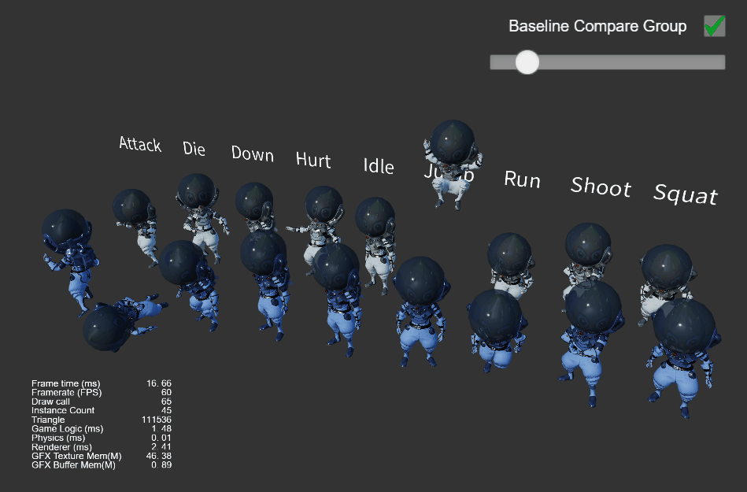
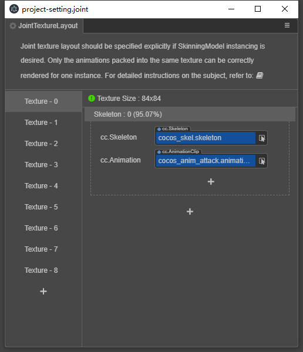

# Joint Texture Layout Settings

To ensure that the [Skeletal Animation](../../animation/skeletal-animation.md#About-Dynamic-Instancing) can also participate fully and correctly in [Dynamic Instancing](../../engine/renderable/model-component.md#Instancing-Batching), requiring the user to manually specify how the data for each joint texture is assigned.

For example, consider a scene with a large number of identical characters to draw, each of which may be walking, jumping, or attacking. If you want to be able to draw all characters correctly with one drawcall, an important prerequisite is that the data for all three animations is stored in the same joint texture. Currently, in the default [pre-baked skeletal animation mode](../../animation/skeletal-animation.md#pre-baked-skeletal-animation-system), the joint textures are automatically reused globally, but the size of each texture and which animations they store are unpredictable. If instancing of the skinned model is turned on directly without any processing, the final runtime effect is that some animations are correct and some are completely wrong and unpredictable. Therefore, we introduce the Joint Texture Layout Settings panel, which is used to manually specify which animation information is stored for which skeletons in each joint texture.

> **Note**: the Joint Texture Layout Settings panel provides what is essentially a runtime "memory allocation guideline". For the specified skeletons and animation resources, they are guaranteed to be allocated according to the specified rules, but if a resource is used at runtime that is not specified by the rules, it will go back to the automatic allocation mode of global reuse.

As an example, using the **instanced-skinning** scenario of the [show-case](https://github.com/cocos-creator/example-3d/blob/v3.0/show-cases/assets/scenes/instanced-skinning.scene) project to show the setup process and how it works in practice.

The figure below shows a sample scenario with multiple instances from the same model, each playing a completely different animation at the same time. These models use the real-time computation animation mode and do not have instancing turned on. As you can see, the current scene plus the UI has a total drawcall of 60 and an instance count of 0. This state will be used as a baseline for later changes as a comparison.

To create a model with the instancing turned on, you need to:

- Make sure `useBakedAnimation` is checked on the SkeletalAnimationComponent.
- Check `USE_INSTANCING` for all materials used by SkinningModel.

In the example scene (referenced above) two sets of prefabs are made and the material diffuse color set to blue in the instancing version in order to see and distinguish between the two systems at the same time. Notice that the effect has been exactly correct and that only 5 drawcalls (each model is divided into 5 parts) were used, with 45 instances.

> **Note**: the reason all models are rendered correctly here is that the amount of animation data is relatively small, and the global reuse logic of the generic joint texture already writes all animation data to the same texture, so the effect is correct. However, if the size of the default joint texture is exceeded by new animations that may be added at any time, the animation will definitely go wrong, which is why the joint texture layout panel must exist.

For display purposes, we can intentionally place each animation on a separate texture in the layout panel to see the final rendering effect.

Open the Skeletal Texture Layout settings panel via menu **Panel -> Animation -> Joint Texture Layout**:

- Click the plus sign ① to add a Texture unit, which is composed of multiple Skeleton units.
- Click the plus sign ② to add a Skeleton unit, which consists of a Skeleton resource and one to more AnimationClip resources.
- Click the plus sign ③ to add an AnimationClip resource slot.

Here we have 9 different animations separated into 9 Texture cells:

Re-running the scene, the effect becomes:

As you can see, there is a problem with the animation, all the animations become attack actions, and there is a problem with the model disappearing from time to time. The reason behind this can be precisely analyzed:

- Each drawcall draws 9 instances, which are playing 9 different animations.
- But the skeletal animation texture can only be use one per drawcall. It is obvious that Texture unit 0 is used here and there is only one attack animation.
- And the length of different animation clips is different, some clips longer than attack will be read outside the valid area of Texture unit 0 in the last period. The data here is not defined (usually all 0 by default), which is not valid skeleton transformation data, so naturally it cannot be rendered correctly.

> **Note**: all 9 textures here have only the same skeletal animation information, so only the actions are wrong in the final result, even if the textures are not right; but if there are multiple skeletons with animation information in one texture, and the texturs doesn't match at the same time, the rendering effect will be completely wrong.

For this example scene, since the model does need to play the 9 animation clips simultaneously on the same screen, the correct joint texture layout is set as follows:

This will now be able to **guarantee** that it renders correctly. Observe the change in the relevant data on the panel:

- Texture cell 0 has a total size of 276 x 276 (automatically generated by the algorithm, the minimum size sufficient to hold all the specified animation data).
- the specified 9 groups of animation data take up 94.41% of this texture, with 5.59% excess space; (this space does not participate in global reuse at runtime)

In addition, the color of the icon next to the texture size indicates the device adaptation of the current texture.

- Green (side length less than 1024): supported on all devices.
- Yellow (side length between 1024 and 2048): may not supported on some mobile devices or mini-game platforms that do not support floating point texture.
- Red (side length more than 2048): not supported on many mobile devices.

> **Note**: here are only 9 animations for one set of skeletons on one texture, but you can put **any number of animations for any number of skeletons** on each texture as long as the total size does not exceed the device limit. Usually it is more common to put multiple sets of skeletons on a single texture, for example for [flat shadows of skinned models](../../animation/skeletal-animation.md#About-Dynamic-Instancing).

We can continue to increase the number of instances in more scenes. We can see that the number of drawcalls does not change, and only the number of instances increases:

Feel free to try it out! This test scenario is the instanced-skinning scenario of the show-cases project in the [showcase repository](https://github.com/cocos-creator/example-3d).
