# Android Publish Example

In this section, we will introduce how to build Cocos Creator project with Android Studio.

Please prepare a Cocos Creator project with at least one scene.

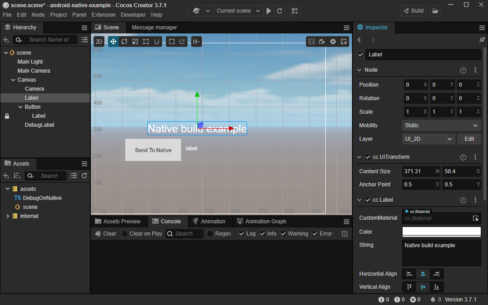

## Publish Workflow

### Configure the Android development Environment

- Download Android Studio

    Developers should download the appropriate IDE from the [official Android Studio](https://developer.android.com/studio).

- Reference Setting up the [Native Development Environment](../setup-native-development.md#Android%20Platform%20Dependencies) to set up the development environment

    - Download and install JDK
        - Reference [Native Development Environment](../setup-native-development.md#Downloading%20the%20Java%20SDK (JDK))
        - Type `java -version` in the terminal to verify if the installation is successful.

            

            > Please refer to [How do I set or change the PATH system variable?](https://www.java.com/en/download/help/path.html) to set up your own environment<br>
            >
            > **Note**：The author utilizes [OpenJDK](https://openjdk.org/), which has similar features as the JDK but follow anther open-source protocol.

    - Download and install the Android SDK
        - Here is an example how to download Android SDK through Android Studio

            - Start Android Studio

            - Open Settings/Preferences panel from the main menu

                

                > The name of the setting panel differs on the platform. It is called **Settings** on Windows but **Preferences** on MacOS.

            - Navigate to the Android SDK page in the Settings/Preferences panel.

                

            - Select at lease one suitable SDK to download. You can choose the recommended version mentioned in [Downloading the SDK and NDK required to publish to the Android platform](../setup-native-development.md#Downloading%20the20SDK20and20NDK20required20to20publish20to20the%20Android%20platform).

                - As an example, we will be using Android 11.0 (R). Check the box next to the name and then click either the OK or Apply button to proceed

                - Click the OK button in the pop-up dialog

                    

                - Please wait until the download is finished

                    

        - Manually downloading the Android SDK

            In case of network connectivity issues, you can manually download the Android SDK and put it in the directory configuring in **Android SDK Location**.

            > You could click the **Edit** button to choose a different path.

            

        - SDK mirrors(Optional)

            - Setting HTTP Proxy in Android Studio:

                - Auto-detect proxy settings：

                    In the Settings panel of Android Studio, navigate to the HTTP Proxy and select the **Auto-detect proxy settings** option, and then input the mirror links blow.

                    

            - Optional mirrors：

                Here are some alternative mirrors for the Android SDK and Gradle than can help developers resolve download issues when downloading failed from the official website. However, if  these mirrors dot not work, you may need to search for other mirrors.

                | Mirror   | Address                                                |
                | :------- | :----------------------------------------------------- |
                | Tencent(CN)  | <https://mirrors.cloud.tencent.com/AndroidSDK/>        |
                | AliCloud(CN) | <https://mirrors.aliyun.com/android.googlesource.com/> |

                > In case these mirrors are not working, please search for other valid mirrors.

    - Download And Install Android NDK
        - Please refer to [Downloading the SDK and NDK required to publish to the Android platform](../setup-native-development.md#Downloading%20the%20SDK%20and%20NDK%20required%20to%20publish%20to%20the%20Android%20platform) to download the appropriate version of Android NDK(**r18~21**).

            - Download the Android NDK from Android Studio

                - Navigate to the **Android SDK** page in Android Studio **Settings** panel

                    > **Note**: check **Show Package Details** <br>
                    > 

                    

                    Make sure to select the appropriate version to download. If the list fails to refresh, you can follow the steps in the next section to manually download the Android NDK.

            - Manually download

                - You could find the historical versions of Android NDK [here](https://github.com/android/ndk/wiki/Unsupported-Downloads#r20b)

                    For instance, let's consider the version r20b, which can be found in the link provided above. Make sure to select the appropriate version according to your operating system, and extract it to the directory previously set as the Android SDK Location.

                    

### Configure Android SDK and NDK in Cocos Creator

Navigate to the **Preferences** panel in Cocos Creator by clicking the **File** -> **Preferences** menu. From there go to the **Program Manager** page and configure the **Android SDK** and **Android NDK** properties with the following images.


The path should be like follows:

- NDK：

    

- SDK：

    

### Publish

The next step is to create a new build task and publish an Android APK on **Build** panel in Cocos Creator.

- Create Build Task

    - By clicking the **Project** -> **Build** menu to open **Build** panel.

        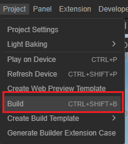

    - At the top of **Build** panel, click on the **New Build Task** button

        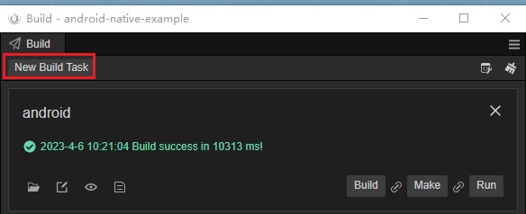P

    - To select **Android** as the build target platform, click on the drop-down menu

        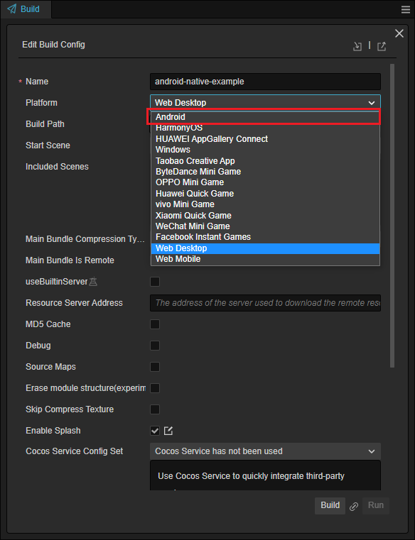

    - Make sure to have at least one scene designated as the Start Scene. If you have only one scene, it will be added by default

        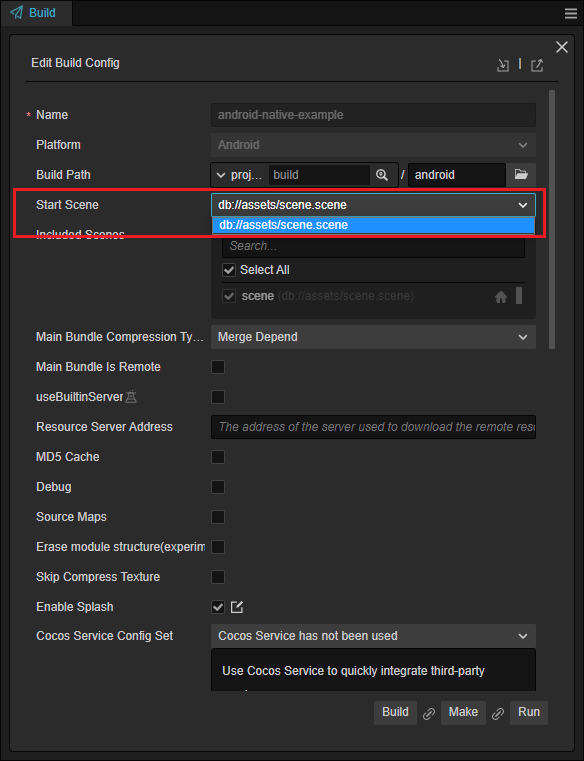

    - Please refer to  [Publishing to Native Platforms - Render BackEnd](../native-options.md#Render%20BackEnd) to select an appropriate render backend

        

    - Enter the Game Package Name

        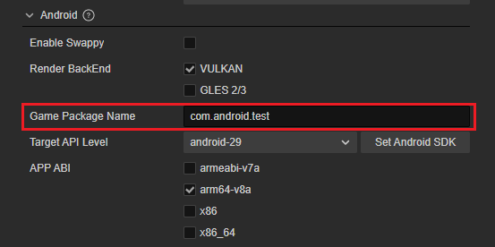

        > Please refer to [Bundle Identifier](../native-options.md#Bundle%20Identifier) for guidance your app's bundle identifier

    - Select Target API Level

        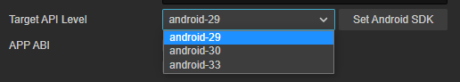

        > In case no dropdown content, please check the SDK and NDK configuration in Cocos Creator

    - Other build options please refer to  [Publishing to Native Platforms](../native-options.md)

- Build

    - To begin a build process, clicking on the **Build** button for the selected build task.

        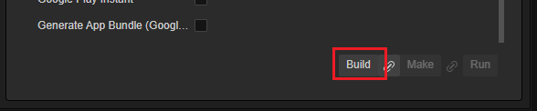

    - Please wait util the build process finished

        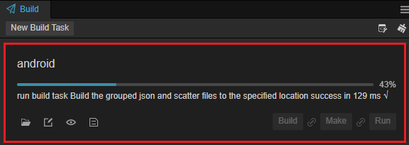

    - Compile Android Project

        - Click on the button below to open the folder containing the exported Android Project

          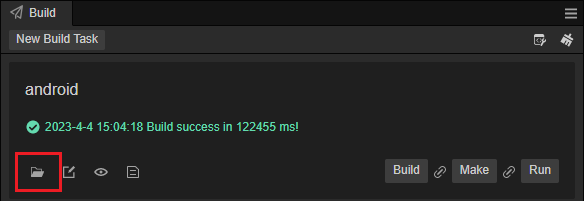

        - Locate corresponding directory

          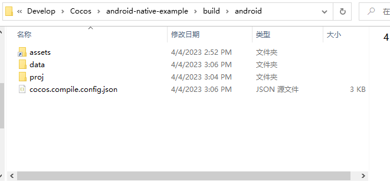

        - Click on the open menu on android studio

          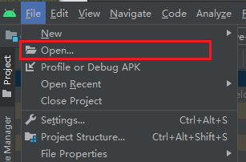

        - Navigate to the project path in the `{Your project}/build` directory, which is named 'android' by default, and open it using Android Studio.

          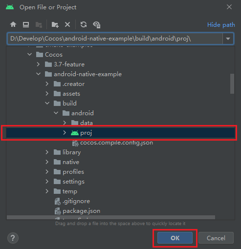

    - Build APK

        After the preparation has been completed by Android Studio, you can start building an Android APK. However, the sync process may take a long time to complete. If this happens, you can stop any ongoing background tasks by following the steps below:

        > Click on the background task on status bar:
        >  <br>
        > Close all background tasks by clicking on the close button
        > 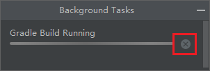

        - Click on **Build Bundle(s) / APK(s)** in the **Build** menu

            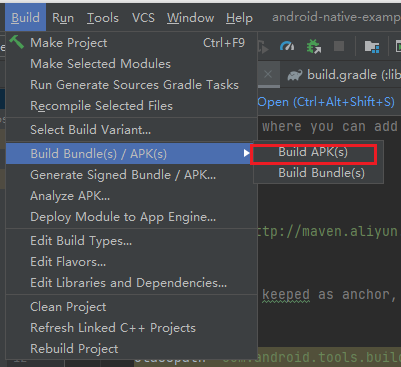

        - The debug APK could be found in the `{proj/build}` directory

            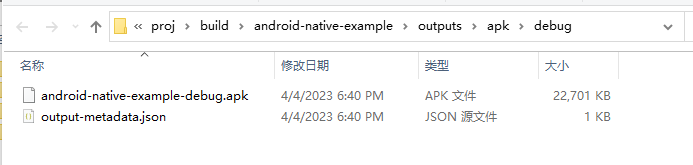

    - To build a release APK, you need to uncheck the **Use Debug Keystore** in your build task settings in Cocos Creator

        > Usually, you need to create a new build task to publish release version.

        

        In case there is no valid keystore, You can generate a new one using JAVA or Android Studio.

        Here is an example to create a new keystone via Android Studio menu.

        - Select Generate Signed Bundle / APK：

            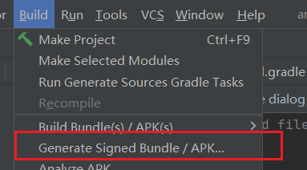

        - Select **APK** in the pop-up dialog

            

        - Create a new keystone by clicking on the **Create new ...** button

            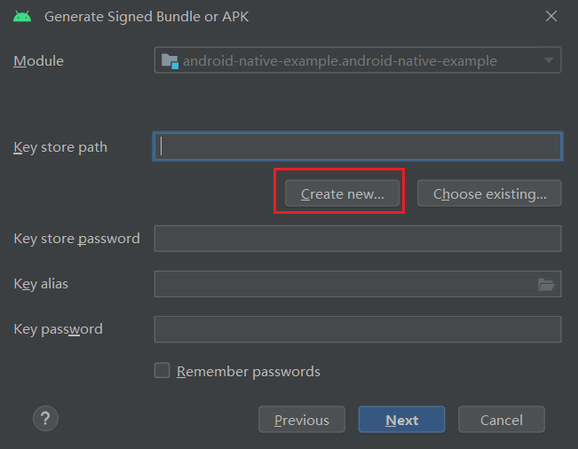

## Advanced

### Import Third-party Libraries

Please refer to [Use your library in other projects](https://developer.android.com/studio/projects/android-library#psd-add-library-dependency) to add third-party libraries that required by the application marketplace if you intend to distribute your app to the market.

### Communication between JAVA and TypeScript

Cocos Creator supports various ways to communicate between native and TypeScript.

When accessing common SDKs, we need to use the SDK's login interface to perform login operations. After obtaining the login result, the result is then passed to the TypeScript layer for game processing.

The engine provides [Simplify the use of JavaScript to call Java methods](../../../advanced-topics/js-java-bridge.md) to solve these problems more quickly. In general, this mechanism is convenient for interfacing with the SDK's actions such as registration and login.

- After the `onCreated` method in `AppActivity.java` of your Android Project, insert the provided code snippet

    ```java
    @Override
    protected void onCreate(Bundle savedInstanceState) {
        super.onCreate(savedInstanceState);
        // DO OTHER INITIALIZATION BELOW
        SDKWrapper.shared().init(this);

        JsbBridge.setCallback(new JsbBridge.ICallback() {
            @Override
            public void onScript(String arg0, String arg1) {
                Log.d("[AppActivity]", "onScript: " + arg0 + "," + arg1);
                JsbBridge.sendToScript("sdklogin", "result json here");
            }
        });
    }

    ```

    One can receive messages from TypeScript in the `onScript` callback of `JsbBridge.setCallback`.

    To send messages to TypeScript, use `JsbBridge.sendToScript`.

- To establish communication between Typescript and JAVA, you can add a new component and attach it to any node in your start scene. Use the following provided code for the component.

    ```ts
    import { _decorator, Component, Label, native } from 'cc';
    import { NATIVE } from 'cc/env';
    const { ccclass, property } = _decorator;

    @ccclass('DebugOnNative')
    export class DebugOnNative extends Component {

        @property(Label)
        debugLabel: Label = null;

        start() {
            if (NATIVE) {
                native.bridge.onNative = (arg0: string, arg1?: string | null) => {
                    console.log('onNative', arg0, arg1);

                    this.debugLabel.string = 'onNative' + arg0 + "," + arg1;
                }
            }       
        }

        onSendToNative() {
            if (NATIVE) {
                native.bridge.sendToNative("logInToGameSerivceResult", "isOK=true");
            }
        }
    }
    ```

    You can use the `native.bridge.sendToNative` method to send messages to the JAVA layer, which can then be received in the `onScript` method of `JsbBridge.setCallback`. Similarly, the `native.bridge.onNative` callback can handle any messages sent from the JAVA layer using `JsbBridge.sendToScript`.

    If you build the Android project and start the application on your Android device, logs can be noticed after trigger the `onSendToNative`  method:

    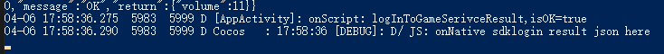

    > **Note**:
    > 1. Use the **NATIVE** macro to control access permissions. Only the native application can access there methods.
    > 2. It's necessary to wait for the engine initialization to be completed before calling `JsbBridge.sendToScript` to send messages to JAVA.
    > 3. One can only transfer strings through this method, for complex data, it is recommended to encode them in JSON format before transmission.

For complex data, please refer to [JSB Swig](../../../advanced-topics/jsb-swig.md) or [Tutorial: JSB 2.0](../../../advanced-topics/JSB2.0-learning.md)。

### Mechanism of Build Extension

Please refer to [Extending Build Process](../custom-build-plugin.md) to extend the publishing mechanism by the extension system.

## Q&A

- Q：How to debug publishing errors
    - A：You can debug publishing errors by opening the log.txt file using the log button

        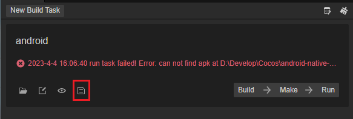

- Q：Missing LIB_EGL
    - A：Change you NDK to the version mentioned above.

- Q：Asset name mechanism
    - A：Since Android is based on Linux, some file specifications of Linux still apply in Android, such as
        - 1. Android is case-sensitive, make sure the path is case-sensitive, otherwise it will not load correctly
        - 2. Do not include spaces in the folder or file name
