# Android Development Environment Setup

## Download Android Studio

Developers should download the appropriate IDE from the [official Android Studio](https://developer.android.com/studio).

Reference Setting up the [Native Development Environment](../setup-native-development.md#Android%20Platform%20Dependencies) to set up the development environment

## Download and install JDK

Reference [Native Development Environment](../setup-native-development.md#Downloading%20the%20Java%20SDK (JDK))

Type `java -version` in the terminal to verify if the installation is successful.

> Please refer to [How do I set or change the PATH system variable?](https://www.java.com/en/download/help/path.html) to set up your environment 
>
> **Note**：The author utilizes [OpenJDK](https://openjdk.org/), which has similar features as the JDK but follows another open-source protocol.

Download and install the Android SDK

### Auto Download

Here is an example of how to download Android SDK through Android Studio

1. Start Android Studio

2. Open the Settings/Preferences panel from the main menu
    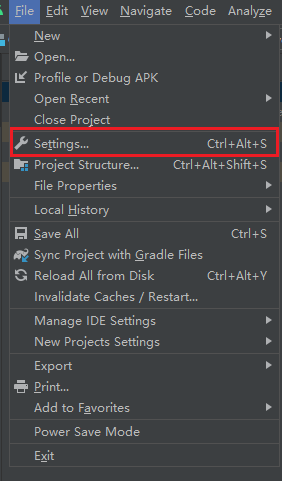

    > The name of the setting panel differs on the platform. It is called **Settings** on Windows but **Preferences** on MacOS.

3. Navigate to the Android SDK page in the Settings/Preferences panel.
    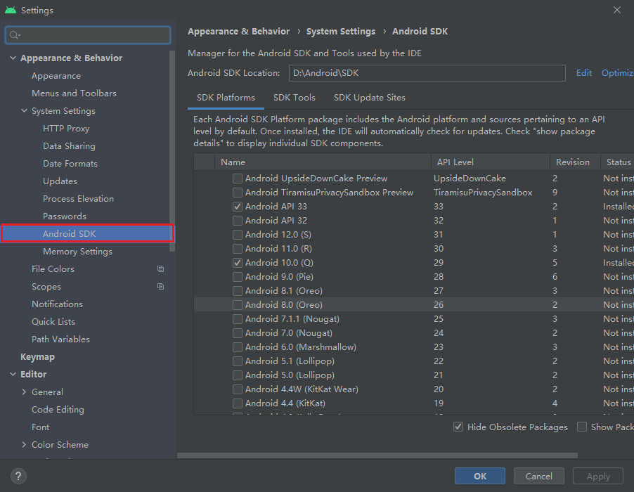

4. Select at least one suitable SDK to download. You can choose the recommended version mentioned in [Downloading the SDK and NDK required to publish to the Android platform](../setup-native-development.md#Downloading%20the20SDK20and20NDK20required20to20publish20to20the%20Android%20platform).

    - As an example, we will be using Android 11.0 (R). Check the box next to the name and then click either the OK or Apply button to proceed

    - Click the OK button in the pop-up dialog
        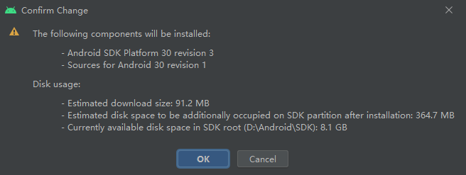

    - Please wait until the download is finished
        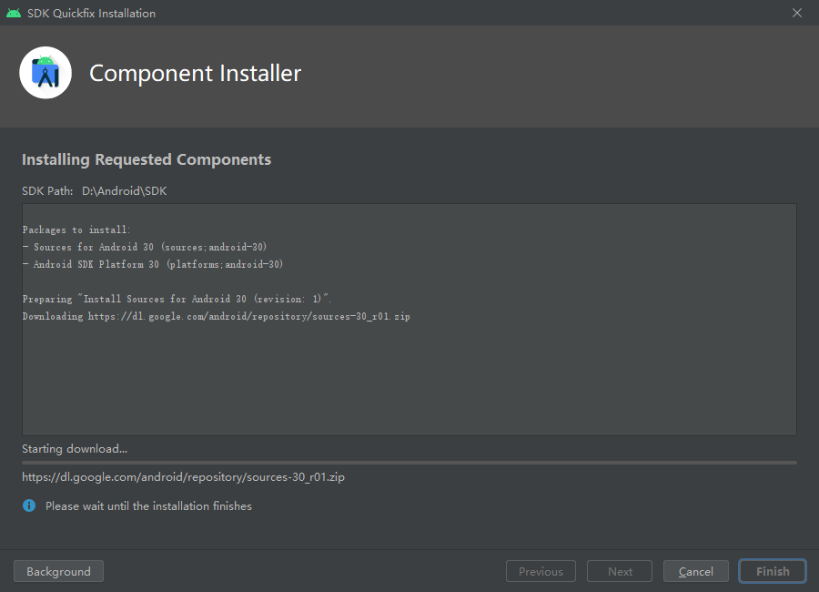

### Manually downloading the Android SDK

In case of network connectivity issues, you can manually download the Android SDK and put it in the directory configuring in **Android SDK Location**.

You could click the **Edit** button to choose a different path.

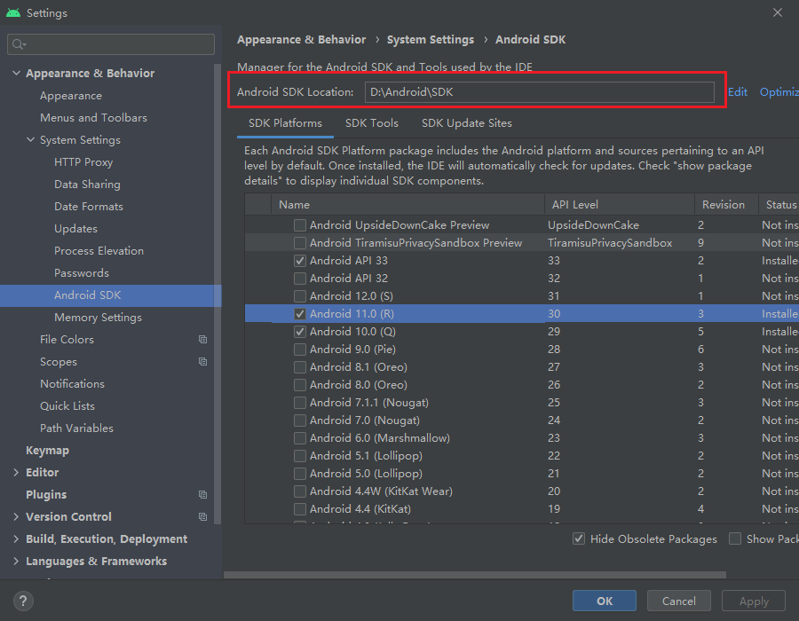

You can change to use SDK mirrors(Optional) by setting HTTP Proxy in Android Studio.
**Auto-detect proxy settings：** In the Settings panel of Android Studio, navigate to the HTTP Proxy and select the **Auto-detect proxy settings** option, and then input the mirror links below.

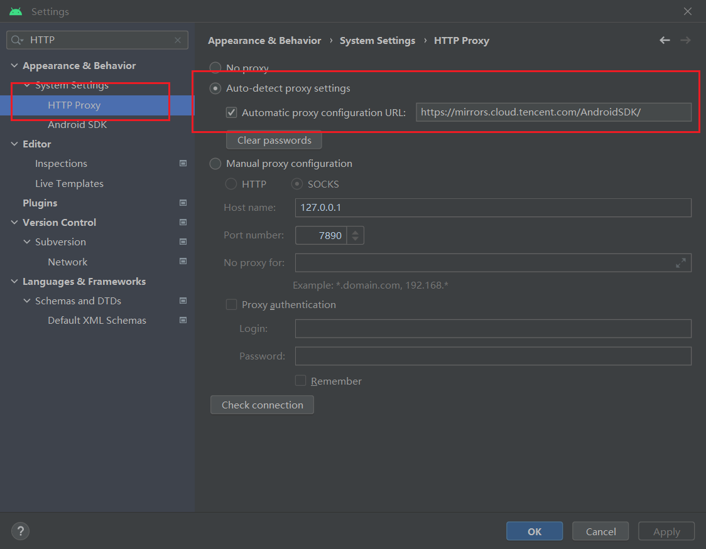

**Choose specific mirrors：** Here are some alternative mirrors for the Android SDK and Gradle that can help developers resolve download issues when downloading failed from the official website. However, if these mirrors do not work, you may need to search for other mirrors.

| Mirror   | Address                                                |
| :------- | :----------------------------------------------------- |
| Tencent(CN)  | <https://mirrors.cloud.tencent.com/AndroidSDK/>        |
| AliCloud(CN) | <https://mirrors.aliyun.com/android.googlesource.com/> |

> In case these mirrors are not working, please search for other valid mirrors.

## Download And Install Android NDK

Please refer to [Downloading the SDK and NDK required to publish to the Android platform](../setup-native-development.md#Downloading%20the%20SDK%20and%20NDK%20required%20to%20publish%20to%20the%20Android%20platform) to download the appropriate version of Android NDK(**r18~21**).

### Download the Android NDK from Android Studio

Navigate to the **Android SDK** page in Android Studio **Settings** panel.

**Note**: check **Show Package Details**
> 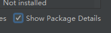

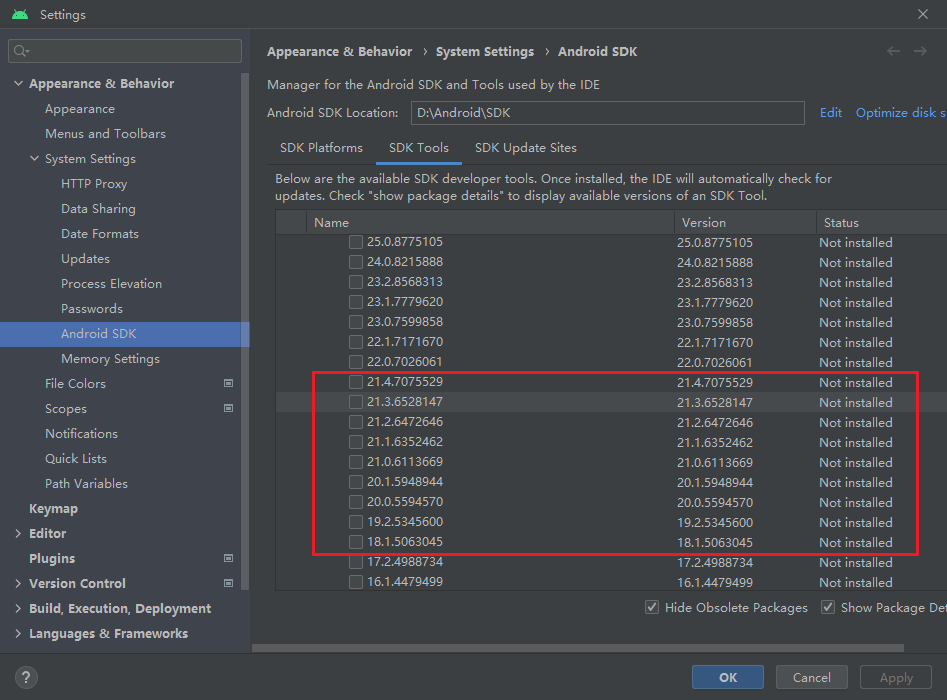

Make sure to select the appropriate version to download. If the list fails to refresh, you can follow the steps in the next section to manually download the Android NDK.

### Manually download

You could find the historical versions of Android NDK [here](https://github.com/android/ndk/wiki/Unsupported-Downloads#r20b)

For instance, let's consider the version r20b, which can be found in the link provided above. Make sure to select the appropriate version according to your operating system, and extract it to the directory previously set as the Android SDK Location.

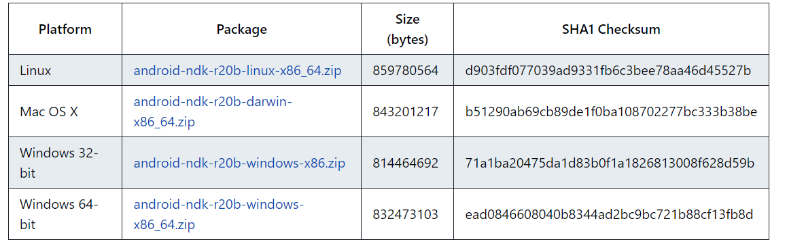

## Configure Android SDK and NDK in Cocos Creator

Navigate to the **Preferences** panel in Cocos Creator by clicking the **File** -> **Preferences** menu. From there go to the **Program Manager** page and configure the **Android SDK** and **Android NDK** properties with the following images.

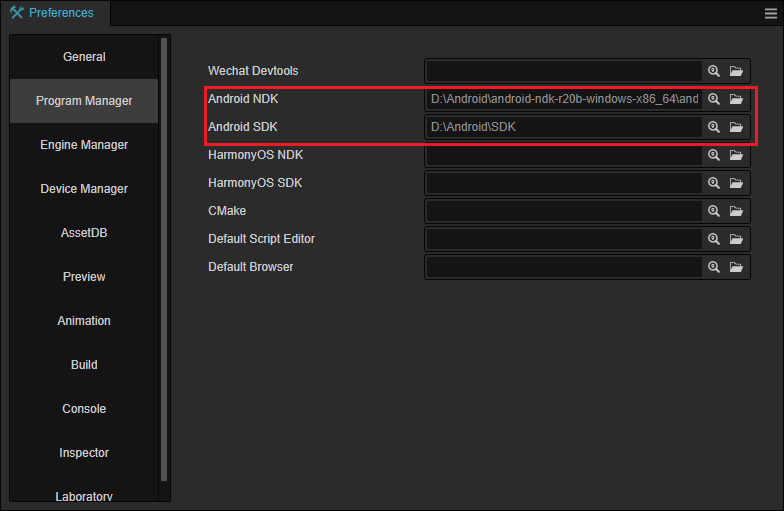

The path should be like follows:

**NDK:**

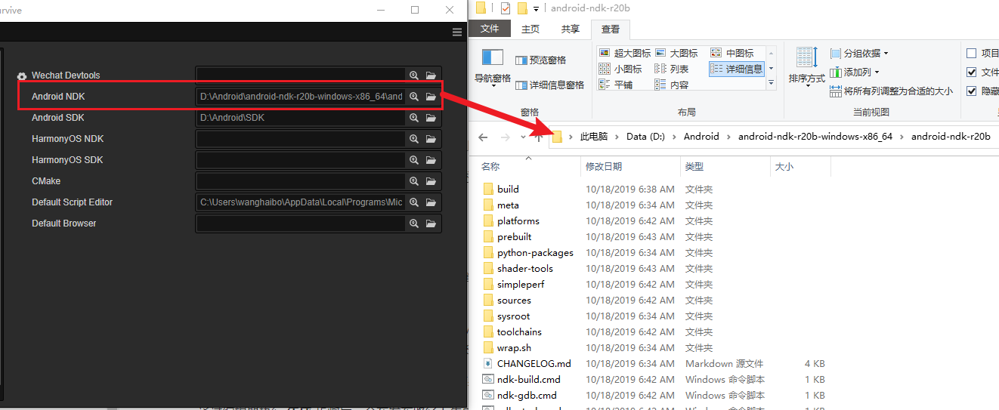

**SDK：**

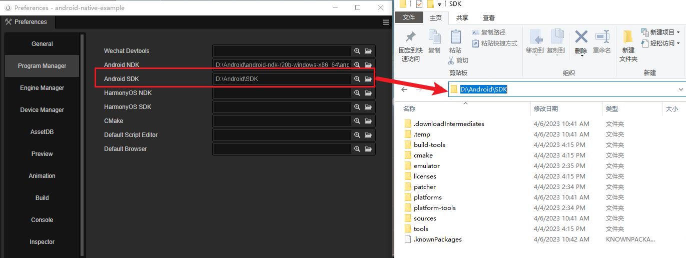
