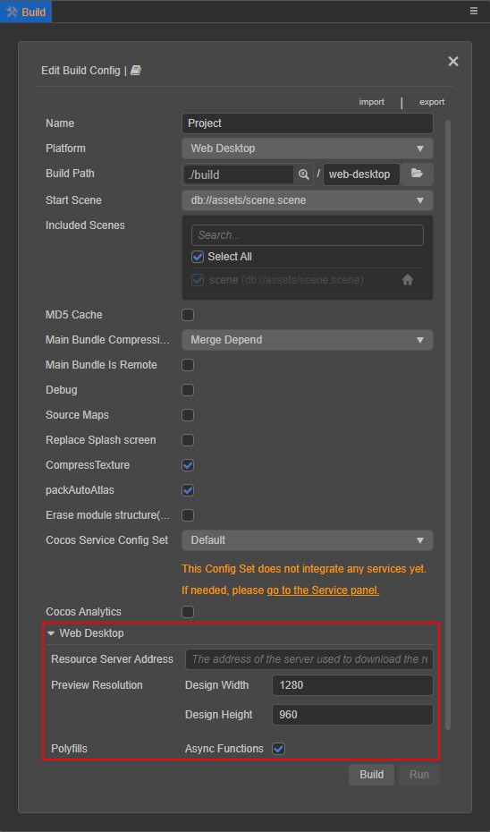
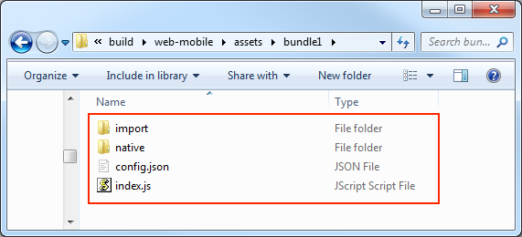

# Introduction to the Build process and FAQ

## Introduction to the Build Infrastructure

The build process mainly includes the following two parts:

- **General build processing**
- **Build processing for each platform**

Due to the adjustment of the build mechanism in v3.0, the build process of different platforms is injected into the **Build** panel in the form of **build plugins**, each participating in the build process. The build options specific to each platform are displayed in the **Build** panel in the form of expanded options. Developers can inject custom build options into the panel through [Build Plugin](custom-build-plugin.md).



## General Build process flow

The general Build process of Cocos Creator mainly includes the following contents:

1. Initialization of build options
2. Build data organization
3. Write the built resources to the file system
4. Organize `settings.json`/`config.json` data
5. UUID compression and file writing in `config.json`

### Initialization of Build options

This step is mainly to initialize the **initial options** passed to the build during the build to **build internal options**, complete the format conversion of some of the build options, initialize the resource data of the build resource database, and load the latest resource information and classified.

### Build data organization

When building, the editor will first summarize the current scenes involved in the build and all resources in the [Bundle](../../asset/bundle.md) and then search for dependent resources through engine deserialization, and recursively find a list of all the resources that need to be packaged. After the resource list is summarized, the resources will be classified according to the Bundle configuration, and scripts, image compression tasks, and json grouping information will be collected.

The engine will configure the scripting environment of the entire project before deserialization, that is, load all non-plug-in scripts. Whether the script is successfully loaded will directly affect the deserialization. If the script fails to load because the script is not correctly written, it will directly cause the build to fail.

If the engine finds that the dependent resources are missing during the deserialization process, it will issue a warning, but will continue to build. The warning does not mean that the problem does not need to be solved. If the resource is lost and it is not solved, it is difficult to guarantee that the content after the build is correct.

### Write the built resources to the file system

The constructed resources will be configured according to the [Asset Bundle](../../asset/bundle.md#%E9%85%8D%E7%BD%AE%E6%96%B9%E6%B3%95) and distributed in different locations. After the build is completed, the Asset Bundle will be packaged into the `assets/[Bundle name]` under the corresponding platform release package directory. The directory structure is as follows:



For more information about Asset Bundle configuration, building, file description, etc., please refer to the [Asset Bundle](../../asset/bundle.md) documentation.

After finishing the basic build tasks, the build will continue with the other build processes according to the unprocessed units of each Bundle.

It is divided into the following steps:

- **Script building**: The script building in the editor is divided into **plug-in scripts** and **non-plug-in scripts**.

    - The plug-in script will directly copy the source files according to the original directory structure to the `src` directory under the release package directory generated after the build, the plug-in script does not support any script form that needs to be compiled, such as TypeScript or JavaScript (ES6). The resource information of the plug-in script will be written into the jsList array in settings.

    - All non-plugin scripts will be packaged into `project.js` (`project.dev.js` in debug mode) and placed in the corresponding `src` directory. Checking the `sourceMap` option will generate the corresponding map file, and determine whether the script is compressed according to the debug option.

- **Automatic Atlas Processing**: Will query the Auto Atlas resource information within the project, package the SpriteFrame small images under the atlas into a large image, generate serialized files, etc. according to the configuration of the automatic atlas resource. This step will modify the json grouping information, asset resource grouping information, and add texture compression tasks. If the Auto Atlas is not checked in the build option, no processing will be performed.

- **Texture compression**: According to the organized image compression task, the image resources are compressed and written into the build folder. If the build option is not checked for texture compression, no processing will be performed.

- **Engine building**: According to the **function tailoring** in the project settings, remove the unused engine modules and pack them into the cocos-js directory. Checking the `sourceMap` option will generate the corresponding map file, and determine whether the script is compressed according to the debug option.

    The main steps of engine packaging include:

    - Get **engine module information in project settings**.

    - **Check** whether the engine version in the cache is consistent with the engine currently to be compiled, and if the content is consistent, copy it directly without compiling.

    - If compiling is needed, execute the task of packaging the engine according to the engine interface, then copy the compiled js file and save the modification time of the engine;

      When compiling the engine, [output log information](./build-panel.md#%E6%9E%84%E5%BB%BA-log-%E4%BF%A1%E6%81%AF%E6%9F%A5%E7%9C%8B) can be viewed:

      

      Regarding the reuse rules of engine files, it is necessary to elaborate:<br>
      The packaged engine file will be placed in the editor's global temporary directory (use `Build.globalTempDir` to print during the build process). The cache file is stored as the name according to the hash value generated by the parameters that will affect the engine compilation.

      ```bash
      global-temp-folder
      |--CocosCreator
          |--x.xx(3.0.0)
              |--builder
                  |--engine
                      |--1dc4a547f9...63a43bb8965.watch-files.json
                      |--1dc4a547f9...63a43bb8965
                      |--1dc4a547f9...63a43bb8965.meta
                  ...
      ```

      As long as any relevant engine build parameters are changed, the engine will be recompiled. The specific effects on the use of the build engine cache are:

        - debug: whether to open the debug mode
        - includeModules: engine module settings
        - sourceMaps: whether to enable sourceMap
        - platform: build platform
        - Engine modification time
        - Whether to check the separation engine (only WeChat mini game platform)
        - Use engine path

- **JSON build**: When serializing JSON, it will be merged and written into the file system (in the folder `assets/xxxBundle/import`) according to the JSON grouping and the bundle to which it belongs. If it is in **release mode, it will also serialize JSON The UUID inside is compressed**.

- **Common Asset Copy**: Some raw assets (rawAssets) are directly copied from the library to the built folder `assets/xxxBundle/native`.

- **md5 processing**: Add the `.md5` suffix to all resources in the `res` folder, and organize the data to be recorded in settings.

- **application.js template file generation**: Inject some project settings into the `application.js` file according to user options and generate it to the release package directory generated after the build.

### Organize settings/config data

It is mainly based on the data compiled by previous resources to prepare the configuration information necessary for the game to start.

Example `settings.json` structure:

```js
{
    debug: boolean; // Whether it is in debug mode, taken from the build release panel
    designResolution: ISettingsDesignResolution; // Canvas resolution setting, taken from the data in the project settings
    jsList: string[];
    launchScene: string; // Initial scene url
    moduleIds: string[]; // Information about all user script components
    platform: string;
    renderPipeline: string; // renderPipeline information, taken from the project settings
    physics?: IPhysicsConfig; // Physics module settings (only generated when the physics engine module is checked)
    BundleVers: Record<string, string>; // Bundle's md5 file stamp
    subpackages: string[]; // subcontract information
    remoteBundles: string[]; // Record the collection of remote package Bundle
    // server: string;
    hasResourcesBundle: boolean; // Does it contain resources built-in Bundle
    hasStartSceneBundle: boolean; // Whether it contains the built-in Bundle in the initial scene
    customJointTextureLayouts?: ICustomJointTextureLayout[];
    macros?: Record<string, any>; // Engine Macro configuration value, taken from project settings
}
```

Example `config.json` structure:

```js
{
    importBase: string; // The name of the import directory in the Bundle, usually'import'
    nativeBase: string; // The name of the native directory in native, usually'native'
    name: string; // The name of the Bundle, the Bundle can be loaded by the Bundle name
    deps: string[]; // Other Bundle names that this Bundle depends on
    scenes: Array<{url: string, uuid: string}>; // The array of scene information contained in the Bundle
    rawAssets: { [index: string]: { [uuid: string]: string[] } };
    // Store the url and type of the resource loaded under resources
    // Example: "bba00d3a-2f17-4511-b47c-0d584b21b763@6c48a": ["test/right/texture", "cc.Texture2D", "bba0...@6c48a"]
    // "bba0...@6c48a": ["test/right/texture", 1, 1]
    packs: Record<string, IUuid[] | number[]>; // json group information
    versions: { 
        import: Array<string | number>;
        native: Array<string | number>;
     }; // Only available after md5Cache is checked, the array part is 
     // stored in the format of [uuid_1, md5_1, uuid_2, md5_2, ...], 
     // where uuid_1 is a simple number indicating that the storage is 
     // the uuid index in the uuids array
    uuids: string[]; // uuid array, only in release mode
    types?: string[]; // Resource type array, only in release mode
    encrypted?: boolean; // Used natively to mark whether the script in the Bundle is encrypted
    isZip?: boolean; // Is it in zip mode
    zipVersion?: string;
}
```

The structure here only lists the structure of `settings.json` and `config.json` in a general sense. In fact, when packaging on different platforms, configurations should be added as needed.

### UUID compression and file writing in config.json

During the resource packaging process, the resource UUID involved in the resource building will be collected continuously, and finally sorted into the `config.json` of the bundle generated after the build. Before generating the `config.json`, it will decide whether to check the file according to whether it is in debug mode or not. The UUID is compressed.

All used UUIDs will be sorted during building, and the ones that appear **twice or more** will be stored in the `uuids` array, and the position of the previously used UUID will be replaced with the index. All `types` that appear **twice or more** will also be stored in the `types` array, and the previously used position will be replaced with the index.

#### Build resources

The building of resources in this step is to package resource files other than scripts, because scripts are packaged separately as special files. In the stage of packaging resources, the editor will first summarize **currently participating in the building of the scene and all resources in the Bundle directory. The packaging of each resource will be deserialized by the engine, and the dependent resources will be found and then recursively packaged** . Before deserialization, the script environment of the entire project will be configured, that is, all non-plug-in project scripts will be loaded. Since the loading of the script will directly affect the deserialization, if the script is not legally loaded, it will directly cause the build to fail. If a dependent resource is found to be lost during the deserialization process, a warning will be issued, but the building will continue. The warning here does not mean that the problem does not need to be resolved. **If the resource is lost and cannot be resolved, it is difficult to ensure that the content after the build is free of problems**.

After the resource is deserialized during the packaging process, it will be recompressed and serialized to reduce the package body after packaging. The serialized files of texture resources will all be packaged into a JSON file, and other serialized files will be subpackaged according to the build configuration parameters.

#### Build script

The script building in the editor is divided into **plug-in scripts** and **non-plug-in scripts**. For details, please refer to the description of **script building** in the previous section.

## building of each platform

The build provides part of the life cycle hook function, which is convenient for developers to participate in the building during different processing periods of the building and affect the building result. At the same time, the build also provides a way for developers to directly add some custom build options. The UI interface can be modified, provide data verification, etc. in the build options configuration page. For details, please refer to the [Build Plugin](custom-build-plugin.md). The build options injected by the build plugin will be stored in `options.packages`, the current way of writing option parameters built through the command line also needs to follow this rule.

### Compilation/generation process of each platform

The build process of all platforms that require/support separate compilation and generation have been split. Some developers may wonder why the current mini game platform has a new **Generate** button. In fact This part of the logic has always existed before, but it is merged in the **build** and cannot be controlled separately.

The **build** of the editor is similar to the function of an **export game package for the corresponding platform**, which is mainly to complete the interface of the engine to each platform and the compatibility of the basic format of the game package, which does not mean that all the work is completed. Each platform usually has its own compilation process, such as the compilation and upload function of the developer tools that come with the WeChat mini game platform, and the compilation, running and debugging functions of the relevant IDE for each native platform. If the developer needs to customize the packaging process for a specific platform, the editor needs to support the process of splitting in order to better access.

## FAQ Guide

The entire build process is in a single worker, to view the log information of the build process or view the complete call stack when an error occurs, click on the main menu, then **Developer -> Open Build Debug Tool**. In fact, a lot of log information will be output when building, but in order not to interfere with users, by default, only error information and important information will be printed to the editor's console, and the log information in the debugging tool is the most complete. Of course, the output log level can be set in **Preferences -> Resource Database -> Log Level**. For details, please refer to the [Build](./build-panel.md) documentation.

> **Note**: Before building **please make sure that the scene participating in the building can be previewed normally**. Loss of resources in some scenes or other script problems can be exposed during the preview stage. Building under the condition that the preview is normal can save time and troubleshoot better.

### Resource loading 404 errors

In case of a 404 error, please copy the `uuid` in the log that reported the error resource loss and search for the corresponding resource in **Explorer** to check whether the resources that the resource depends on are normal. Resource loading 404 errors usually occur under the following situations:

1. **Resources that are not placed in the Bundle are dynamically loaded in the script**.

    - **Reason**: Through the above introduction, we know that only the resources and their dependent resources in the Bundle directory, as well as the resources and their dependent resources participating in the construction scenario will be packaged into the final build folder, and **only the resource URL directly put into the `Bundle` folder will be written to the `config.json`**. If a resource is used in the script but the resource is not placed in any Bundle directory, a 404 error will appear when it is loaded.

    - **Solution**: Move the used resources to the Bundle folder.

2. **There is a problem importing the loaded resource, and the data cannot be generated normally to the library**

    - **Reason**: All the original data is obtained by reading the resource files in the library during construction. If the import fails, the correct corresponding resource information will not be obtained.

    - **Solution**: Find the corresponding resource through **Explorer**, right-click, and select **Reimport Resource** in the menu.

3. **Resource Loss**

    - **Reason**: As mentioned in the previous construction process, **resource construction will go through the reverse sequence to find dependent resources**, and the most frequent problem is that the dependent resources are accidentally during the project iteration process Delete and cause resource loss. The loss of these resources may not usually be noticed, but once the build is performed, it will be exposed.

    - **Solution**: Use the code editor to find out which resources the UUID is referenced, and modify the corresponding resources.

### Script resource loading error

As mentioned in the previous section of **Building Data Sorting**, the script environment needs to be configured when building. If the error message is related to the script, please refer to the error content to modify the script. If you don't know which script is reporting the error, find the UUID of the corresponding script in the error message call stack, and then find the location in **Explorer**.

### How to find the big picture after the small picture is automatically combined

The automatic atlas will print out the UUID information of the original small image and the synthesized large image during the construction process, which can be found in the build debugging tool, and then use the UUID of the large image found to generate the `XXXBundle/native` after packaging. You can view it in the directory. If there are too many combined images, open the build log and search for the UUID.


### How to decompress uuid

The resource JSON packaged in release mode and the `uuid` in `config.json` is compressed, and need to be unzipped to find the resources in the corresponding original project. There are some built-in tools and methods in the build process. On the global variable Build, directly click **Developer -> Build DevTools** in the main menu, and enter the following commands in the console:

```js
Build.Utils.decompressUuid('425o80X19KipOK7J1f5hsN');
// 42e68f34-5f5f-4a8a-938a-ec9d5fe61b0d
```

<!-- ### How to find the position of the resource serialized json in the package body after construction

After json is packaged, it will be stored in the `assets/XXXBundle/import` folder. If it is a common resource, just use uuid to search in the folder. -->

### Engine compilation failed

If the custom engine fails to compile, please check the code that was modified or the custom engine path. If the engine fails to compile, please attach the Creator version, build option configuration, build log files in the build task, and a demo of reproducible problems to the [forums](https://discuss.cocos2d-x.org/c/creator/33) for feedback.
