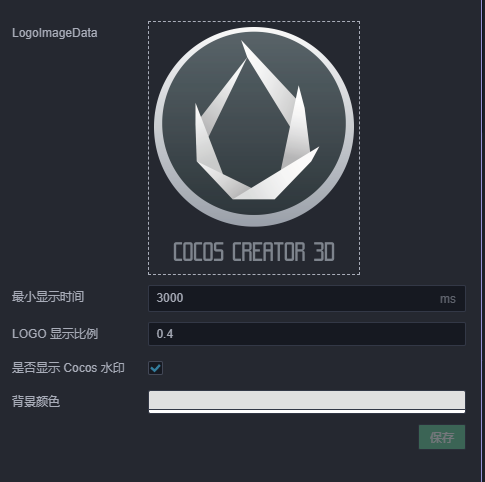
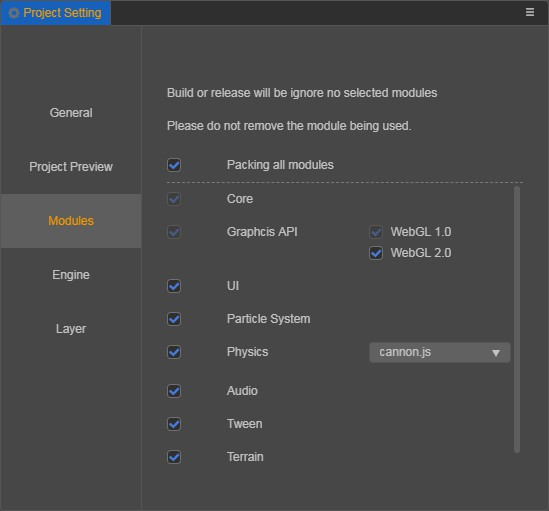

# General Build Options

## General Options in the Build Panel

### Build Path

You can designate a release path for the game by inputting a path in the **Build Path** input field or choosing one via the **...** browsing button. The following cross-platform release will create assets or projects in child folders of this release path.

The default release path is in the `build` under the project folder. If you use version control systems like `git` and `svn`, you can ignore the `build` folder in version control.

### Debug

In release mode, the `uuid` of the asset, the built engine script and the project script will be compressed and confused, and the JSON of the same asset will be subpackaged to reduce the number of asset loads. When debugging a project, it is recommended to check the **Debug** option for easy positioning of the problem.

### Replace Splash screen

Mouse over this option and an **Edit** button will appear. Click this button and the panel will open. The first time you use this feature you need to fill out a questionnaire before opening the Replace Splash screen panel. There will be some project-based information in the questionnaire, and we hope to gather more information on games developed using **Cocos Creator**, as well as more support programs in the future that developers will hopefully be able to fill out truthfully.



### Included Scenes

There are usually multiple game scenes in the project, this option allows you to choose the scenes you want to package. During the build process, all assets that depended on these selected scene assets in deep will be packaged. Just select the game scenes that are actually needed can reduce the size of game package after build.

For more information about assets packaging, please refer to the [Build Process with FAQ](./build-guide) documentation.

### Start Scene

The first scene after entering the game can be set directly in the **Start Scene**. You can also choose other scenes, that are part of your game, in **Included Scenes**. Move the mouse to the scene, a `move up icon` button will appear after the scene, then click the button to set it.

### Source Maps

The build will compress engine files and project scripts by default, if you want to generate a `sourcemap`, you need to check this box.

A `source map` is a file that maps from the transformed source to the original source, enabling the browser to reconstruct the original source and present the reconstructed original in the debugger.

For more details on `source maps`, please refer to the [Source Maps](https://developer.mozilla.org/en-US/docs/Tools/Debugger/How_to/Use_a_source_map) documentation.

### Compress Texture

Some compression options can be added to `spriteFrame` type image assets in the editor. Once enabled, the corresponding image assets are generated based on these compression options during build. If disabled, the compression texture will not take effect at build time even if configured.

Please refer to the [Compress Texture](../../asset/compress-texture.md) documentation for details.

### packAutoAtlas

The **Auto Atlas** is the editor's built-in texture merge. If this is disabled, even if you configure the `packAutoAtlas`, it will not take effect at build time.

When the **Auto Atlas** is configured in the `resources` folder, the compiled image, the raw images and all the serialization JSON will be packaged. Please don't use it like that unless necessary.

Please refer to the [Auto Atlas](../../asset/auto-atlas.md) documentation for details.

<!-- ### 内联所有 SpriteFrame
自动合并资源时，将所有 SpriteFrame 与被依赖的资源合并到同一个包中。建议网页平台开启，启用后会略微增大总包体，多消耗一点点网络流量，但是能显著减少网络请求数量。建议原生平台关闭，因为会增大热更新时的体积。 -->

### Merge all JSON that the Start Scene depends on

When merging assets automatically, all `JSON` files that the **Start Scene** depends on are merged into the package that contains the **Start Scene**. This option is disabled by default. When enabled, it will not increase the overall game size, but if these `JSON` is also used by other scenes, then CPU overhead may increase slightly when they are loaded again.

### MD5 Cache

Append MD5 hash to the exported assets for resolving CDN or browser cache issue.

After being enabled, if any asset fails to load, it is because the renamed new file can not be found. It is usually because some third party assets was not loaded by `cc.loader`. If this happens, you can convert the url before loading, to fix the loading problem. Example:

```js
url = loader.md5Pipe.transformURL(url);
```

## Other option configurations involved in the build.

### Engine Modules

Click **Project -> Project Setting -> Modules** in the menu bar to open the **Modules** panel. The Modules panel is mainly used to reduce the size of the packaged package by eliminating some engine modules that are not needed in the project. Engine modules may change with the version upgrades, and specific module information is subject to the version-specific editor.

> **Note**: please reconfirm the module information after each version upgrade before building and releasing it.



### Canvas

Click **Project -> Project Setting -> General -> Default canvas setting** in the menu bar to set the **Canvas**. The Canvas is mainly used to set multiple resolutions. If there is no `Canvas` component in the project, this option can be ignored.

Please refer to the [Multi-Resolution Adaption](../../ui-system/components/engine/multi-resolution.md) documentation for details.
