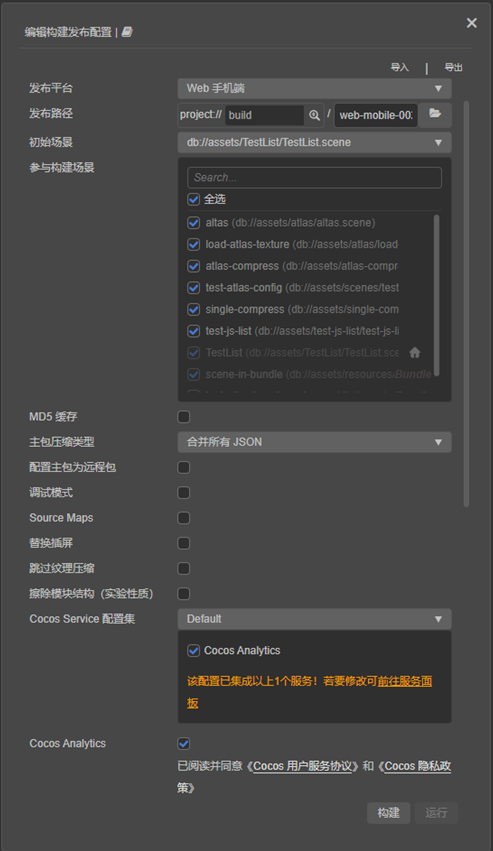
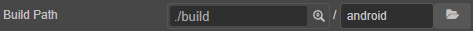
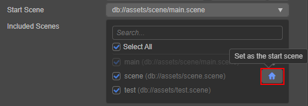
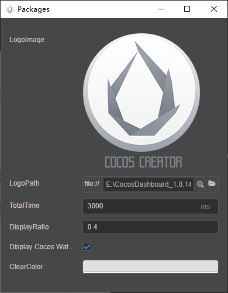

# Build Options

## General Build Options

**Build** - the general build parameters in the panel are as follows:



### Build path

There are two input boxes in the build path:



- The first input box is used to specify the release path of the project. A path can be directly entered or selected through the magnifying glass button next to it. The default release path is the `build` folder of the project directory. If using a version control system such as git, svn, etc., ignore the `build` folder in version control.

   > **Note**: spaces, illegal characters and Chinese characters are not allowed in the distribution path.

- The second input box is used to specify the name of the build task when the project is built and the name of the release package generated after the build. The default is the name of the current build platform. Every time the same platform is built, a suffix of **-001** will be added to the original basis, and so on. After the build is completed, directly click the folder icon behind the input box to open the directory where the project release package is located.

### Initial scene

It is necessary to set the first scene to enter after opening the game. One way is to search for the desired scene in the list of **scenes participating in the build**, move the mouse to the desired scene bar, and then click the button that appears on the right to set it as the initial scene.



### Participate in building the scene

During the build process, all the assets and scripts in the bundle will be packaged except for the `resources` folder in the project directory and the assets and scripts in the bundle. Other assets are packaged on demand according to the scenes involved in the build and the asset referenced in the bundle. Therefore, removing the check box for scenes that do not need to be released can reduce the size of the project release package generated after the build.

### MD5 cache

Adding MD5 information to all the asset file names after building can solve the problem of CDN or browser asset caching.

After enabling, if the asset cannot be loaded, it means that the renamed new file cannot be found. This is usually caused by some third-party assets not being loaded through the `assetManager`. In this case, you can use the following method to convert the URL before loading, and the converted path can be loaded correctly.

```typescript
const uuid = assetManager.utils.getUuidFromURL(url);
url = assetManager.utils.getUrlWithUuid(uuid);
```

> **Note**: after MD5 Cache is enabled on the native platform, if assets cannot be loaded, it is usually caused by some third-party assets used in C++ not being loaded through the `assetManager`. It can also be solved by converting the URL with the following code:
>
> ```cpp
> auto cx = ScriptingCore::getInstance()->getGlobalContext();
> JS::RootedValue returnParam(cx);
> ScriptingCore::getInstance()->evalString("cc.assetManager.utils.getUrlWithUuid(cc.assetManager.utils.getUuidFromURL('url'))", &returnParam);
>
> string url;
> jsval_to_string(cx, returnParam, &url);
> ```

### Main package compression type

Set the compression type of the main bundle. For details, please refer to the [Asset Bundle — compression type](../../asset/bundle.md#compression-type) documentation.

### Main Bundle Is Remote

This item is optional and needs to be used in conjunction with the **asset server address** option.

After checking, the main package will be configured as a remote package, and its related dependent assets will be built to the [built-in Asset Bundle — main](../../asset/bundle.md#%E5%86%85%E7%BD%AE-asset-bundle) under the remote directory of the release package. The developer needs to upload the entire remote folder to the remote server.

### Debug mode

If this option is unchecked, the build is running in release mode, compressing and obfuscating asset UUID, built engine scripts and project scripts, and subcontracting the JSON of similar assets to reduce the number of asset loadings.

This option is checked, the build is running in debug mode. At the same time, the Source Maps option can be checked, which is more convenient for locating problems.

### Source Maps

If this option is not checked, release mode will be built and the editor will compress and obfuscate the UUID of the asset, the engine script and project script generated by the build, and subpackage the `json` of the same type asset, reducing the times of asset loading.

As JavaScript scripts are becoming more and more complex, most of the source code (development code) has to be compiled and converted before it can be put into the production environment, which makes the actual running code different from the source code. This makes it impossible to locate the source code during debugging. The Source Map can map the converted code to the source code, that is, the converted code corresponds to the location of the source code before the conversion. In this way, when a problem occurs, it is possible to directly view and debug the source code, making it easier to locate the problem. For details, please refer to the [Use source maps](https://developer.chrome.com/docs/devtools/javascript/source-maps/) documentation.

### Replace

When the mouse is moved to this option, the **Edit Icon** button will appear. Click this button to open the interstitial setting panel, and the data will be saved in real time after editing.



### Compressed texture

If the image assets in the project is set to [Compressed Texture](../../asset/compress-texture.md) and this option is checked, the corresponding image assets will be generated according to the compressed texture setting during construction. If this option is not checked, even if the compressed texture is configured, it will not take effect at build time.

### Auto Atlas

If the current project is configured with [Auto Atlas asset](../../asset/auto-atlas.md) and this option is checked, then the atlas configuration will be combined during construction to generate an atlas To the project. If this option is not checked, even if auto-combing  is configured, it will not take effect at build time.

> **Note**: if an automatic atlas is configured in the `resources` folder, the image assetss of the large and small images and the corresponding serialization information will be packaged at the same time, and the package body will be enlarged. Please do not use this if necessary.

### Erase module structure (experimental)

If this option is checked, the script import speed is faster, but module features such as `import.meta`, `import()`, etc. cannot be used.

<!--
### 内联所有 SpriteFrame
自动合并资源时，将所有 SpriteFrame 与被依赖的资源合并到同一个包中。建议网页平台开启，启用后会略微增大总包体，多消耗一点点网络流量，但是能显著减少网络请求数量。建议原生平台关闭，因为会增大热更新时的体积。

### 合并初始场景依赖的所有 JSON

自动合并资源时，将初始场景依赖的所有 JSON 文件都合并到初始场景所在的包中。默认关闭，启用后不会增大总包体，但如果这些 JSON 也被其它场景公用，则后面再次加载它们时 CPU 开销可能会稍微增加。
-->

### Cocos Service Configuration Set

This item is used to display all the services integrated by the current project in the [Service](https://service.cocos.com/document/en/) panel.

### Cocos Analytics

If this item is checked, it directly enables [Cocos Analytics](https://n-analytics.cocos.com/docs/) in the [Service](https://service.cocos.com/document/en/) panel.

## Related build options for each platform

Due to the adjustment of the current construction mechanism, the processing of different platforms is injected into the **Build** panel in the form of plug-ins. After selecting the platform to build in the **Build Platform** of the **Build** panel, notice the expanded options of the corresponding platform. The name of the expanded option is the platform plug-in name, in the editor main menu **Extensions -> Extension Manager -> Built-in** to see various platform plug-ins.

For the relevant build options of each platform, please refer to:

- [Publish to native platform](native-options.md#%E6%9E%84%E5%BB%BA%E9%80%89%E9%A1%B9)
- [Publish to Mini Game Platform](publish-mini-game.md)

Creator supports the custom building of extension plug-ins, and the processing method is the same as that of platform plug-ins. For details, please refer to the [Extension Build Process](custom-build-plugin.md) documentation.

## Other parameter configuration involved in the construction

The configuration in the menu bar of the editor **Project -> Project Settings** will affect the result of the project construction. For details, please refer to the [Project Settings](../project/index.md) documentation.
