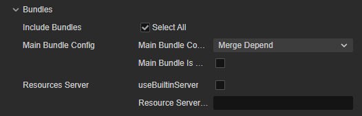
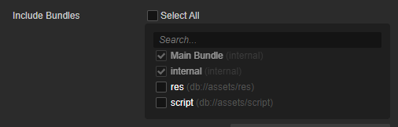
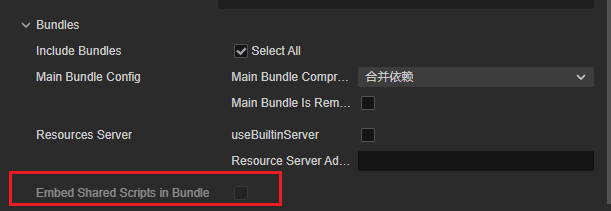

# General Build Options

## General Build Options

For the general build options in the **Build** panel are as follows:


### Build Path

There are two input boxes in the Build Path:


- The first input box is used to specify the build path of the project. The path can be entered directly in the input box or selected via the magnifying glass button next to it. Starting from v3.1, support to switch the following two paths to use:

    

    - **file**: The specified build path is an **absolute path**, which is the way used in previous versions.
    - **project**: The specified build path is a **relative path**, and the selected path can only be in the project directory. When using this path, some path-related configurations (e.g. Icon) in the build options are recorded as relative paths, making it easier for team members to share configurations across devices.

    The default build path is the `build` folder in the project directory. If a version control system such as Git or SVN is used, the `build` folder can be ignored in version control.

    > **Note**: Spaces, illegal characters and Chinese are not allowed in the Build Path.

- The second input box is used to specify the name of the build task when the project is built and the name of the release package generated after the build. The default is the name of the current build platform, and for each additional build of the same platform, the **-001** suffix will be added to the original one, and so on.<br>After the build is completed, click the folder icon behind the input box to open the project release package directory.

### Start Scene

It is necessary to set the first scene to enter after opening the game. One way is to search for the desired scene in the list of **Included Scenes**, move the mouse to the desired scene bar, and then click the button that appears on the right to set it as the start scene.


### Scenes that Participate in Build (Included Scenes)

During the build process, all the assets and scripts in the bundle will be packaged except for the `resources` folder in the project directory and the assets and scripts in the bundle. Other assets are packaged on demand according to the scenes involved in the build and the asset referenced in the `bundle`. Therefore, removing the check box for scenes that do not need to be released can reduce the size of the project release package generated after the build.

### Bundles

As of v3.8, developers can decide whether a Bundle should participate in a build based on the needs of the project.



- Select all: all Bundles will participate in the build.
- Uncheck it to select the Bundle you want to participate in the build from the dropdown box.

  

  > Main and engine built-in internal bundles cannot be canceled.

### Embed Shared Script in Bundle



Whether to embed shared scripts in bundle when build.

> This option is read only, and only switched with the build button changes from **Normal Build** or **Build Bundle** in the **Build** panel.

- Unchecked:
  When building a Bundle, if there are shared scripts inside the Bundle, they will not be built inside the Bundle, but the script inside the Bundle will be built separately inside bundle.js in src/chunk. Therefore, the bundles built in this way are integrated with the project, which means that such bundles are smaller in size, but cannot exist separately from the project.
- When checked:
  The scripts inside the bundle are not built into the public JS library but inside the bundle. Such Bundle can be run independently from the project (because the required scripts are inside the Bundle, and Bundles referencing the same code may have duplicated parts), and can be loaded and run correctly even in other projects, but the drawback is that because the script resources are inside the Bundle, the final size of the Bundle will be larger.

### MD5 Cache

Adding MD5 information to all the asset file names after building can solve the problem of CDN or browser asset caching.

After enabling, if the asset cannot be loaded, it means that the renamed new file cannot be found. This is usually caused by some third-party assets not being loaded through the `assetManager`. In this case, you can use the following method to convert the URL before loading, and the converted path can be loaded correctly.

```typescript
const uuid = assetManager.utils.getUuidFromURL(url);
url = assetManager.utils.getUrlWithUuid(uuid);
```

> **Note**: after MD5 Cache is enabled on the native platform, if assets cannot be loaded, it is usually caused by some third-party assets used in C++ not being loaded through the `assetManager`. It can also be solved by converting the URL with the following code:
>
> ```cpp
> auto cx = ScriptingCore::getInstance()->getGlobalContext();
> JS::RootedValue returnParam(cx);
> ScriptingCore::getInstance()->evalString("cc.assetManager.utils.getUrlWithUuid(cc.assetManager.utils.getUuidFromURL('url'))", &returnParam);
>
> string url;
> jsval_to_string(cx, returnParam, &url);
> ```

### Main Bundle Compression Type

Set the compression type of the main bundle. For details, please refer to the [Asset Bundle — compression type](../../asset/bundle.md#compression-type) documentation.

### Main Bundle is Remote

This option is optional and needs to be used in conjunction with the **Resources Server Address** option.

After checking, the main package will be configured as a remote package, and its related dependent assets will be built to the [built-in Asset Bundle — main](../../asset/bundle.md#the-built-in-asset-bundle) under the `remote` directory of the release package. The developer needs to upload the entire `remote` folder to the remote server.

### Debug Mode

If this option is unchecked, the build is running in release mode, compressing and obfuscating asset UUID, built engine scripts and project scripts, and subcontracting the JSON of similar assets to reduce the number of asset loadings.

If this option is checked, the build is running in debug mode. At the same time, the **Source Maps** option can be checked, which is more convenient for locating problems.

### Source Maps

Check this option to generate sourcemap. The engine files and project scripts will be compressed by default during the build.

As JavaScript is becoming more and more complex, most of the source code (development code) has to be compiled and converted before it can be put into the production environment, which makes the actual running code different from the source code. This makes it impossible to locate the source code during debugging. The Source Map can map the converted code to the source code, that is, the converted code corresponds to the location of the source code before the conversion. In this way, when a problem occurs, it is possible to directly view and debug the source code, making it easier to locate the problem. For details, please refer to the [Use source maps](https://developer.chrome.com/docs/devtools/javascript/source-maps/) documentation.

### Replace Splash Screen

When the mouse is moved to this option, the **Edit Icon** button will appear. Click this button to open the splash screen setting panel, and the data will be saved in real time after editing.


- **TotalTime**: the total time (milliseconds) to display the inset screen, minimum 500 milliseconds
- **Image Size Multiplier**: the zoom ratio of the image, the minimum is 100%
- **Preview**: If you want to change the splash screen image, hover your mouse over the preview window and click the '+' button, then select a new image path.

If you want to disable the splash screen, please refer to [Introduction to Build Options](./publish/build-options.md) for details.

> **Note**:
> 1. After selecting different build platforms in the build options, adjusting the screen insertion rules again can achieve the diversity of screen insertion on different platforms
> 2. the screen insertion will only take effect after the package, not during the preview.
> 3. Some countries and regions are not open for full screen insertion, we apologize for any inconvenience caused to you.

Translated with <www.DeepL.com/Translator> (free version)

### Erase module structure (experimental)

If this option is checked, the script import speed is faster, but module features such as `import.meta`, `import()`, etc. cannot be used.

### Skip Compress Texture

The default is 'false'. If this option is checked, the build skips the entire texture compression process to reduce build time. The command parameter is `skipCompressTexture`.

### Engine Config

As of 3.8.3, it is possible to configure some of the engine module configurations in the build panel, making it easier to select different physical backends for different platform or build tasks, etc.


The following configuration changes are currently supported:

| Configuration | Optional | Description | Default |
| --- | --- | --- | --- |
| CLEANUP_IMAGE_CACHE | `Inherit Project Setting`, `On`, `Off` | Whether to clear the original image cache after uploaded a texture to GPU | `Inherit Project Setting` |
| 2D Physics | `Inherit Project Setting`, `Box 2D`, `Built-In` | - | Inherit Project Setting |
| 3D Physics | `Inherit Project Setting`, `Bullet`, `cannon`, `PhysX`, `built-in` | - |Inherit Project Setting|
| WebGL 2.0 | `Inherit Project Setting`, `On`, `Off` | - | Inherit Project Setting|
| Bundle Mode Of Native Code | `Wasm + AsmJS`, `Wasm`, `AsmJS` | It mainly affects the native module packing format of Physics, Spine, etc., in which Wasm mode can improve the performance of games to a certain extent. Since the support degree of different game platforms is not consistent, please judge the choice according to the actual official support data. | Wasm + AsmJS|
| Enable Wasm Brotli compression | `On`, `Off` | Enabling this will reduce the size of the wasm package, which will take slightly longer to load due to the need to decompress it at runtime | Off |

The above options will be shown or hidden according to the selection of the actual module in the project settings, e.g. `If the 2D Physical Module is not checked in the project settings, the corresponding option will not appear`.

### Cocos Service Config Set

This option is used to display all the services integrated in the [Service](https://service.cocos.com/document/en/) panel for the current project.

## Related Build Options for Each Platform

Due to the adjustment of the current build mechanism, the processing of different platforms is injected into the **Build** panel in the form of a plugin. After selecting the platform to build in the **Platform** option of the **Build** panel, notice the expanded options of the corresponding platform. The name of the expanded option is the platform plug-in name, in the editor main menu **Extensions -> Extension Manager -> Internal** to see various platform plug-ins.

For the relevant build options of each platform, please refer to:

- [Publish to Native Platforms](native-options.md#build-options)
- [Publish to Mini Game Platforms](publish-mini-game.md)

Cocos Creator supports custom extension build plugins, handled in the same way as platform plugins. For details, please refer to the [Extension Build Process](custom-build-plugin.md) documentation.

## Configuration of Other Options Involved in the Build

The configuration of **Project -> Project Settings** in the menu bar of the editor will affect the result of the project build. For details, please refer to the [Project Settings](../project/index.md) documentation.
