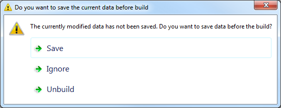
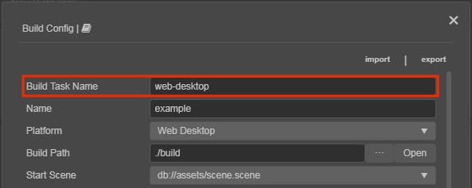
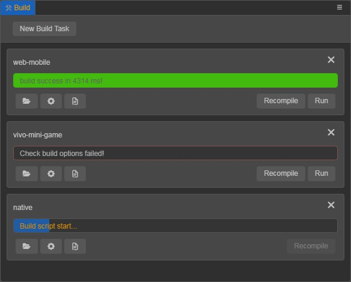

# About the Build Panel

Click **Project -> Build** in the main menu or use the shortcut `Ctrl / Cmd + Shift + B` to open the **Build** panel. If multiple build tasks are added at the same time, the editor will automatically start building the next task after the current platform's build task is completed in the order in which it was added.

## Platform Plugin

Each platform's build will be embedded in the **Build** panel as a separate plugin, with platform related options placed in a collapsible `section` (e.g.: the Web Desktop in the figure below).

## New Build Task

Click the **New Build Task** button at the top right of the **Build** panel to open the build options configuration panel. After the options are configured, click **Build**.

Make sure the content in the **Scene** panel is saved before you build. If it is not saved, when you click on the **Build** button, a prompt will pop up asking: `Do you want to save the current data before build?`. You can choose **Save**, **Ignore** or **Unbuild**. If **Save** / **Ignore** is selected, the build will continue, and if **Unbuild** is selected, a record of cancelled builds will be generated.

> **Note**: there is no point in executing a build if there is no scene in the project, so projects without a scene are not allowed to add build tasks.

### Build Task Name

**Build Task Name** is the name of the release folder generated after the build. It is not modified by default. If the same platform performs multiple builds, the suffix `-001`, `-002`, `-003` and so on will be added to the original **Build Task Name**. If you want to overwrite an old release package, simply manually change the **Build Task Name** back to its original name.

> **Notes**:
> 1. __Cocos Creator__ uses the **Platform** name as the name for the release package generated after the build, and overwrites the original package with each build.
> 2. __Cocos Creator__ uses the **Build Task Name** as the name of the release package that is generated after the build, and a new release package is generated with each build. If you want to overwrite the original release package, you can manually modify the **Build Task Name** to match the original release package name.

## Build Progress

After clicking **Build**, you can monitor the current build task progress in the **Build** panel. If the build is successful, the progress bar is shown in green, and the time of the actual build is output. Sometimes, especially a first build, the engine will be slow to compile, please be patient. If the build fails, the progress bar is shown in red.

## Run

Currently, most platforms can directly click the **Run** button in the **Build** panel to preview the effect of the project after the build is complete. If there is no **Run** button, it means that the current platform does not support run in the editor, please refer to the release document of the relevant platform for details.

## Build Log

Because the build process generates so many log messages, by default only error log are printed to the editor's **Console** panel. There are several ways to view all log information:

- **Open Build DevTools**

  Click **Developer -> Open Build DevTools** in the menu bar to see all the log information printed during the build, including the call stack.

- **Log File**

  The editor will record the error log generated during each build, which can be viewed by clicking the  button under build task in the **Build** panel. The log file is stored in the project's `temp/build-log` directory and can be attached when you send feedback to the forum on build related issues.

## Adjust the build options configuration

The **Build** panel has a  button below the build task, which can be clicked to see or adjust the configuration of the previous build options. Click the **Recompile** button after the adjustment is complete, the generated release package will directly overwrite the original.

The information about the completed build task will be saved in the `profiles/packages/build.json` file of the project. As long as the source file of the corresponding build task is not deleted, either in the **Build** panel or directly deleted in the project directory, you can view the build options configuration of the previous build after reopening the editor, as well as to run and preview again.

> **Note**: the  button is for developers to recompile after adjusting the build options of the current build task, while the **New Build Task** button is for creating a new build task, please don't confuse the two.

## Export/Import

### Export

The **Export** option at the top right of the **Build** panel exports the current configuration of build options to a `JSON` file. This mainly facilitates building from the command-line and sharing the configuration of build options within the same project. The exported configuration of build options are platform-specific. For developers who use the command line to build, you can directly use the `JSON` configuration file as the `configPath` of the command-line build options.

The exported configuration is differentiated by platform and comes with a version number. Please do not delete the version number to prevent failing to migrate the data when importing the configuration across versions.

### Import

The **Import** option reads `JSON` configuration file into the **Build** panel for developers to share build options configuration.

## Recompile

If you want to adjust the configuration of build options after the project is built, or if you want to recompile the project after a bug fix. There are following two ways:

**Option 1**: use the **Recompile** button at the bottom right of the build task, in the Build panel. This option will directly recompile using the previous configuration of build options.

**Option 2**: use the  button at the bottom of the build task in the **Build** panel. Click the button to enter the **Build** panel and you can see a **Recompile** button. For details, see **Adjust the build options configuration** in the upper part of the documentation.
