# Detailed explanation of building release panel

Click **Project -> Build** in the main menu of the editor or use the shortcut key `Ctrl/Cmd + Shift + B` to open the **Build** panel:

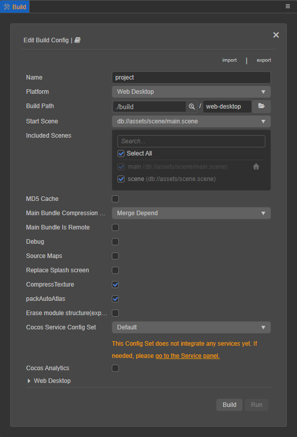

If a platform has already been build for, open the **Build** panel to enter the **Build Task** page. The construction of each platform for v3.0 is carried out in the form of a build task, similar to a download task:

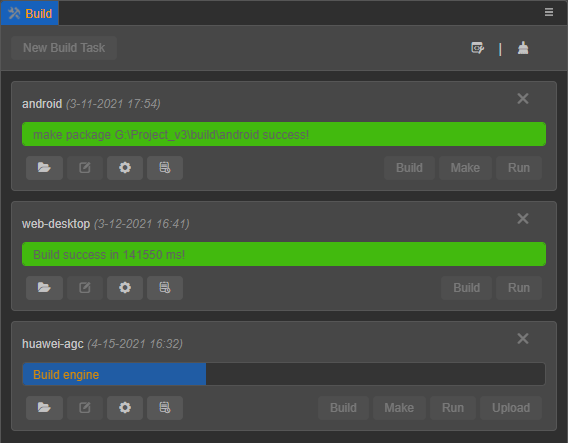

## Build

In the **Build** panel, select the platform to be built, and then configure the [build options](build-options.md). After the configuration is complete, click the **Build** button in the lower right corner to jump to the **Build Task** page to execute the build process. Another way is to click the **Close (X)** button in the upper right corner to enter the **Build Task** page.

There are three function buttons at the top of the panel:

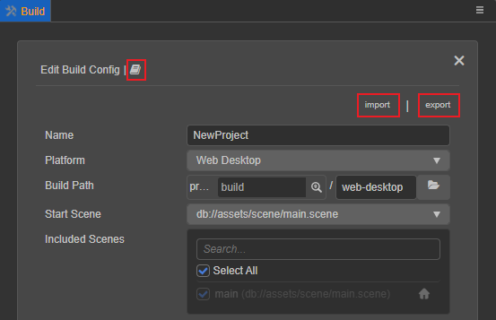

- 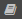: Click this button to jump to the official manual document of the current platform.

- **Import**: Click this button to import the JSON file that saves the configuration of the build options.

- **Export**: Click this button to export the current platform's build option configuration as a JSON file for the [command line build](publish-in-command-line.md), or share it among project members. The exported configuration is differentiated according to the platform. When using the command line to build, specify the file path of the build parameter `configPath` as the exported JSON configuration file path.

    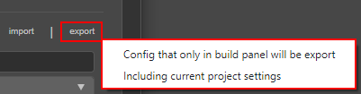

    - **Export config in Build panel only**: only export the configuration in the **Build** panel.
    - **Also export current project settings**: export the configuration of the **Build** panel and the configuration that participates in the build process in the main menu **Project -> Project Settings**.

> **Note**:
>
> 1. It is meaningless to build a project without a scene, if there is no scene in the currently opened project, a prompt will appear to create a scene first when opening the **Build** panel:
>
> 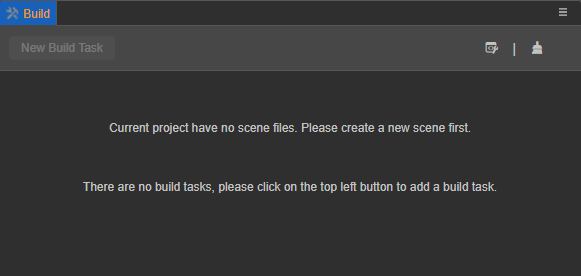
>
> 2. Before building, please make sure that the current scene has been saved, otherwise wclick the **Build** button, and a pop-up prompt will be displayed. Choose **Save**, **Ignore** or **Cancel Build** . Select **Save** and **Ignore** to continue the build process.
>
> 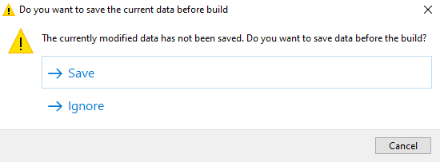

## Build Tasks

On the **Build Tasks** page, developers can view the current platform's build progress and build results.

- **Building**: the progress bar is displayed as **blue**.
- **Build success**: the progress bar reaches 100%, and the actual build time is output and displayed as **green**.
- **Construction failure**: the progress bar reaches 100%, prompting the reason for the failure of the construction or an error message, and it is displayed as **red**.

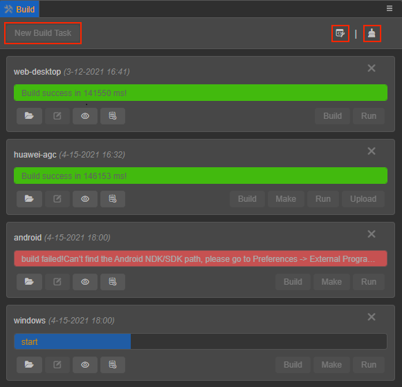

There are three buttons at the top of the page, including **New Build Task**, **Open Build Debug Tool** and **Clear Build Cache**:

- **New Build Task**: click this button to return to the **Build** panel, select a new platform to build.

- 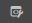: open the build debugging tool, click this button to open the build debugging tool, and view all the log information generated during the build process, including the call stack.

- : clear the build cache. In order to reuse the reusable build results, and in order to speed up the build and reduce memory usage when rebuilding, many processes in the build process have added cache management mechanisms, such as compressed textures, automatic atlas generation, engine compilation, and resources being serialized JSON, etc.  Under normal circumstances, this part of the cached data does not need to be manually cleaned, but if it is needed to avoid cache interference under special circumstances, click this button to clear the cached data.

  The project-related resource cache will be stored in the project directory, and the engine compilation-related cache will be stored in the global directory. Developers can choose to clear the project cache, the global cache, or all of them according to their needs.

  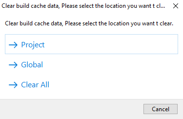

### Platform building tasks

The building of each platform is carried out in the form of a **build task**, similar to a download task. The name of the platform build task depends on the **Release Path** option in the **Build** panel. For details, please refer to the [Build Options](build-options.md) documentation.

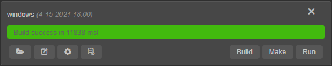

Each building task has corresponding function buttons for easy use.

**The remove (X) button at the top right of the build task** is used to remove the current build task. Choose **Remove only build records** or **Delete source files**. **Delete source files** means to delete the project release package generated in the `build` directory after the corresponding platform is built.

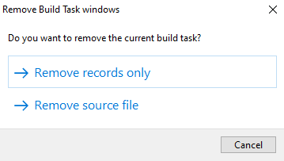

**The buttons at the bottom left of the build task include**:

- : click this button to open the project release package generated after the corresponding platform is built (the default is in the `build` directory).

- 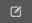: click this button to return to the **Build Release** panel, modify the build options configured during the last build of the corresponding platform, and then click **at the bottom right Build** button to rebuild. For details, please refer to the content in the **Modify Build Options** section below.

- 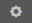: click this button to return to the **Build** panel to view the build options configured during the last build of the corresponding platform.

- 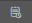: click this button to open the log file generated by the corresponding platform during the build process. For more information, please refer to the content in the **Building Log Information View** section below.

**The button at the bottom right of the build task** is mainly used for each platform to execute the release process such as generation, operation, and upload according to the platform requirements after the completion of the build. The **Build** button is used to rebuild.

After each platform is built, the build options configuration information related to the build will be saved in the `profiles/v2/packages/builder.json` file in the project directory, as long as the build of the corresponding platform is not deleted on the **Build Tasks** page or delete the project release package in the `build` directory. To view the build option configuration of the last build after reopening the editor, and continue to run the preview, etc.

For the specific release process of each platform, please refer to:

- [Publish to Native platform](native-options.md)
- [Publish to Mini Game platform](publish-mini-game.md)

### Modifying Build options

Click the edit button at the bottom left of the build task to return to the **Build** panel to modify the build options configured during the last build for rebuilding. Since it is only possible to modify the build option configuration during the last build of the current platform, the **Platform** item on the page is grayed out and cannot be modified.

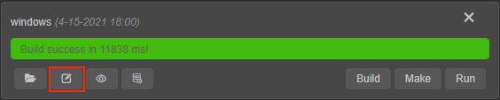

Click the  button to the right of the edit button to view the configuration of the build options during the last build of the current platform.

After the modification is completed, clicking the **Build** button will clear the project release package generated after the last build and rebuild. Or click the **X** button at the top right of the **Build** panel to return to the **Build Tasks** page, and then click the **Build** button at the bottom right of the platform build task to rebuild.

> **Note**: in order to avoid accidentally deleting customized content, the native platform only updates project resources when rebuilding, and does not overwrite the original native project content. Therefore, when returning to the **Build** panel to modify the previously configured build options, the native platform-related build options are in the **disabled** state. To regenerate the project, please create a new build task.

If the **Build** button is not clicked to rebuild after modifying the configuration, the modified configuration will also be saved. If the configuration in the current **build release** panel is inconsistent with the configuration in the project release package in the `build` directory generated after the last build, a yellow * number key.

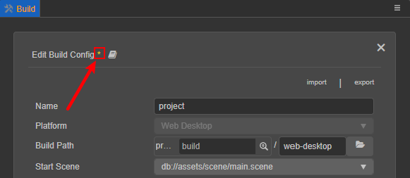

### Build log information view

Since the build process will generate a lot of log information, only error messages will be printed to the editor's **console** panel by default.

To view all the log information, there are the following operations:

- **Open the build debugging tool**

    To view, click **Developer -> Open Build Debug Tool** in the main menu or click the  button at the top right of the **Build Task** page. All log information printed during the build process includes the call stack.

- **Adjust log level**

    Click **Cocos Creator -> Preferences -> Build** in the main menu to adjust the output log level as needed.

    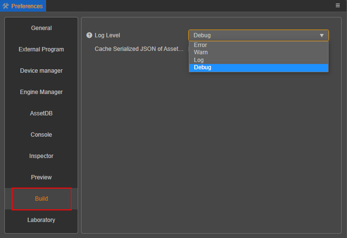

- **Open the build logging file**

    The error message generated during each build process will be recorded and stored in the `temp/builder/log` folder under the project directory. Click the  button at the bottom right of the build task to view it. When feedback on construction related issues, directly paste the file to locate the problem.
