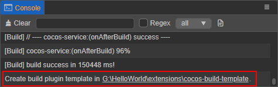
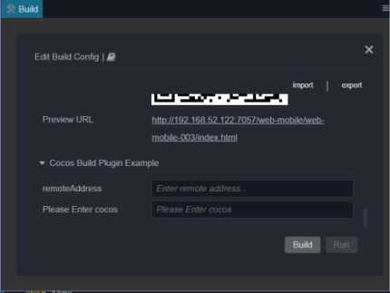
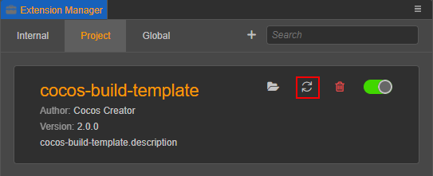
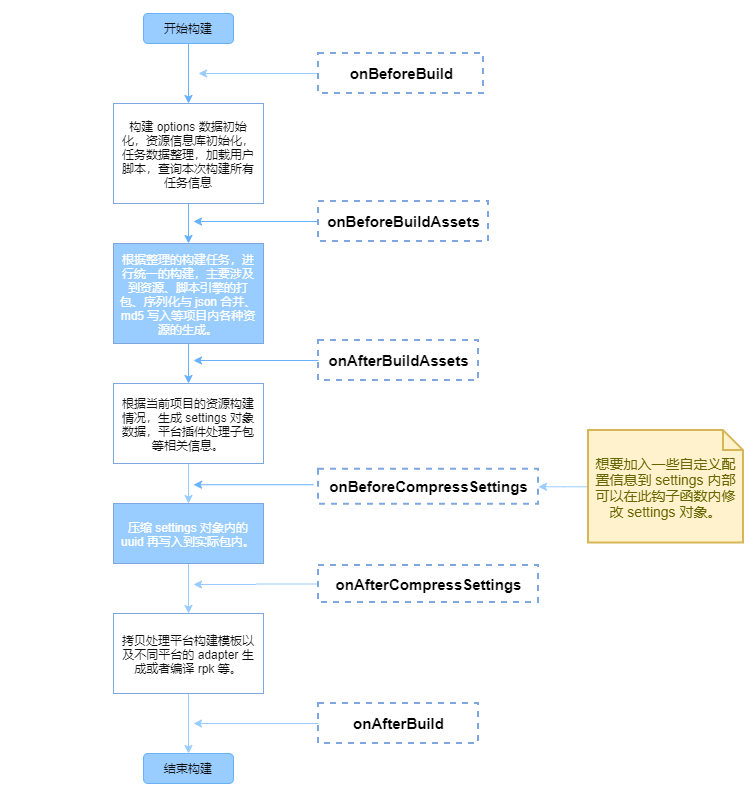
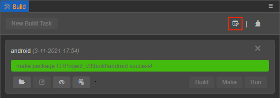

# Extending Build Process

To build a platform plug-in a common editor plug-in format is required. For the basic structure of the plug-in, please refer to the [First Extension](../extension/first.md) documentation . To extend the build function, it is necessary to understand the overall process of the build. Please read the [Introduction to the build process and FAQ guide](./build-guide.md) documentation.

## Quick start

1. Click **Project -> New Build Extension** in the menu bar of the editor, and select **Global**/**Project** to create a build extension package.

    - If selecting **Global**, the build extension will be applied to all Cocos Creator projects. The path of **Global** is:

        - **Windows**: `%USERPROFILE%\.CocosCreator\extensions`

        - **macOS**: `$HOME/.CocosCreator/extensions`

    - If selecting **Project**, this will apply the build extension to the specified Cocos Creator project. The path of **Project** is:

        - `$Your project address/extensions`

2. After the build extension is created, you will see the generation path of the plugin in the **Console**. Click on the path to open the build extension package in the file manager of the operating system.

    

3. Before enabling the build extension, execute `npm install` in the directory to install some dependent **@types** modules to compile normally. The interface definition that comes with the editor has been generated under the **@types** folder in the root directory. **Developer -> Export.d.ts** from the menu bar of the editor shows the latest interface definitions.

4. Click **Extension -> Extension Manager** in the menu bar of the editor to open the **Extension Manager** panel. Then select the **Project**/**Global** tab in the **Extension Manager**, and click the **Refresh Icon** button to see the build extension you just added. Then click the **Enable** button on the right to run the plug-in normally.

    

5. After the build extension is enabled, open the **Build** panel, notice the expansion bar of the build extension plugin. Click **Build** to join the build process.

    

6. If you need to modify the content of the build extension, directly modify the build extension package under the `extensions` directory, see the `readme.md` file in the build extension package directory for details. Then find the corresponding build extension in the **Extension Manager**, and click the **Reload** icon button. At this time, the extension in the editor will re-run with the latest code and files.

    

## Basic configuration process

To extend the build function of the plug-in, you need to add the `builder` field to the `contributions` in `package.json`, and the relative path configuration of the corresponding module can be passed to the specified platform in the field.

Example `package.json`:

```json
// package.json

{
    "contributions": {
        "builder": "./dist/builder"
    }
}
```

> **Note**: the `builder` field specifies the `./dist/builder.js` entry script is the compiled script, and the source file of the entry script is located in `./source/builder.ts`, if you need to configure the entry script, please change it in the source file.

### Entry script configuration

The plugin entry configuration code example is shown below:

```ts
//builder.ts

// Allow external developers to replace parts of the build asset handler module. Please refer to the "Custom Texture Compression Processing" section below for details.
export const assetHandlers: string = '. /asset-handlers';

export const configs: IConfigs = {
    'web-mobile': {
        hooks: './hooks',
        options: {
            remoteAddress: {
                label: 'i18n:xxx',
                render: {
                    ui: 'ui-input',
                    attributes: {
                        placeholder: 'Enter remote address...',
                    },
                },
                // Validation rules, there are currently several commonly used validation rules built in, and the rules that need to be customized can be configured in the "verifyRuleMap" field
                verifyRules: ['require', 'http'],
            },
            enterCocos: {
                    label: 'i18n:cocos-build-template.options.enterCocos',
                    description: 'i18n:cocos-build-template.options.enterCocos',
                    default: '',
                    render: {
                        // Please click "Developer -> UI Components" in the menu bar of the editor to view a list of all supported UI components.
                        ui: 'ui-input',
                        attributes: {
                            placeholder: 'i18n:cocos-build-template.options.enterCocos',
                        },
                    },
                    verifyRules: ['ruleTest']
                }
            },
            verifyRuleMap: {
                ruleTest: {
                    message: 'i18n:cocos-build-template.ruleTest_msg',
                    func(val, option) {
                        if (val === 'cocos') {
                            return true;
                        }
                        return false;
                    }
                }
            }
        },
};
```

Please pay extra attention to the following points when writing entry scripts:

1. The environment variables in different processes will be different. The entry script will be loaded by the rendering process and the main process at the same time, do not use the editor interface that only exists in a single process in the entry script.

2. There are two ways to configure the key of `config`: 

- One is for a single platform configuration, and the key is filled in as **platform plugin name** (available in the editor menu bar **Extensions -> Extension Manager -> Internal** to view the platform plug-in name); 

- One is the configuration for all platforms, the key is filled in as `*`. These two configuration methods are mutually exclusive, please do not use them in the same build extension package.

 > **Note**: these two configuration methods are mutually exclusive, please do not use both in the same build extension package. Otherwise the configuration for a single platform (key value `platform build plugin name`) will overwrite the configuration for all platforms (key value `*`).

### Entry script interface definition

The detailed interface definition is described as follows:

```ts
declare type IConfigs = Record<Platform | '*', IPlatformConfig>;
declare interface IBuildPlugin {
    hooks?: string; // Storage path of hook function
    options?: IDisplayOptions; // Platform parameter configuration that needs to be injected
    verifyRuleMap?: IVerificationRuleMap; // Register parameter verification rule function
}
declare type IDisplayOptions = Record<string, IConfigItem>;
declare interface IConfigItem {
    // The default value, the registered default value will be in the "options.[platform].xxx" field in the plugin configuration
    default?: any;

    render: ?{
        // The rules for rendering UI components are consistent with the unified rules at "ui-prop". Only configurations with UI properties specified will be displayed on the Build panel
        ui?: string;
        // The configuration parameters passed to the UI component
        attributes?: IUiOptions;
    };

    // Configure the displayed name, if you need to translate, then pass in "i18n:${key}"
    label?: string;

    // A brief description of the setting, which will be displayed on the title when the mouse hovers over the configuration name.
    description?: string;

    // Type of configuration
    type?: 'array' | 'object';

    // If type is an array, the data will be rendered according to the specified data type and "itemConfigs"
    itemConfigs?: Record<string, IConfigItem> | IConfigItem[];
}

declare interface IUiOptions extends IOptionsBase {
    //     // Validation rules array, build provides some basic rules, and you can also specify new validation rules through “verifyRuleMap”. Only when pass in “require” will be a valueless checksum, otherwise only when there is a value.
    verifyRules?: string[];
}

declare interface IUiOptions extends IOptionsBase {
    class?: string | string[]; // The name of the style that needs to be set on the current "ui-prop"
}
```

For the interface definition of `IOptionsBase` please refer to [ui-prop automatic rendering rule definition](../extension/ui.md).

## Custom build hook function code configuration

In the script module defined by the hooks field in the entry configuration, hook functions can be written that build the life cycle. In different hook functions, the data received will be different. All hook functions run in the build process, and the engine method can be used directly in the build process.

The relationship between the public hook function and the life cycle of the build can be seen in the following figure:



The rough interface definition of hook function is as follows:

```ts
declare interface IHook {
    throwError?: boolean; // The hook function injected by the plugin, whether to exit the build process directly and show the build failure when the execution fails.
    // ------------------ hook function --------------------------
    onBeforeBuild?: IBaseHooks;
    onBeforeCompressSettings?: IBaseHooks;
    onAfterCompressSettings?: IBaseHooks;
    onAfterBuild?: IBaseHooks;

    // Compile the generated hook function (only valid if the platform's build process has a "Make" step)
    onBeforeMake?: (root: string, options: IBuildTaskOptions) => void | Promise<void>;
    onAfterMake?: (root: string, options: IBuildTaskOptions) => void | Promise<void>;
}
type IBaseHooks = (options: IBuildTaskOptions, result?: IBuildResult) => void | Promise<void>;
```

> **Notes**:
> 1. the `result` parameter can be accessed only at the beginning of `onBeforeCompressSettings`, and the `options` passed to the hook function is a copy of the `options` used in the actual build process, and only used as a reference for information acquisition, so directly modifying it does not really affect the build process, although it can be modified successfully. To modify the build parameters, please set in the `options` field of the entry configuration code. Due to the numerous interface definitions, you can refer to the `@types/packages/builder` folder in the build extension package for detailed interface definitions.
> 2. The hook function is allowed to be an asynchronous function. the next process.

A simple example:

```ts
export function onBeforeBuild(options) {
    // Todo some thing...
}
export async function onBeforeCompressSettings(options, result) {
    // Todo some thing...
}
```

### Custom texture compression processing

The `assetHandler` path configuration specified in the **entry script configuration** above allows external developers to register some asset handling functions to replace the engine's handler module when building partial assets. Currently only **texture compression** handler registration is available.

Creator provides its own compression tools to handle compressed texture assets at build time, but does not focus on image compression because it needs to be compatible with different user environments and usually the compression tools are chosen to work on most computers rather than the most efficient ones. Therefore, Creator has opened up a plug-in mechanism in v3.4, **which allows users to directly register compression processing functions for the corresponding texture assets, which will be called at the appropriate processing time when building**.

The specific steps are as follows:

1. In the entry script, write the relative path of the `assetHandlers` module script:

    ```ts
    export const assetHandlers = './asset-handlers';
    ```

2. In the `assetHandlers` script module, we open up the `compressTextures` function, so developers can write the corresponding handler function directly in `compressTextures`, which will be called during the texture compression phase of the build.

    The handler function takes the current array of remaining unprocessed texture compression tasks and removes them from the original array when processing is complete. Texture compression tasks that are not removed are considered unprocessed and are placed in the next corresponding processing function until all processing functions have been processed, and if there are still unprocessed texture compression tasks, they are placed back in the Creator's original texture compression process.

    When there are multiple plugins registered with texture compression handler functions, they are executed in the order in which the plugins are started. If the previous plugin processes all the texture compression tasks, the subsequent plugins registered with the handler functions will not receive the tasks.

    The code example is as follows:

    ```ts
    type ITextureCompressType =
        | 'jpg'
        | 'png'
        | 'webp'
        | 'pvrtc_4bits_rgb'
        | 'astc_12x12'; // See interface definition for detailed format
    interface ICompressTasks {
        src: string; // source file address
        dest: string; // address of the generated target file (default suffix is PNG, other types need to be changed manually)
        quality: number | IPVRQuality | IASTCQuality | IETCQuality; // Compression quality 0 - 100 or other compression levels
        format: ITextureCompressType; // Compression type
    }
    export async function compressTextures(tasks: ICompressTasks[]) {
            for (let i = 0; i < Array.from(tasks).length; i++) {
            const task = Array.from(tasks)[i];
            if (task.format ! == 'jpg') {
                // Texture compression tasks that are skipped are passed to the next processing function until they finally enter the Creator's original build-time texture compression process
                continue;
            }
            task.dest = task.dest.replace('.png', '.jpg');
            await pngToJPG(task.src, task.dest, task.quality);
            // Remove the finished texture compression task from tasks, so that it will not be processed again when building
            tasks.split(i, 1);
        }
    }
    ```

## Debugging build extension plugins

When the build extension plugin is involved in the build process, the associated code runs in the following three processes:

- **Main Process**: executes the entry script and its dependent assets.
- **Rendering Process**: executes some of the fields registered in the entry script to the **Build** panel.
- **Build Process**: executes the script defined in the `hooks` field of the entry script.

### Main Process (Entry Script)

The main process mainly executes the entry script used in the build extension plugin to participate in the build process (the script specified in the `builder` field), and the plugin's own entry script (the script specified in the `main` field).

When the code running in the main process is modified, the plugin must be restarted and then the process to be updated must be refreshed (this will be optimized later to try to solve the code update problem with a single restart, but refreshing is still the most thorough reloading method). The main process currently does not have a more appropriate debugging method, you can use the command line to open the editor to view the main process code log to assist debugging:

```bash
// Mac
/Applications/CocosCreator/Creator/3.0.0/CocosCreator.app/Contents/MacOS/CocosCreator --project projectPath

// Windows
... \CocosCreator.exe --project projectPath
```

### Rendering Process (Build Panel)

The entry script of the build extension plugin has some fields that are registered to the **Build** panel, such as the display configuration of `options`, the `panel` field, and the `panel` script itself, which is loaded and executed in the render process. The rendering process is actually the window's own execution process. Open the DevTools to debug the `dom` elements, styles, scripts, etc. on the **Build** panel.

If you modify the code registered to the **Build** panel, just refresh the panel without restarting the plugin.

- **Open the DevTools for the rendering process of the Build panel**

  Click on the **Build** panel and press the shortcut **Ctrl + Shift + I** (Windows) or **Command + Option + I** (Mac) to open the DevTools for the **Build** panel.

- **How to reload (refresh) the panel**

  Press **Ctrl/Command + R** after clicking the debug tool in the **Build** panel or the **Build Release** panel.

### Build Process (`hooks` Script)

The actual execution phase of the build is a separate worker process, ensuring that even if an abnormal crash occurs, it will not affect the normal use of other windows. The scripts defined in the `hooks` field of the entry script are also loaded and executed in this separate worker process.

If only the script defined in the `hook` field is modified, the build process can be refreshed without restarting the plugin. To do this, press **Ctrl/Command + R** after opening the build DevTools, as in the **Build** panel above.

#### Opening the DevTools for the build process

This includes the following three ways:

1. Click the **Open Build DevTools** button at the top right of the build task window in the **Build** panel.

    

2. Click **Developers -> Open Build DevTools** in the main editor menu to open it.

3. In any plugin code or in the console, execute the following code:

    ```ts
    Editor.Message.send('builder', 'open-devtools');
    ```

    You can extend this message method to suit your needs. For example, you can catch errors in the code you write to build the plugin, and automatically open DevTools once there is an exception or something like that.
