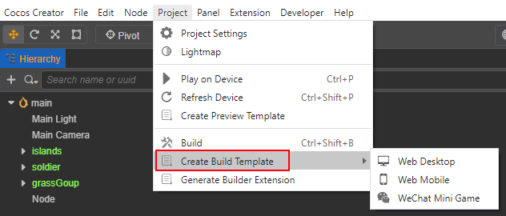
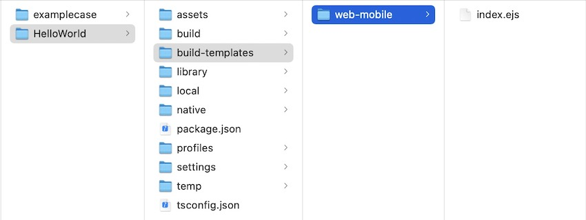

# Custom Project Build Template

**Cocos Creator** supports custom build templates for each project. Add a `build-templates/[platform]` folder to the project path, and divide the sub-folder according to the **platform name**. Then all the files in this folder will be automatically **copied** to the build generated project according to the corresponding folder structure after the build. Currently, all platforms except the native platform support this function, the specific **platform name** can be referred to as the following **custom build template supported platform list**.

Folder Structure:

```bash
project-folder
 |--assets
 |--build
 |--build-templates
      |--web-mobile
            // The file to be added, such as index.html
            |--index.html
```

If the current platform is `Web-Mobile`, then `build-templates/web-mobile/index.html` will be copied to `build/web-mobile/index.html`.

In addition, the file types currently supported by the build template include **ejs type** and **json type**. These two types will not copied directly but rather parsed. Please refer to the **Special Custom Build Template Platform support list** below for details on the support for these two template types by platform.

## `ejs` type

Since the content of the package is not guaranteed to be exactly the same in every version, when the build template within the editor is updated, the developer also needs to update the build template within their project. For example, if the MD5 Cache option is checked at build time, taking `index.html` on the web platform as an example, the `css` file referenced in it will have an MD5 Hash suffix, which may not match the one in the original template and may not work. <br>
To optimize this problem, a new way is added to use the template. Click on **Project -> Create Preview Template** in the main menu, and an `ejs` template file will be generated for the corresponding platform.



Developers only need to customize the generated build template in the `.ejs`, the build will automatically synchronize the updates of the editor build template to the custom build template, and the frequently changed content will be synchronized to the sub-template (`.ejs`) referenced by the template, so that the custom build template can be updated manually without frequent updates.

Taking the creation of a Web Mobile build template as an example, the generated build template directory structure is as follows:



> **Note**: the copy template occurs after the rendered template. For example, if both `index.ejs` and `index.html` exist in this directory, the final packaged package will be the `index.html` file instead of the `index.ejs` rendered file.

### `json` Type

Many mini games have their own configuration `JSON` files, like `game.json` to WeChat Mini Games. Files in the build templates folder will just copy in **default**, but this configuration JSON will be merged instead of overwrite. Of course, it doesn't mean that all `JSON` file will be merged, you can check it in the tables below.

## Special Custom Build Template supported Platform list

Most files placed in the `build-templates/[platform]` directory will be copied directly to the corresponding directory. In addition, many platforms support some template files with special name formats. The supported file with special name formats for build templates by the platform are as follows:

| Platform | Actual Name | Supported File Type |
| :-------- | :---------- | :----------- |
| **Huawei AGC** | huawei-agc | not supported yet |
| **Alipay Mini Game** | alipay-mini-game | `game.json` |
| **ByteDance Mini Game** | bytedance-mini-game | `game.ejs`、`game.json`、`project.config.json` |
| **OPPO Mini Game** | oppo-mini-game | `manifest.json` |
| **Huawei Quick Game** | huawei-quick-game | not supported yet |
| **Cocos Play** | cocos-play | `game.config.json` |
| **vivo Mini Game** | vivo-mini-game | `project.config.json` |
| **Xiaomi Quick Game** | xiaomi-quick-game | `manifest.json` |
| **Baidu Mini Game** | baidu-mini-game | `game.json`, `project.swan.json` |
| **WeChat Mini Game** | wechatgame | `game.ejs`, `game.json`, `project.config.json` |
| **Web Desktop** | web-desktop | `index.ejs` |
| **Web Mobile** | web-mobile | `index.ejs` |
| **Native** | native | not supported yet |

<!--
## Customizing `application.js`

All platforms generate a startup script `application.js` after the build. To customize the startup script, there are two ways:

- Refer to the way described at the beginning of this article, place `application.js` in the specified directory and then customize it as needed.
- Click **Project -> Create Build Template** in Creator's top menu bar, then select **application.ejs** to customize the generated `application.ejs` file, and the generated directory will be displayed in the **Console** panel. The `application.ejs` file will be compiled into an `application.js` file when built.

The directory where the `application.ejs` file is located determines the platform on which it will take effect.

- If it is placed in the `build-templates/common` directory, it will take effect for all platforms.
- If it is placed in the `build-templates/{platform}` directory, it will take effect for the specified platform. The `application.ejs` file in this directory is used first when building.

Using the `ejs` method of customization prevents the custom `application.js` from becoming unavailable if the MD5 Cache option is checked during the build. However, it should be noted that since the startup scripts and the engine interface are strongly correlated, it is not possible to ensure that they remain completely unchanged during major iterations of the upgrade, so we will mark any changes in the changelog.
-->
