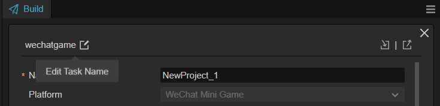

# Custom Project Build Template

Cocos Creator supports customizing build templates for each project separately. You just need to add the templates/build directory under the project path, and then divide subdirectories according to the platform extension name or build task name. After the build is completed, all files in the templates/build/[platform | taskName] directory will be automatically copied to the corresponding directory structure of the constructed project for the respective platform. This feature is supported by all platforms. For the specific platform extension names, please refer to the Special Custom Build Template Platform Support Table at the bottom.
Note: For version 3.8.2 and earlier, the build template directory is located within the templates/build/[platform] directory of the project, and it does not support build task name templates. Other special rules are consistent.

## Template Distinction Based on Build Platform Name

```bash
project-folder
 |--assets
 |--build
 |--templates
    |--build
        |--web-mobile
            // The file to be added, such as index.html
            |--index.html
```

If the current platform is `Web-Mobile`, then `templates/build/web-mobile/index.html` will be copied to `build/web-mobile/index.html`.

## Template Distinction Based on Build Task Name

Starting with version 3.8.3, the build template also supports distinguishing templates based on the build task name. The build task name is a parameter named taskName in the build options, which can be edited and modified in the top-right corner of the build parameter editing page.



For example: If there is a build task with the task name web-mobile-debug in the build tasks, then all files under the templates/build/web-mobile-debug directory will be copied to the build/web-mobile-debug (subject to the task name) directory.

## Special Custom Build Template

In addition, the file types currently supported by the build template include **ejs type** and **json type**. These two types will not copied directly but rather parsed. Please refer to the **Special Custom Build Template Platform support list** below for details on the support for these two template types by platform.

### `ejs` type

Since the content of the package is not guaranteed to be exactly the same in every version, when the build template within the editor is updated, the developer also needs to update the build template within their project. For example, if the MD5 Cache option is checked at build time, taking `index.html` on the web platform as an example, the `css` file referenced in it will have an MD5 Hash suffix, which may not match the one in the original template and may not work. <br>
To optimize this problem, a new way is added to use the template. Click on **Project -> Create Preview Template** in the main menu, and an `ejs` template file will be generated for the corresponding platform.


Developers only need to customize the generated build template in the `.ejs`, the build will automatically synchronize the updates of the editor build template to the custom build template, and the frequently changed content will be synchronized to the sub-template (`.ejs`) referenced by the template, so that the custom build template can be updated manually without frequent updates.

Taking the creation of a Web Mobile build template as an example, the generated build template directory structure is as follows:


> **Note**: the copy template occurs after the rendered template. For example, if both `index.ejs` and `index.html` exist in this directory, the final packaged package will be the `index.html` file instead of the `index.ejs` rendered file.

### `json` Type

Many mini games have their own configuration `JSON` files, like `game.json` to WeChat Mini Games. Files in the build templates folder will just copy in **default**, but this configuration JSON will be merged instead of overwrite. Of course, it doesn't mean that all `JSON` file will be merged, you can check it in the tables below.

Note: If the build template and the build interface options configure the same field value, the actual result will be based on the build options.

### Special Custom Build Template supported Platform list

Most files placed in the `templates/build/[platform]` directory will be copied directly to the corresponding directory. In addition, many platforms support some template files with special name formats. The supported file with special name formats for build templates by the platform are as follows:

| Platform | Actual Name | Supported File Type |
| :-------- | :---------- | :----------- |
| **Huawei AGC** | huawei-agc | `game.ejs` |
| **Alipay Mini Game** | alipay-mini-game | `game.json` |
| **Taobao Mini Game** | taobao-mini-game | `game.json`、`mini.project.json` |
| **Douyin Mini Game** | bytedance-mini-game | `game.ejs`、`game.json`、`project.config.json` |
| **OPPO Mini Game** | oppo-mini-game | `manifest.json` |
| **Huawei Quick Game** | huawei-quick-game | `game.ejs` |
| **Cocos Play** | cocos-play | `game.config.json` |
| **vivo Mini Game** | vivo-mini-game | `project.config.json` |
| **Xiaomi Quick Game** | xiaomi-quick-game | `manifest.json` |
| **Baidu Mini Game** | baidu-mini-game | `game.json`, `project.swan.json` |
| **WeChat Mini Game** | wechatgame | `game.ejs`, `game.json`, `project.config.json` |
| **Web Desktop** | web-desktop | `index.ejs` |
| **Web Mobile** | web-mobile | `index.ejs` |
| **Native** | native | `index.ejs` |

<!--
## Customizing `application.js`

All platforms generate a startup script `application.js` after the build. To customize the startup script, there are two ways:

- Refer to the way described at the beginning of this article, place `application.js` in the specified directory and then customize it as needed.
- Click **Project -> Create Build Template** in Creator's top menu bar, then select **application.ejs** to customize the generated `application.ejs` file, and the generated directory will be displayed in the **Console** panel. The `application.ejs` file will be compiled into an `application.js` file when built.

The directory where the `application.ejs` file is located determines the platform on which it will take effect.

- If it is placed in the `templates/build/common` directory, it will take effect for all platforms.
- If it is placed in the `templates/build/{platform}` directory, it will take effect for the specified platform. The `application.ejs` file in this directory is used first when building.

Using the `ejs` method of customization prevents the custom `application.js` from becoming unavailable if the MD5 Cache option is checked during the build. However, it should be noted that since the startup scripts and the engine interface are strongly correlated, it is not possible to ensure that they remain completely unchanged during major iterations of the upgrade, so we will mark any changes in the changelog.
-->