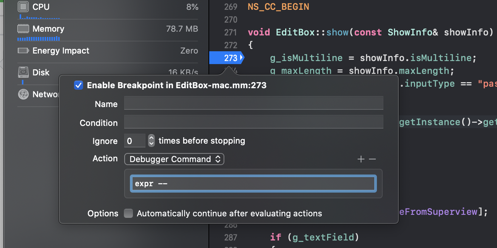
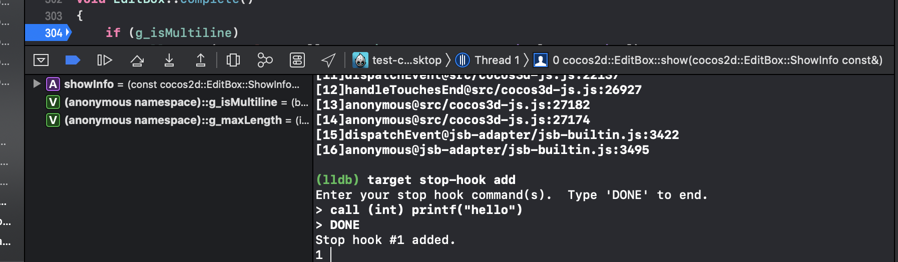
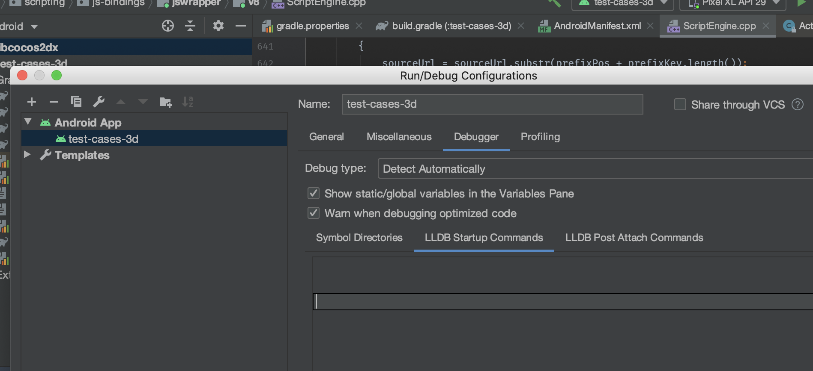

# Debugging JavaScript on Native Platforms

After a game is released on the native platform, because the runtime environment is different, there may be some bugs that cannot be reproduced in the browser preview. This means it is necessary to debug it directly on the native platform. **Cocos Creator** makes it easy to debug JavaScript remotely in the native platforms.

## Debugging on Android / iOS

If a game can only run on a physical device, then the packaged game must be debugged on a physical device. Debugging steps are as follows:

- Make sure that the Android / iOS device is on the same LAN as Windows or Mac.
- Select the **Android/iOS** platform and **Debug** mode in the **Build** panel to build, compile and run a project (for the iOS platform, it is recommended to connect to the physical device via Xcode to compile and run).
- Open this address with Chrome browser: `devtools://devtools/bundled/js_app.html?v8only=true&ws=Local IP of the device:6086/00010002-0003-4004-8005-000600070008`.

  

## Debugging on Windows / Mac

The steps for debugging a game on the Windows / Mac platform are similar to the Android / iOS, just compile the project and run it in the IDE.

- Compile and run the packaged project with the IDE (Visual Studio for Windows and Xcode for Mac).
- Open Chrome while the game is running and enter the address: `devtools://devtools/bundled/js_app.html?v8only=true&ws=127.0.0.1:6086/00010002-0003-4004-8005-000600070008` to debug it.

 

## Using `lldb` to view the current JS call stack

By using breakpoints in C++, we can easily see the C++ call stack, but not the JS call stack at the same time, which often breaks the debugging experience. The features provided by `lldb` allow doing a lot of things during debugging, including viewing the call stack.

Both **Xcode** and **Android Studio** use `lldb` as debugger by default. For more details, please refer to the [LLDB Guide](https://lldb.llvm.org/use/tutorial.html) documentation.

### Global configuration of `lldb`

`lldb` will load `~/.lldbinit` at startup, for example the following configuration:

`~ % cat ~/.lldbinit`

```
target stop-hook add 
expr -- cocos2d::log(".lldbinit ---- \n%s\n", se::ScriptEngine::getInstance()->getCurrentStackTrace().c_str())
DONE
```

The behavior after setting **every breakpoint** and executing the following code to output the JS call stack:

```c++
cocos2d::log(".lldbinit ---- \n%s\n", se::ScriptEngine::getInstance()->getCurrentStackTrace().c_str())
```

For more information on the usage of `target stop-hook`, please refer to the documentation: <https://lldb.llvm.org/use/map.html#examining-variables>

However, this approach has an obvious drawback: it works for **all projects** and will result in an error if the corresponding symbol does not exist for other projects.

### Configuring `lldb` in Xcode

#### Editing `Action` in breakpoints in Xcode (only triggered for specific breakpoints)



Enter the following command in the **Debugger Command**:

```lldb
expr -- cocos2d::log(".lldbinit ---- \n%s\n", se::ScriptEngine::getInstance()->getCurrentStackTrace().c_str())
```

For more information about the usage of `target stop-hook`, please refer to the documentation: <https://lldb.llvm.org/use/map.html#evaluating-expressions>

#### Setting `stop hook`

After the breakpoint is triggered, a callback needs to be added to the lldb console. More calls can be made for specific breakpoints: the



As above, the call stack can also be viewed by executing the following code:

```lldb
expr -- cocos2d::log(".lldbinit ---- \n%s\n", se::ScriptEngine::getInstance()->getCurrentStackTrace().c_str())
```

### Configuring `lldb` in Android Studio

Configure in the **Run -> Debug Configuration -> Debugger** interface of **Android Studio**:



Android Studio also provides a `lldb console` similar to Xcode.

## Advanced Debugging Guide

If you need to debug in Release mode, or need to debug a customized native engine, please refer to the more detailed [JSB 2.0 Usage Guide: Remote Debugging and Profile](../../advanced-topics/JSB2.0-learning.md).
