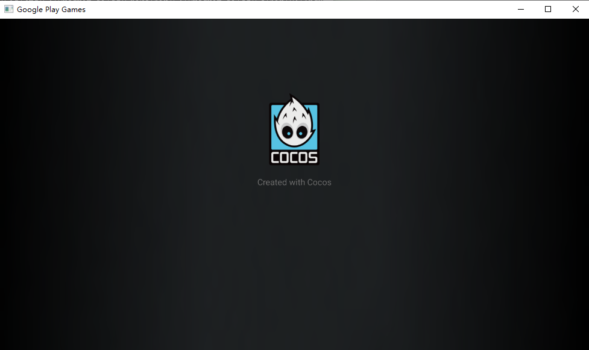
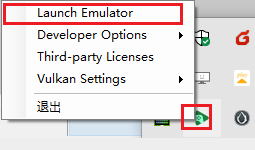
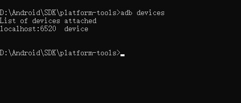
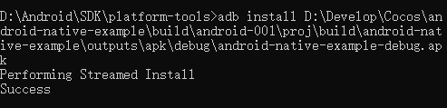
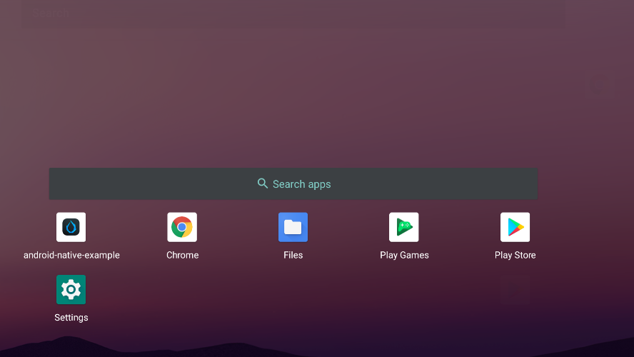

# Build and Run



In this section we will describe how to develop and test an existing APK with the HPE simulator.

## Preparation

First you need to prepare an Android Studio project published by Cocos Creator, if you are not familiar with this, we recommend you to refer to [Android Build Example](./android/build-example.md)

## Start the emulator

First you need to launch the emulator by finding the emulator icon in the OS toolbar and selecting **Launch Emulator**:



After starting:


## Installing the app

Let's review a little how to build the APK via Android Studio, just click on the following menu:


After a successful build, you can find the corresponding APK file in the project directory.

### Start ADB

Next you need to install the APK to the emulator, find the adb command and enter:

> adb is usually found in the SDK/plat-form directory of Android. You may consider adding this directory to the environment variables so that it is available anywhere.

```bash
adb devices 
```

Used to check if the emulator is properly connected.



If `localhost:6520 offline` is displayed or the devices are not displayed, restart the emulator or type: `adb connect localhost:6520` from within the command line.

### Install the application

Find the directory where the apk was previously stored and type in the command line.

```bash
adb install C:/yourpath/yourgame.apk

```



## Start the application

If you want to find the installed application, find the application icon in the screen by swiping up and then click on it to launch the application:


