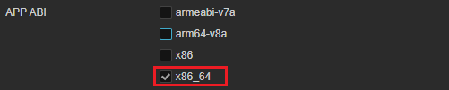
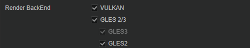
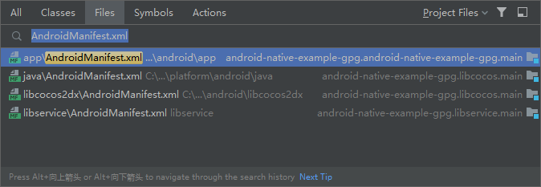
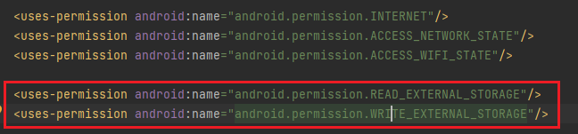
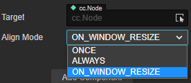
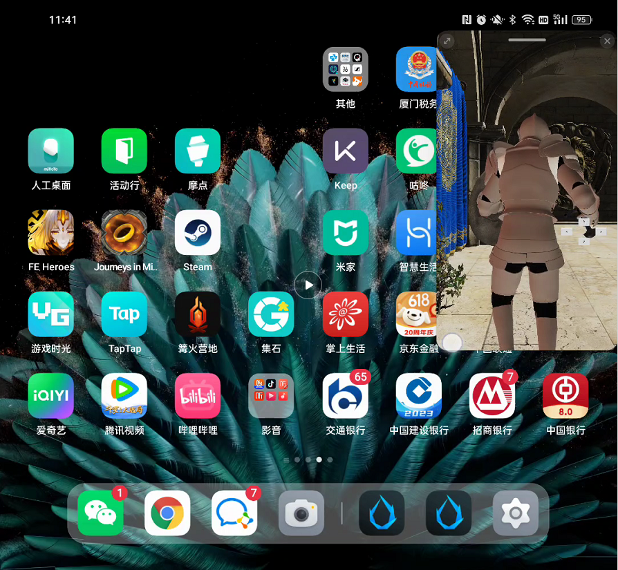

# Google Play Games on PC

[Google Play Games (GPG)](https://play.google.com/googleplaygames#section-system-requirements) is a related technology developed by Google that allows you to publish and play your mobile APK on PC.

Starting from v3.8, Cocos Creator will provide support for publishing to GPG. This will help your Android version of the game to be published on PC platform for more growth.

In order to publish on GPG smoothly, we recommend you to read the [GPG official website](https://developer.android.com/games/playgames/overview?hl=zh-cn) first to get involved with GPG SDK quickly.

## Integration Guide

In order to get your app on the shelf smoothly, please check that the following steps are all set.

1. In order for the game to run on Windows (both intel and AMD chips), you need to build it with x86 architecture. When building in Cocos Creator, check [APP ABI](./native-options.md#app-abi) and check the box x86_64:

    

    > x86_64 supports both x86 and x64 builds, so we recommend that you check x86_64 for future changes in requirements.

2. The highest version of OpenGL ES supported by Cocos Creator is 3.1, please check the GLES options in the following figure if you want your application supports OpenGL ES.
3. Vulkan version is not higher than 1.1. For Cocos Creator to support Vulkan, you need to check Vulkan in the build options, please refer to the figure below.

    

4. The relevant mobile platform features and permissions need to be removed, according to the [Functional testing requirements](https://developer.android.com/games/playgames/pc-compatibility?hl=zh-cn#unsupported-features-1) and [Quality testing requirements](https://developer.android.com/games/playgames/pc-compatibility?hl=zh-cn#unsupported-features-2). Currently, the default build of Cocos Creator does not cover these features or permissions.
5. Remove the Permissions dialog for Android apps, [Details](https://developer.android.com/games/playgames/pc-compatibility#permissions-dialogs).
6. Remove the unsupported Google Play API, [Details](https://developer.android.com/games/playgames/pc-compatibility#unsupported-google-apis).
7. Enable scoped storage when the application needs to read and write to external storage, example is as follows:

    - Find AndroidManifest.xml in the project directory.

        

    - After adding the permissions:

        

    - Fore more details, please refer to [Enable scoped storage](https://developer.android.com/games/playgames/pc-compatibility#scoped-storage).

8. Scaling UI

    Cocos Creator supports adaptive UI. For most mobile games, the resolution is determined when the app is launched, so there is no need to consider the adaptation, but on GPG, since the user can resize the window through the outside of the window, you need to adapt the resolution separately.

    We recommend you to select **Widget** component and make sure its **Align Mode** is **On_WINDOW_RESIZE** or **ALWAYS**.

    

    - [GPG Interface Scaling](https://developer.android.com/games/playgames/graphics?hl=zh-cn#ui-scaling)
    - [Multi-resolution Adaptation Scheme](../../../ui-system/components/engine/multi-resolution.md)
    - [Widget Component Reference](../../../ui-system/components/editor/widget.md) Adaptation of child UI

    For more details, see [UI Practice Guide](../../../ui-system/components/engine/usage-ui.md)

    For adapting devices with large screens, you can refer to Google [Responsive Layout for Large Screen Device Development](https://developer.android.com/large-screens).

    </img>

9. GPG requires support for a 16:9 aspect ratio. For an ideal player experience, the game should also support 21:9, 16:10 and 3:2.
Portrait mode games only need to support a 9:16 aspect ratio. If your game lacks landscape support, Google Play Games will render black bars in full screen mode. Again, see the **Widget** component section above.
1. Adapting to window transformations, the resolution rendered by GPG games will change the game's rendering resolution at game startup, at window resize, and when switching between full-screen and window models, [details](https://developer.android.com/games/playgames/graphics#dynamic-display).
2. To ensure that users do not lose progress when switching between mobile devices and PCs, please check that your game meets Google's requirements for continuity, see [About continuity and cross-device play](https://developer.android.com/games/playgames/identity?hl=zh-cn)

## Release process

The GPG release process is similar to the Android release process, you can refer to the following documents for release support.

- [install-and-run](./build-and-run.md)
- [Android build example](./android/build-example.md)
- [native-release](../native-options.md)

## Content

- [Integration with Input SDK](../gpg-input-sdk.md)

## Related links

- [GPG official website](https://developer.android.com/games/playgames/overview?hl=zh-cn)
