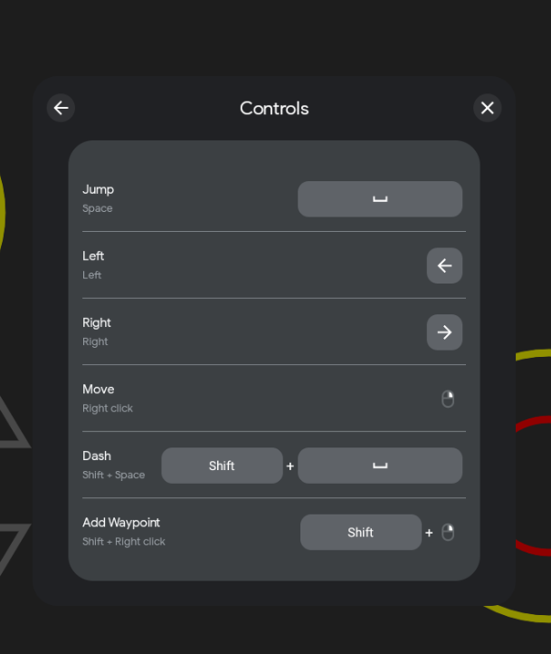

# Integrating Input SDK

The Input SDK provides a unified interface that allows players to easily find the mouse and keyboard bindings for your game on Google Play Games for PC, thereby enhancing their gaming experience.

## Prerequisites

If you are using Input SDK on a new Android build, simply check the Input SDK option in the build panel.

If the Android project was built previously, you will need to manually add the following code to the `native/engine/android/app/build.gradle` file.

```gradle
dependencies {
  implementation 'com.google.android.libraries.play.games:inputmapping:1.0.0-beta'
  ...
}
```

## Create a the class named `MyInputMapProvider`.

Create a new file `MyInputMapProvider.java` which contains the following code:

```java
    public class MyInputMapProvider implements InputMappingProvider {
        public enum InputEventIds {
            JUMP,
            LEFT,
            RIGHT,
            USE,
            SPECIAL_JUMP,
            SPECIAL_DUCK,
            CMB_MOVE,
            CMB_DASH,
            CMB_WAYPOINT
        }

        @Override
        public InputMap onProvideInputMap() {
            InputAction jumpInputAction = InputAction.create(
                    getString(R.string.key_jump),
                    InputEventIds.JUMP.ordinal(),
                    InputControls.create(
                            Collections.singletonList(KeyEvent.KEYCODE_SPACE),
                            Collections.emptyList()
                    )
            );
            InputAction leftAction = InputAction.create(
                    getString(R.string.key_Left),
                    InputEventIds.LEFT.ordinal(),
                    InputControls.create(
                            Collections.singletonList(KeyEvent.KEYCODE_DPAD_LEFT),
                            Collections.emptyList()
                    )
            );
            InputAction rightAction = InputAction.create(
                    getString(R.string.key_Right),
                    InputEventIds.RIGHT.ordinal(),
                    InputControls.create(
                            Collections.singletonList(KeyEvent.KEYCODE_DPAD_RIGHT),
                            Collections.emptyList()
                    )
            );

            InputAction cmbMove = InputAction.create(
                    getString(R.string.key_Move),
                    InputEventIds.CMB_MOVE.ordinal(),
                    InputControls.create(
                            Collections.emptyList(),
                            Collections.singletonList(InputControls.MOUSE_RIGHT_CLICK)
                    )
            );
            InputAction cmbDash = InputAction.create(
                    getString(R.string.key_Dash),
                    InputEventIds.CMB_DASH.ordinal(),
                    InputControls.create(
                            Arrays.asList(KeyEvent.KEYCODE_SHIFT_LEFT, KeyEvent.KEYCODE_SPACE),
                            Collections.emptyList()
                    )
            );
            InputAction cmbWaypoint = InputAction.create(
                    getString(R.string.key_Waypoint),
                    InputEventIds.CMB_WAYPOINT.ordinal(),
                    InputControls.create(
                            Collections.singletonList(KeyEvent.KEYCODE_SHIFT_LEFT),
                            Collections.singletonList(InputControls.MOUSE_RIGHT_CLICK)
                    )
            );
            InputGroup movementInputGroup = InputGroup.create(
                    getString(R.string.key_BasicMove),
                    Arrays.asList(jumpInputAction, leftAction, rightAction, cmbMove, cmbDash, cmbWaypoint)
            );
            return InputMap.create(
                    Arrays.asList(movementInputGroup),
                    MouseSettings.create(true, true)
            );
        }
    }

```

## Add binding names for keys

Define key code names in the `res/values/strings.xml` file to enable internationalization of the app. These descriptions will be used in the previous steps to provide context and clarity for the user when mapping input events to corresponding actions.

```xml
<resources>
    ...
    <string name="key_jump">Jump</string>
    <string name="key_Left">Left</string>
    <string name="key_Right">Right</string>
    <string name="key_Move">Move</string>
    <string name="key_Dash">Dash</string>
    <string name="key_Waypoint">Add Waypoint</string>
    <string name="key_BasicMove">Basic Movement</string>
</resources>
```

## Register `InputMapping`

To register the `InputMapping`, modify `AppActivity.java` located in `native\engine\android\app\src\main\cocos\game` by adding the necessary code.

```java
    ...
    @Override
    protected void onCreate(Bundle savedInstanceState) {
        super.onCreate(savedInstanceState);
        ...
        
        InputMappingClient inputMappingClient = Input.getInputMappingClient(this);
        inputMappingClient.setInputMappingProvider(new MyInputMapProvider());
    }
    ...

    @Override
    protected void onDestroy() {
        InputMappingClient inputMappingClient = Input.getInputMappingClient(this);
        inputMappingClient.clearInputMappingProvider();

        super.onDestroy();
        ...
    }
   
```
## Test Result

To bring up the page, use Shift + Tab while running on the HPE emulator provided by Google Play Games.




Refer to the [official documentation](https://developer.android.com/games/playgames/input-sdk-start) of the Input SDK for more details.
