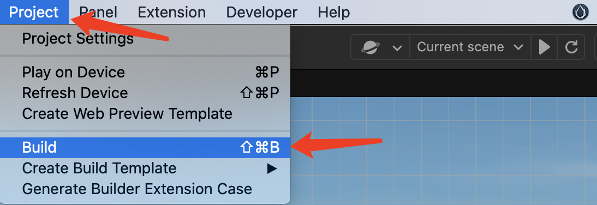
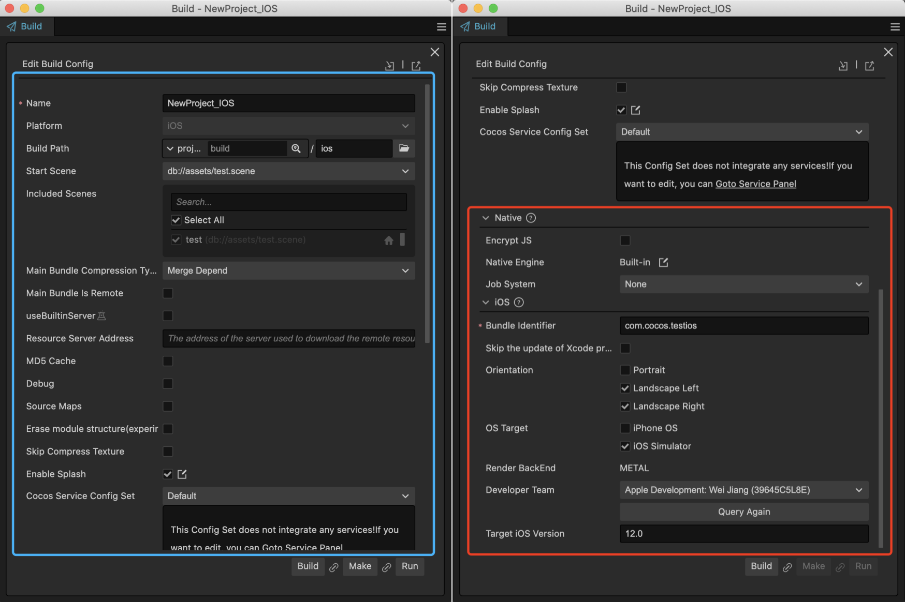
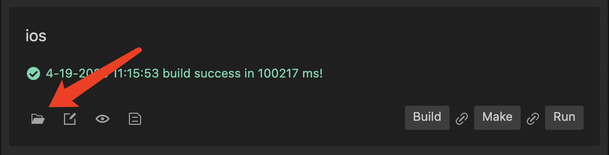
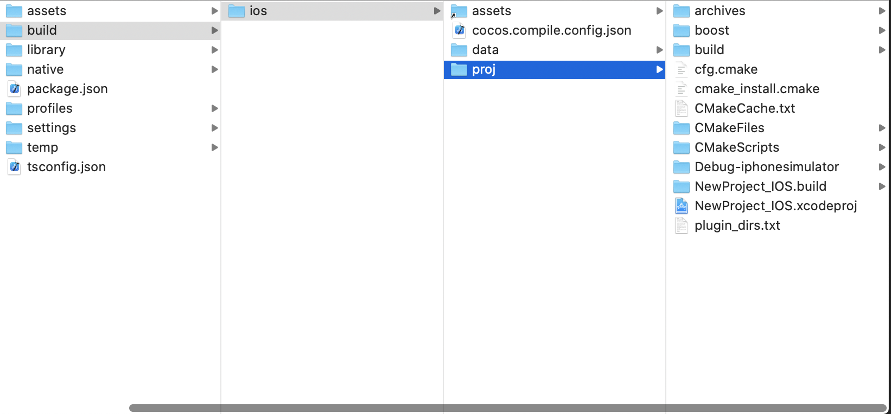
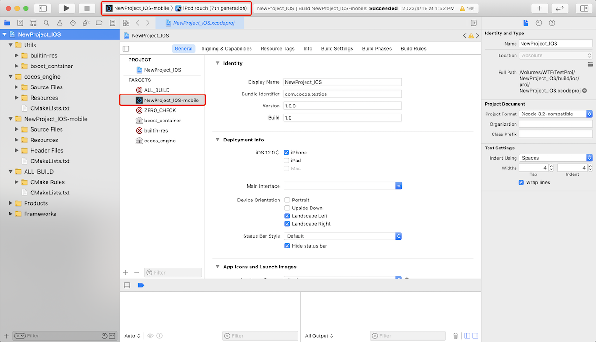
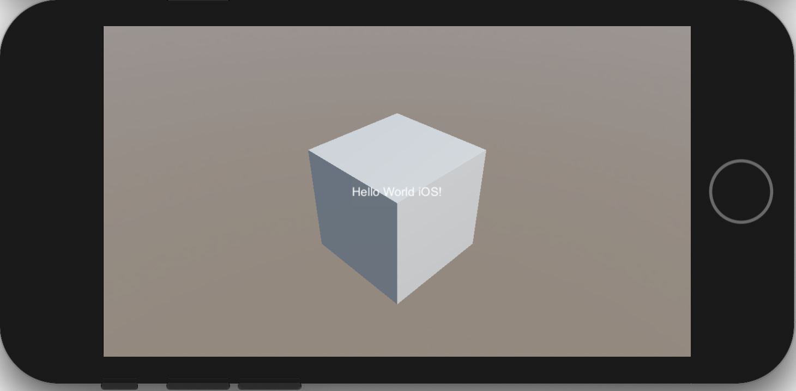

# iOS Publishing Example

This article will demonstrate the process of publishing a Cocos Creator project as an iOS application. Before getting started, you will need the following preparations:

- A macOS device with Xcode installed
- An Apple Developer account

## Publishing Process

### Register an Apple Developer account

Firstly, you need to have an Apple Developer account. If you don't have one, please go to the [registration page](https://appleid.apple.com/account) to create an account.

### Verify the macOS System and Xcode Version

Publishing iOS apps via Cocos Creator environment requirements:

- Xcode version **11.5** or above.
- macOS version **10.14** or above.

> **Note**: By default, the corresponding Xcode version in the App Store matches the system. If you want to use a specific version of Xcode, you can download it from the [Xcode download page](https://developer.apple.com/xcode/download/).

### Prepare a Test Project

Open an existing project or create a new one.

### Build

As shown in the image above, select **Project -> Build** from the top menu in Cocos Creator to open the build panel.

#### General Options

In the blue section on the left side of the image, you can find the common parameters that need to be configured for all platforms supported by Cocos Creator. For more details, you can refer to the [General Build Options](./../build-options.md) page.

#### iOS Specific Options

Choose the platform as **iOS**, and as you scroll down the panel, you will see the red section on the right side. These are the configurations specific to the `native` and `iOS` platforms. For more details, please refer to the [General Native Build Options](./../native-options.md) and [Build Options - iOS](./build-options-ios.md) pages.

#### Bundle Identifier

The Bundle Identifier is a required configuration. It is generally in the format of `com.mycompany.myproduct`. For example, in this example, it is set to `com.cocos.testios`.

#### Perform the Build

After completing the configurations, click the **Build** button to generate the Xcode project.

Once the build is successful, you can click the open file button as shown below to open the generated project folder.

If you haven't changed the build path, you can find the `build/ios/proj` directory in the project root, which contains the following files:

### Compile and Run in Xcode

Double-click on `build/ios/proj/<project_name>.xcodeproj` to open the Xcode project.

Select `<ProjectName>-mobile` as the build target, choose a suitable simulator or a connected iOS device, and click the compile and run button to start the project.

## Read More

### Script-Native Communication

Sometimes, projects need to call iOS system functions from the script layer, or when integrating a third-party iOS SDK, it is necessary to call its API through script code. In such cases, the communication mechanism between the script layer and the native layer is required.

For communication mechanisms, please refer to:

- [JavaScript and iOS/macOS Communication with Reflection](../../../advanced-topics/oc-reflection.md)
- [JavaScript and Objective-C Communication using JsbBridge](./../../../advanced-topics/js-oc-bridge.md)

### Debugging JavaScript on Native Platforms

Some issues only occur on specific devices and environments. If you can debug the code on the corresponding situation, you can quickly identify the problem and find a solution.

Cocos Creator provides a native debugging mechanism that allows you to easily debug game code on a device. For more details, please refer to [Debugging JavaScript on Native Platforms](./../debug-jsb.md).

## Features and System Versions

Different features rely on specific system versions. Please refer to [Features and System Versions](./../../../advanced-topics/supported-versions.md) for more details.
