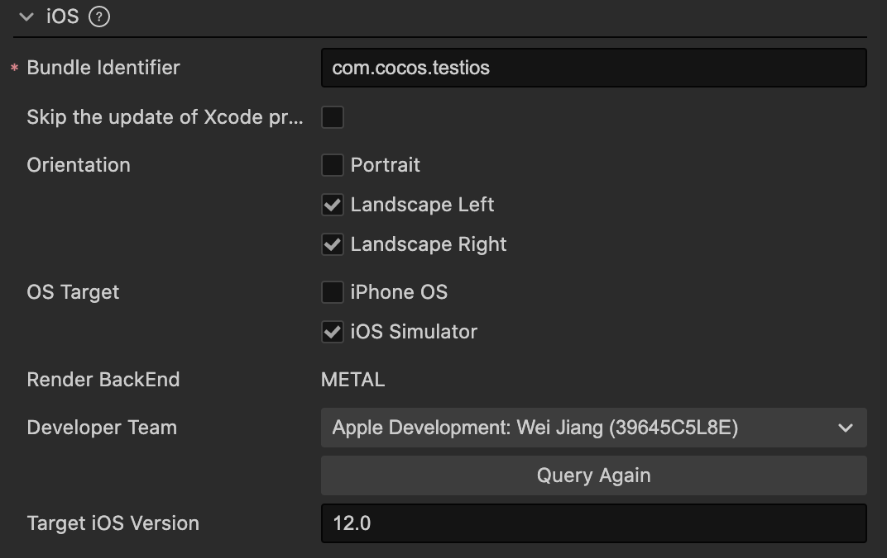

# Build Options - iOS

## Executable Name

This a field used to specify the name of the main executable file of an application, which is stored in the app's Info.plist file. If not provided, the system will generate a default value based on the app name field. The value for this field must adhere to a specific format, containing only numbers, letters, underscores (_) and hyphens (-).

## Bundle Identifier

The package name, usually in reverse order of the product website URL, such as `com.mycompany.myproduct`.

> **Note**: The package name can only contain numbers (0-9), letters (A-Z, a-z), hyphens (-), and dots (.), and the last part of the package name must start with a letter and cannot start with an underscore or a number. For more details, please refer to [Bundle Identifier](https://developer.apple.com/documentation/bundleresources/information_property_list/cfbundleidentifier).

## Skip the update of Xcode project

By default, each build will execute the CMake command to generate an Xcode project. However, if modifications or configurations are made to the generated Xcode project, such as integrating an SDK with CocoaPods, this could cause issues, as these modifications will be reverted in the next build.

However, if this option is checked, subsequent builds will no longer update or overwrite the configuration of the Xcode project.

It should be noted that other changes related to CMake, such as adding C++ source code, will no longer trigger the regeneration of the Xcode project. 

## Orientation

The screen orientation currently includes three options: **Portrait**, **Landscape Left**, and **Landscape Right**.

- **Portrait:** The screen is in an upright position with the Home button at the bottom.
- **Landscape Left:** The screen is in a landscape position with the Home button on the left side of the screen.
- **Landscape Right:** The screen is in a landscape position with the Home button on the right side of the screen.

## OS Target

This defines the default launch system, types can be used are as follows:

- iPhone OS: Run on real iOS devices, e.g. an iPhone, and iPad.
- iOS Simulator: Run on the iOS simulator.

These is just the default value and can be modified at any time in Xcode.

## Render Backend

The Render Backend currently supports **METAL**. For more details, refer to the official documentation on [Metal](https://developer.apple.com/cn/metal/).

## Developer Team

This option is used to configure the Apple Developer account used for signing the app when building and compiling the iOS project. If you manually configure this information in Xcode during compilation, the configuration in Xcode takes precedence. When performing a rebuild, the value of this option will override the value configured in Xcode.

## Target iOS Version

This option is used to specify the iOS software version when publishing to the iOS platform, with a default value of 12.0. The version number after the build will be recorded in the `TARGET_IOS_VERSION` field in the `build/ios/proj/cfg.cmake` file.
