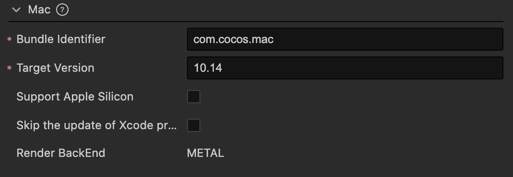

# Build Options - macOS

## Executable Name

This a field used to specify the name of the main executable file of an application, which is stored in the app's Info.plist file. If not provided, the system will generate a default value based on the app name field. The value for this field must adhere to a specific format, containing only numbers, letters, underscores (_) and hyphens (-).

## Bundle Identifier

The package name, usually in reverse order of the product website URL, such as `com.mycompany.myproduct`.

> **Note**: The package name can only contain numbers (0-9), letters (A-Z, a-z), hyphens (-), and dots (.), and the last part of the package name must start with a letter and cannot start with an underscore or a number. For more details, please refer to [Bundle Identifier](https://developer.apple.com/documentation/bundleresources/information_property_list/cfbundleidentifier).

## Target Version

This option is primarily used to specify the target system version when publishing for the Mac platform, with a default value of 10.14. The version number after the build will be recorded in the `TARGET_OSX_VERSION` field of the `build/mac/proj/cfg.cmake` file in the project directory.

## Support Apple Silicon

This option is used to provide better prompts for known engine module support issues on Apple M1 (Silicon) architecture devices.

## Skip the update of Xcode project

By default, when building the project, the Xcode project is updated using the Xcode project template in `native/mac/`. Some configuration modifications in the project will be reset to the template.

If this option is selected, the Xcode project configuration will not be updated during the build.

This option is useful when using CocoaPods or when you want to persist modifications to the Xcode project. Without selecting this option, the modifications made by `pod install` will be overwritten with each build. With this option selected, you don't have to worry about the modifications being overwritten.

> **Note**: If this option is selected, subsequent changes to the configuration will not update the Xcode project.

### Render Backend

The Render Backend currently supports **METAL**. For more details, refer to the official documentation on [Metal](https://developer.apple.com/cn/metal/).
