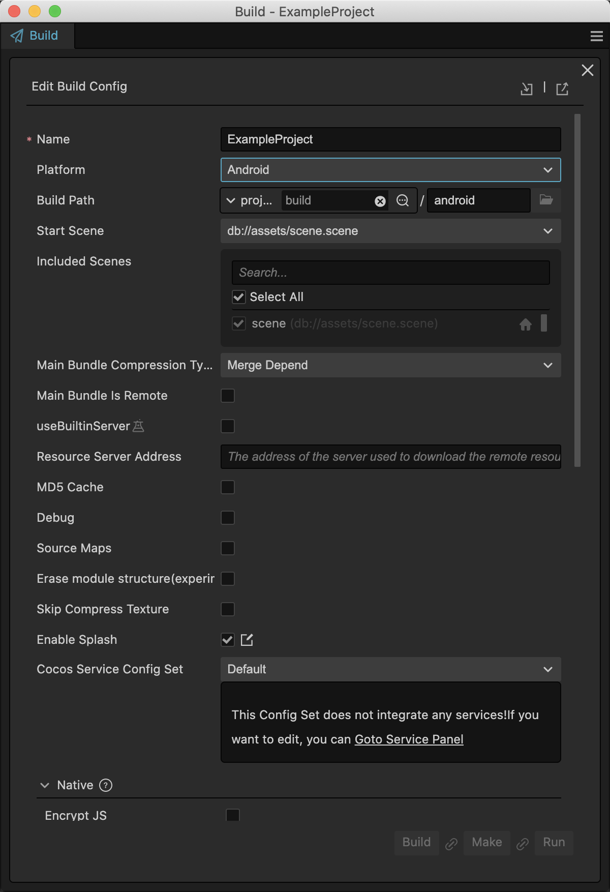
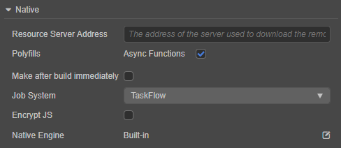
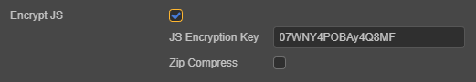
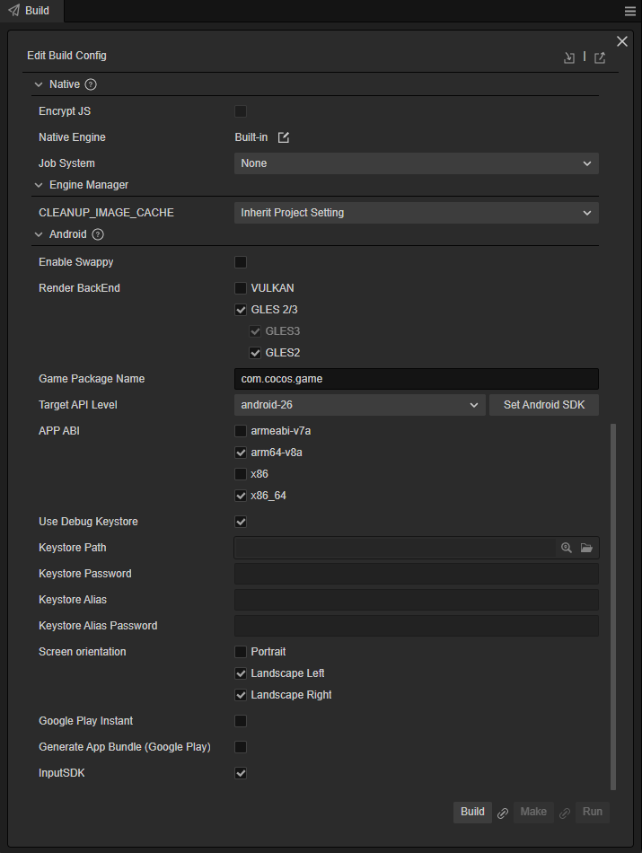
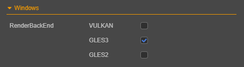
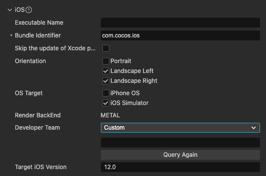
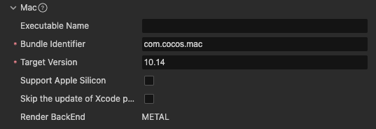
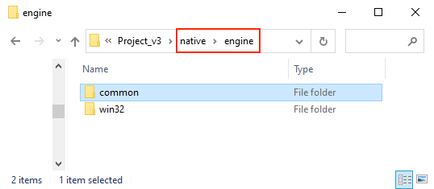
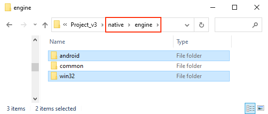
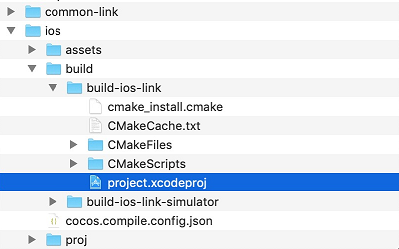

# Publish to Native Platforms

Click **Project -> Build** in the menu bar to open the **Build** panel.

The native platforms that can be selected currently include **Android**, **iOS**, **Mac**, and **Windows**. Among them, the options for publishing to **iOS**, **Mac**, and **Windows** only appear when using the corresponding operating system.

## Environment Configuration

Publishing to the native platform requires installation and configuration of some necessary environments. For details, please refer to the[Installation and Configuration of Native Development Environment](setup-native-development.md) documentation.

## Build Options

For the general build options of each platform, please refer to the [General Build Options](build-options.md) documentation.

### Generic Build Options for Native Platforms

Due to the adjustment of the current build mechanism, the processing of different platforms is built into the **Build** panel in the form of plug-ins.

After selecting the native platform to be built in the **Release Platform** of the **Build** panel, notice that in addition to the expanded options of the specific native platform, there is also an expanded option for **Native**. The build options in **Native** are the same on all native platforms.

#### Select the Source Code Template (Template)

Starting from Cocos Creator 3.0, in order to have a consistent experience, the engine template that can be used in **Template** is **Link**, and the original **Default** template has been removed.

The Link template does not copy the Cocos2d-x source code to the build directory, but uses the shared Cocos2d-x source code. This can effectively reduce the space occupied by the build directory, and modifications to the Cocos2d-x source code can also be shared.

> **Notes**:
>
> **About the source code engine**
>
> The Cocos2d-x engine includes source code engines, and the scope of their application is:
> 1. When the source code engine first builds and compiles a project, it takes a long time to compile C++ code. Depending on the computer configuration, this time may be 5-20 minutes. For the same project, after it has been compiled once, the time required for the next compilation will be greatly reduced.
> 2. The project built by the source code engine is compiled and run using the native development environment (such as Android Studio, Xcode and other IDEs), which can be debugged and error captured.

The `resources\3d\cocos2d-x-lite` folder under the installation directory of Cocos Creator already contains the built-in Cocos2d-x source code engine. To customize the engine, please refer to the [Engine Customization Workflow](../../advanced-topics/engine-customization.md) documentation for details.

#### Resource Server Address

When the package body is too large, the resource can be uploaded to the resource server and downloaded through the network. This item is used to fill in the address where the resource is stored on the remote server. Developers need to manually upload the `remote` folder in the release package directory to the filled resource server address after build. For details, please refer to the [Upload resources to remote server](../../asset/cache-manager.md) documentation.

#### Polyfills

This item is a polyfills option for some new features supported by the scripting system, and currently only supports **asynchronous functions**. After checking, the generated project will bring the corresponding polyfills, that is, the package body will be enlarged, and the developer can choose whether to use it according to actual needs.

#### Make Immediately After Build

If this option is checked, the **Make** step will be executed automatically after the build is completed, and no manual operation is required.

#### Encrypt JS

This item is used to encrypt the published script. The jsc file will be generated in the built-in `assets` directory, this file is encrypted. The js file will be backed up in the `script-backup` directory for debugging, and will not enter the APP during packaging.

**JS Encryption Key**: This value will be used as the key to encrypt the js file on the Native platform. It will be randomly generated when the project is created.

**Zip compression**: If checked, the script size can be reduced.

### Android Platform

Android platform build options：

#### Rendering Backend

Rendering currently supports using [VULKAN](https://www.vulkan.org/), [GLES3](https://www.khronos.org/registry/OpenGL-Refpages/es3/) and [GLES2](https:// www.khronos.org/registry/OpenGL-Refpages/es2.0/) of these three types, **GLES3** is used by default. In the case of multiple being selected at the same time, the runtime will select the rendering backend to be used according to the actual support of the device.

#### Game Package Name

**Game Package Name** is usually arranged in reverse order of the product website URL, such as `com.mycompany.myproduct`.

> **Note**: the package name can only contain numbers, letters and underscores. The last part of the package name must start with a letter, not an underscore or number.

#### Target API Level

Set the Target API Level required when compiling the Android platform. Click the **Set Android SDK** button next to it to quickly jump to the configuration page. For specific configuration rules, please refer to the [Configuring Native Development Environment](setup-native-development.md) documentation.

#### APP ABI

Set the CPU type that Android needs to support. It is possible to choose one or more options. Currently, there are three types: **armeabi-v7a**, **arm64-v8a**, and **x86**.

> **Note**:
>
> 1. After selecting an ABI to build, build another ABI without cleaning. At this time, the so of both ABIs will be packaged into the apk. This is the default behavior of Android Studio. If using Android Studio to import the project, after selecting an ABI to build, first execute **Build -> Clean Project** and then build another ABI. At this time, only the latter ABI will be packaged into the apk.
>
> 2. After the project is imported with Android Studio, it is an independent existence and does not depend on the build release panel. To modify the ABI, just modify the **PROP_APP_ABI** property in the **gradle.properties** file.
>
> 

#### Use the Debug Keystore

Android requires that all APKs must be digitally signed with a certificate before they can be installed. Cocos Creator provides a default keystore. Check **Use debug keystore** to use the default keystore. If the developer needs to customize the keystore, uncheck the **Use debugging keystore** check. For details, please refer to the [Official Documentation](https://developer.android.google.cn/studio/publish/app-signing).

#### Screen Orientation

The screen orientation currently includes **Portrait**, **Landscape Left**, and **Landscape Right**.

- **Portrait**: the screen is upright and the Home button is down.
- **Landscape Left**: the screen is placed horizontally, and the Home button is on the left side of the screen.
- **Landscape Right**: the screen is placed horizontally, and the Home button is on the right side of the screen.

#### Google Play Instant

Check this option to package and publish the game to Google Play Instant. Google Play Instant relies on Google Play and is not a new distribution channel, but closer to a game micro-end solution. It can realize that the game can be played immediately without installation, which is conducive to the trial play, sharing and conversion of the game.

> **Pay attention to the following points when using**:
>
> 1. The version of Android Studio must be 4.0 and above
>
> 2. Android Phone 6.0 and above. Devices with the Android SDK version between 6.0 and 7.0 need to install the Google Service Framework, while those with the SDK version above 8.0 do not need it, and can be installed and used directly.
>
> 3. For the first compilation, open the built project with Android Studio to download the **Google Play Instant Development SDK (windows)** or **Instant Apps Development SDK (Mac)** support package. If the download is unsuccessful, it is recommended to set up the HTTP proxy of Android Studio.
>
> 

#### Make App Bundle (Google Play)

Check this option to package the game into App Bundle format for uploading to the Google Play store. For details, please refer to the [Official Documentation](https://developer.android.google.com/guide/app-bundle/).

### Windows Platform Build Options

There is currently only one **rendering backend** for the Windows platform, including three types **VULKAN**, **GLES3** and **GLES2**. **GLES3** is checked by default. In the case of multiple ticking at the same time, the runtime will select the rendering backend to use according to the actual support of the device.

### iOS Platform Build Options

The build options for the iOS platform include **Bundle Identifier**, **Screen Orientation**, and **Rendering Backend**, where the setting of **Screen Orientation** is consistent with the Android platform.

#### Bundle Identifier

Package name, usually in reverse order of product website URL, such as `com.mycompany.myproduct`.

> **Note**: the package name can only contain numbers, letters and underscores. The last part of the package name must start with a letter, not an underscore or number.

#### Rendering Backend

**Rendering backend** currently supports **METAL**.

### Mac Platform Build Options

The build options for the Mac platform include **Bundle Identifier** and **Rendering backend**, and the setting method is the same as that of the iOS platform.

## Build

After the build options are set, start building. Click the **Build** button at the bottom right corner of the **Build** panel to start the build process.

When compiling scripts and packaging resources, a blue progress bar will be displayed on the **Build Tasks** page of the **Build** panel. If the build is successful, the progress bar will reach 100% and be displayed in green:

### Build the Directory

After the build is over, what we get is a standard Cocos2d-x project, which has the same structure as the newly created project using Cocos Console. Taking the Windows platform as an example, the directory structure of the exported native project package `windows` is:

- `assets`: store project resources.
- `proj`: Store the currently built native platform project, which can be used for the IDE of the corresponding platform to perform compilation tasks. For details, please refer to the introduction below.
- `cocos.compile.config.json`: Compile option configuration for this build.

Because the underlying C++ code generated after the native platform (such as Android, Windows) is built is completely consistent, in v3.0, extract the underlying C++ code separately and place it in the shared `native/engine/common` file in the project directory Folder. In this way, when the native platform is built, if it is detected that the folder already exists, this part of the content will not be processed again, which speeds up the build.

For more instructions on the directory structure, please refer to the [Build Directory Differences - Native Platform](../../release-notes/upgrade-guide-v3.0.md#%E5%8E%9F%E7%94%9F%E5%B9%B3%E5%8F%B0) documentation.

### Secondary Development

v3.0 separates the code and configuration, put part of the code and configuration into the source code management, located in the `native\engine\currently built platform name` folder under the project directory (for example, `native\engine\win32`, `native\engine\android`).

Developers can integrate the SDK or do secondary development here. Deleting the release package directory (such as `build\windows`) generated after the build will not affect the integrated SDK, but the premise is that is needed to add a code reference in the directory:

- If the integrated SDK is common to all native platforms, it is necessary to add a reference in `native\engine\common\CMakeLists.txt` in the project directory.
- To do secondary development based on iOS, Mac, and Windows platforms, add a reference in `native\engine\currently built platform name\CMakeLists.txt` in the project directory (for example, `native\engine\ios\CMakeLists.txt)`)
- If the secondary development is based on the Android platform:
    - C++: Need to add a reference in `native\engine\android\CMakeLists.txt` in the project directory.
    - Java: Need to add a reference in the project release package `build\android\proj\build.gradle`.

For more information about the use of CMake, please refer to the [CMake Introduction](../../advanced-topics/cmake-learning.md) docuementation.

## Build and Run

Cocos Creator supports **Make** and **Run Preview** steps via the editor or the corresponding IDE for each platform (e.g.: Xcode, Android Studio, Visual Studio).

### Via the Editor

After the build is completed, continue to click the **Make** button next to it, and it will prompt:

`make package YourProjectBuildPath success!`

> **Note**: after the first generation of the Android platform or the version upgrade, it is recommended to open the project through Android Studio, download the missing tools according to the prompts, and then compile and run.

**Make** After the completion of the process, continue to click the **Run** button next to it. Part of the compilation may continue. Please wait patiently or check the progress through the log file. The operating results of each platform are:

- Mac/Windows platform will run the preview directly on the desktop
- The Android platform must be connected to the real device via USB, and the preview can be run after the USB debugging is turned on on the real device
- The iOS platform will call the simulator to run the preview, but it is recommended to connect to the real machine through Xcode to execute **Make** and **Run**, please refer to the introduction below.

### Via IDE

Click the **folder icon** button in the lower left corner of the **build task**, and the build path will be opened in the file manager of the operating system. In this path, the `proj` under the `build` directory contains The currently built native platform project.

Next, open these generated native projects using the IDE corresponding to the native platform (e.g.: Xcode, Android Studio, Visual Studio) and make further operations like compilation, preview and release.

- **Android**

  

- **Windows**

  

- **iOS** and **Mac**

  

> **Note**: do not perform secondary development in these native platform projects, otherwise it will be overwritten when rebuilding.

To learn how to debug on the native platform, please refer to the [Native Platform JavaScript Debugging](debug-jsb.md) documentation.

## Precautions

1. The project built in debug mode on MIUI 10 system may pop up the prompt box of "Detected problems with API compatibility". This is a problem introduced by MIUI 10 system itself, just use release mode to build.

2. When packaging the iOS platform, if the developer does not use WebView related functions in the project, please make sure to remove the WebView module in **Project -> Project Settings -> Feature Cropping** to improve the success of iOS App Store machine review Rate. If the developer really needs to use WebView (or the added third-party SDK comes with WebView), and therefore the iOS App Store fails the machine review, they can still try to appeal via email.

3. There are some differences between the compiled results of the Android platform through the editor and Android Studio:

    - After executing the **make** step through the editor, the `build` directory will be generated under the release path, and the `.apk` will be generated under the `app\build\outputs\apk` directory of the `build` directory.

    - After compiling with Android Studio, `.apk` will be generated in `proj\app\build\outputs\apk` directory.

4. Android and Android Instant use the same build template, and the generated projects are all in the `build\android\proj` directory. Please note for this directory:

    - If it is the code used solely by the Android platform, please put it in the `app\src` directory, and put the third-party library used separately in the `app\libs` directory (if these two directories do not exist, create them).

    - If the code and third-party libraries used by Android Instant are used separately, please put them in the `instantapp\src` and `instantapp\libs` directories respectively (if these two directories do not exist, create them).

    - For code and third-party libraries shared by Android and Android Instant, please put them in the `src` and `libs` directories respectively (if these two directories do not exist, create them).

    When compiling for Android by clicking the **Make** button in the **Build Release** panel, the default execution of `assembleRelease/Debug` will be executed, and the default execution of `instantapp:assembleRelease/Debug` when compiling Android Instant.
