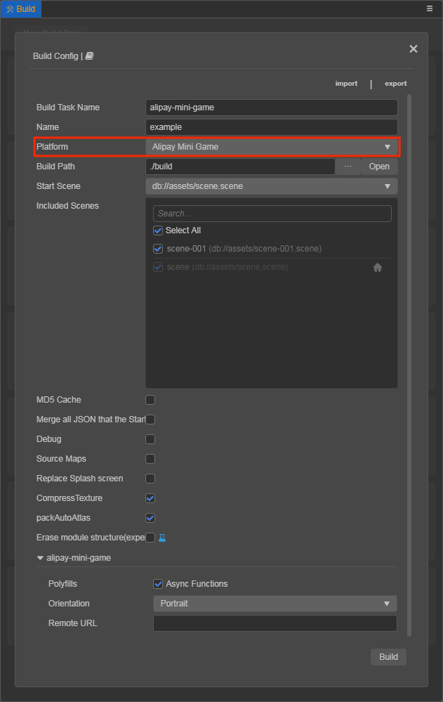
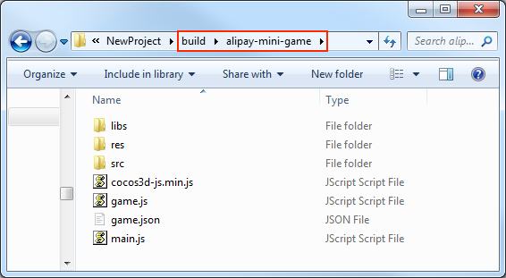
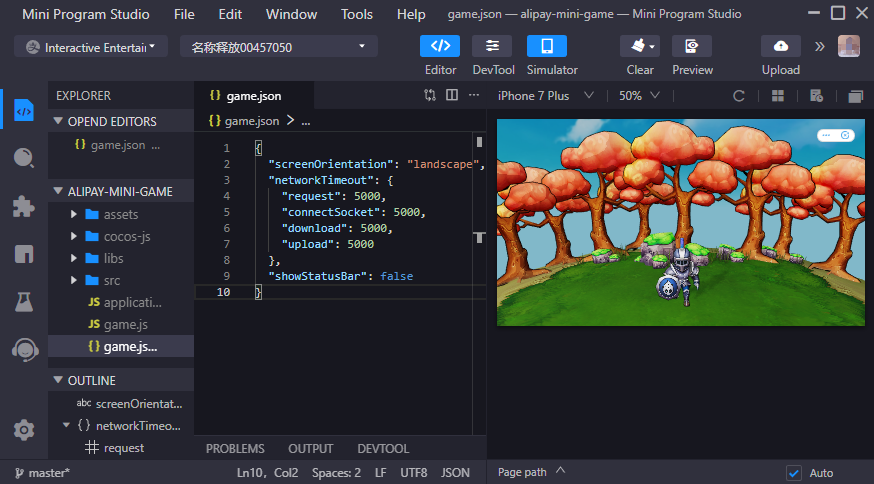

# Publish to Alipay Mini Games

## Environment Configuration

- Download [Alipay Mini Program Studio](https://render.alipay.com/p/f/fd-jwq8nu2a/pages/home/index.html) to the desktop and install it.

- Download [Alipay](https://mobile.alipay.com/index.htm) and install it on your mobile device.

- The minimum version supported of the Alipay client on Android is 10.1.75 and on iOS is 10.1.78.

## Publishing Process

Use Cocos Creator to open the project to be published, select **Alipay Mini Game** in **Platform** of the **Build** panel, and then click **Build**.

Please refer to the [build options](build-options.md) documentation for general build options settings. The rules for filling out build options related to Alipay mini-games are as follows:

| Build Option | Description | Field Name (for command-line publishing) |
| :-- | :-- | :-- |
| Start Scene Asset Bundle | When checked, the first scene and its related dependencies will be built into the built-in Asset Bundle - [start-scene](../../asset/bundle.md#the-built-in-asset-bundle) under the release package directory `assets` to improve the speed of loading assets for the start scene. | `startSceneAssetBundle` |
| Orientation | Optional values include `landscape` and `portrait`. | `deviceOrientation` |
| Resource Server Address | Used to fill in the address of the remote server where the resource is stored. Developers need to manually upload the remote folder in the release package directory to the filled in resource server address after the build. For details, please refer to the [Uploading Resources to Remote Servers](../../asset/cache-manager.md) documentation | `remoteUrl` |
| polyfills | Build polyfills that support some new features, mainly when packaging scripts. Currently only **Async Functions** are supported, more features will be opened later. | `polyfills` |

After the build is finished, click the folder icon button in the bottom left corner of **Build Task**, you can see that the project folder `alipay-mini-game` is created in the `build` directory of the project, which already contains the configuration file `game.json` for the Alipay mini-game environment.

Use **Alipay Mini Program Studio** to open the `alipay-mini-game` folder generated by the build to open the Alipay mini-game project and preview/debug the game content.

## Resource management for Alipay mini-game environment

Alipay mini-games are similar to WeChat mini-games in that there is a package size limit, and additional resources over **4MB** must be downloaded via network requests.  When the package size is too large, configure the **Resource Server Address** option in the **Build** panel to upload the resources to a remote server, please refer to the [Upload Resources to Remote Server](../../asset/cache-manager.md) documentation.

It is recommended to save only the script files in the game package, and download all other resources from the remote server. Cocos Creator has already done the download, cache and version management of remote resources for you, please refer to the [Cache Manager](../../asset/cache-manager.md) documentation.

## Restrictions for Alipay mini-games

Work on adapting the Alipay mini-game is not completely finished yet, and it is known that the text rendering may not work well on low-end machines. And the following modules are still not supported:

- WebView
- VideoPlayer
- Sub-package loading
- Custom Fonts

The above features are expected to be gradually supported in future updates, and we will continue to communicate closely with the engineers of Alipay mini-games to continuously optimize the adaptation effect.

## Documentation

Since Alipay mini-game related documentation is currently only available internally, developers who need it can contact them directly at:

| Contact | Email |
---- | ---- |
| Li Zhi | lz98684@alibaba-inc.com |
| Huang Jiao | huangjiao.hj@alibaba-inc.com |
