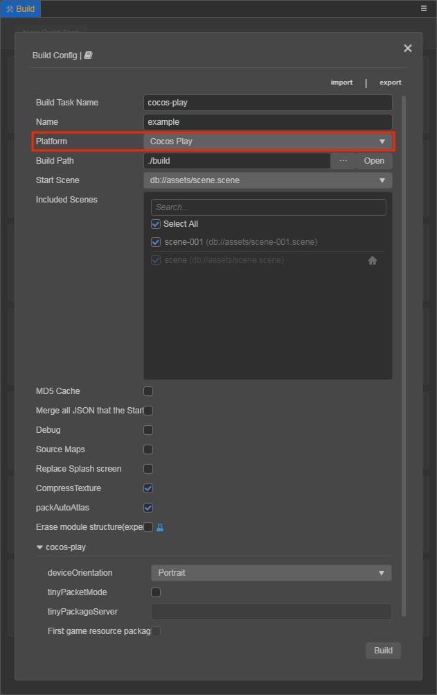

# Publish to Cocos Play

> **Note**: some platforms only have Chinese documentation available when visiting the platform's website. It may be necessary to use Google Translate in-order to review the documentation.

**Cocos Creator** officially supports the release of games to the **Cocos Play**.

## Publish Cocos Play with Cocos Creator

### Prerequisites

- Download and install the [Cocos Play Self-test Tools](https://gamebox.gitbook.io/project/you-xi-jie-ru-wen-dang/zi-yuan-xia-zai/zi-ce-gong-ju) on your Android device (recommended Android Phone 6.0 or above).

### Build

Use **Cocos Creator 3.0** to open a project. Select **Cocos Play** in the **Platform** dropdown of the **Build** panel, and then click **Build**.



The specific filling rules for the relevant parameter configuration are as follows:

1. **tinyPacketMode**

    This item is optional. The in-package volume of the game contains code and assets that cannot exceed 10M, and assets can be loaded via network requests. **tinyPacketMode** is to help developers keep the script files in the game package, other assets are uploaded to the remote server, and downloaded from the remote server as needed. Cocos Creator has already helped the developer with the download, cache, and version management of remote assets. The developer needs to do is the following steps:

    - When building, check the **tinyPacketMode** and fill in the **tinyPacketModeServer**.

    - **First game asset package into the game package**, this item is optional.

      In the `tinyPacketMode`, due to too many assets on the launch scene, downloading and loading assets for a long time may result in a short black screen when entering the game for the first time. If **First game asset package into the game package** is checked, you can reduce the black screen time when you first enter the game. However, it should be noted that the `res/import` asset does not support split asset downloading at this time, and the entire `import` directory is also packaged into the first package.

      Developers can choose whether to check this item according to their needs. Then click on **Build**.

    - After the build is complete, click the **Open** button after the **Build Path** to upload the `res` directory under the release path to the server. For example, if the default release path is `build`, the Build Task Name is `cocos-play`, you need to upload the `/build/cocos-play/res` directory.

    At this point, the `res` directory will no longer be included in the built-up cpk, and the assets in the `res` directory will be downloaded from the filled **tinyPacketMode Server Path** through the network request.

    The build parameters when Publish from the command line:

    ```js
    tinyPackageMode: false,
    tinyPackageServer: '',
    packFirstScreenRes: false,
    ```

2. After the build is completed, click the **folder icon** button below the cocos-play build task to open the `build` release path. If the **Build Task Name** is `cocos-play`, you can see that a `cocos-play` folder is generated in the `build` directory. This folder is the exported **Cocos Play** game project and **cpk**, the **cpk** package is in the `build/cocos-play` directory.

    

### Access testing

Developers must use the Cocos Play **Self-test Tools** to test access without problems before submitting to the platform for review. The size of the package is not required for the self-test, but if it is to be submitted for review, the package size cannot exceed 10M.

The **Self-test Tools** can launch the game and provide features such as game login, payment, etc. By reading the game configuration parameters, you can determine the type of game to start and how the game will start. 

For details, please refer to the [Self-test Tools](https://gamebox.gitbook.io/project/you-xi-jie-ru-wen-dang/ji-shu-dui-jie/zi-ce-gong-ju) documentation.

Open the previously installed **Self-test Tools**, then click the **Configure Game** button at the top left of the **Self-test Tools** to enter the game configuration page. Configure parameters as required and click **Save**.


#### Properties

| Property        | Function Explanation  |
| --------------  |  -----------          |
| **gameId**          | Game ID, which can be obtained from the background. |
| **gameKey**         | Game key, which can be obtained from the background. |
| **gameSecret**      | Game secret key, which can be obtained from the background. |
| **gameType**        | Game type, including **Versus** and **non-Versus**. You can see how to use it in the **Start Game** section below. |
| **gameMode**        | Game mode, please select **Runtime**.    |
| **lodeType**        | Game load type, which is how the game starts. Includes both **File** and **Url**. Please refer to the **Start Game** section below. |
| **path**            | Game load address, needs to be used with `lodeType`. Please refer to the **Start Game** section below.   |

## Start Game

There are two ways to start the game through the **Self-test Tools**.

1. Load the game package as a file from the specified location (The game lodeType is **File**).

    - Copy the `.cpk` file generated after the build to the device directory, if it is copied to the **sdcard** directory of device, you need to create a new folder (named **cocosplay**) in the **sdcard** directory and copy the `.cpk` to the **cocosplay** folder.
    - Select **File** in the **lodeType** of the game configuration page.
    - Fill in the path to the **cocosplay** folder where the `.cpk` file is placed in the `path` option. Such as `/cocosplay/game.cpk`.
    - Click on **Save** after the configuration is complete, then click on **Start Game** to open the game.

2. Open the game as a web page from the specified URL (The game lodeType is **Url**).

    - Upload the `.cpk` file to the server.
    - Select **Url** in the **lodeType** of the game configuration page.
    - Fill in **path**, such as: <http://192.168.0.1:8080/game.cpk>.
    - Click on **Save** after the configuration is complete, then click on **Start Game** to open the game.

## Reference documentation

> **Note**: some platforms only have Chinese documentation available when visiting the platforms website. It may be necessary to use Google Translate in-order to review the documentation.

- [Cocos Play Center](https://gamebox.cocos.com/)
- [Cocos Play Documentation Center](https://gamebox.gitbook.io/project/)
- [Cocos Play API Documentation](https://gamebox.gitbook.io/project/you-xi-jie-ru-wen-dang/ji-shu-dui-jie/ji-chu-neng-li)
- [Cocos Play Self-test Tools](https://gamebox.gitbook.io/project/you-xi-jie-ru-wen-dang/ji-shu-dui-jie/zi-ce-gong-ju)
- [Cocos Play Self-test Tools Download](https://gamebox.gitbook.io/project/you-xi-jie-ru-wen-dang/zi-yuan-xia-zai/zi-ce-gong-ju)
