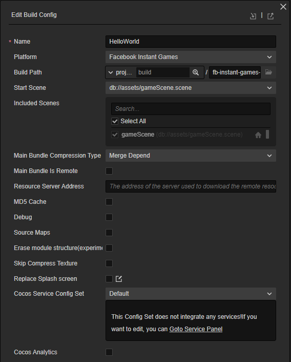
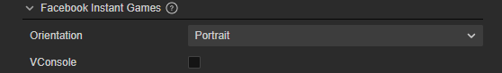
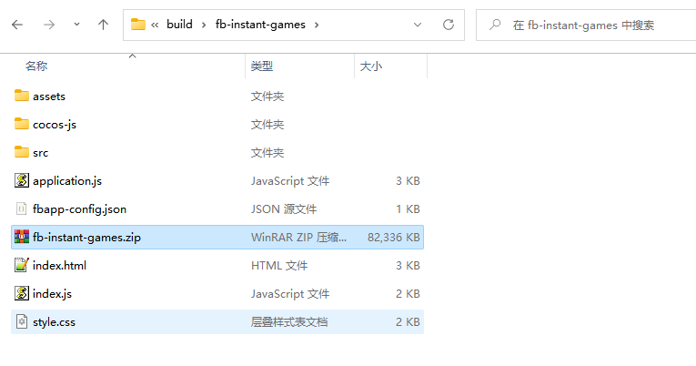
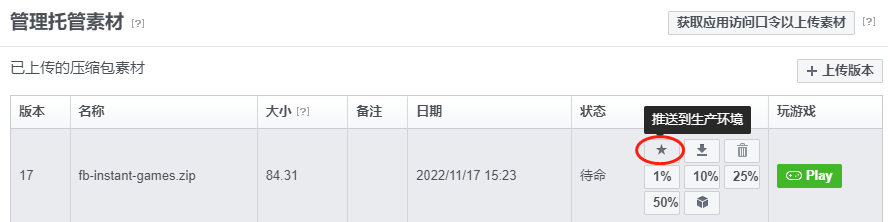
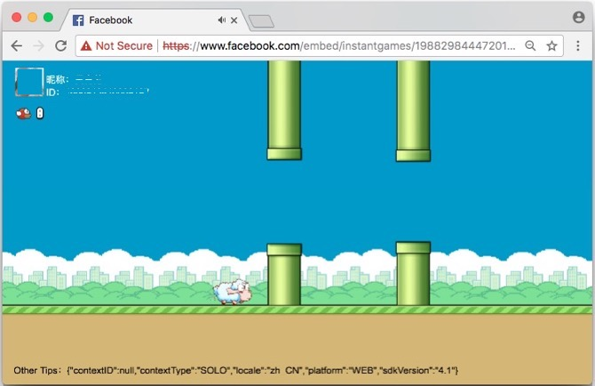
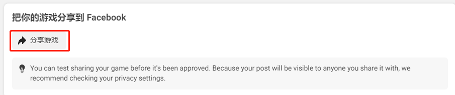
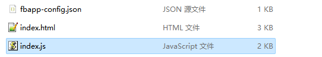

# Publish to Facebook Instant Games

The essential difference between Facebook Instant Games and WeChat mini-games is that Facebook Instant Games runs on a pure HTML5 environment. So it can run not only on cell phones but also on desktop browsers, making development and debugging much easier.

**Currently Cocos Creator does the work for users including:**

- Integration with Facebook Instant Games SDK and automatic initialization, allowing users to call the relevant APIs directly
- One-click packaging process in the Cocos Creator build panel to package games directly to Facebook Instant Games specifications

**What the user needs to do:**

- Call the Facebook Instant Games SDK to access platform-related features
- Upload the packaged version of Cocos Creator to Facebook

## Publishing process

- Build the game using Cocos Creator
- Upload to Facebook backend
- Test the game
- Share your game in Facebook

## Build the game with Cocos Creator

1. Open the project to be published using Cocos Creator and open the **Build** panel from the **Menu bar -> Projects**. Select **Facebook Instant Games** from the **Platform** in the **Build** panel.

    

    Please refer to [Build Options](build-options.md) for general build options, Facebook Instant Games-specific build options are listed below, please refer to the **Build Options** section below for more information.

    

2. Once the build options in the **Build** panel are set, click **Build** button.
    When the build is complete, click the folder icon button in the bottom left corner of **build task** to open the project release package, you can see that the `fb-instant-games` (whichever is the name of the specific build task) folder has been created in the default release path `build` directory, which already contains the zip file of the Facebook Instant Games environment `fb -instant-games.zip`.

    

### Build options

Build options are common across platforms, please refer to [Build Options](build-options.md) for details. Next, let's look at the build options specific to the Facebook Instant Games platform.

| Build options | Description | Field name (for command line publishing) |
| :--- | :--- | :--- |
| Device orientation | Options include **Landscape**, **Portrait** | `orientation` |
| vConsole | Insert the vConsole debugging plugin. vConsole is similar to a mini version of DevTools and is used to assist in debugging. | `embedWebDebugger` |

### Upload to Facebook

Create a new app in Facebook backend, add **small games** in **Add products**, set the game category, and save the changes. (For details, please refer to [Set up the app](https://developers.facebook.com/docs/games/instant-games/getting-started/quickstart?locale=zh_CN#app-setup))

Click the **Small Games -> Web Hosting** tab on the left side of the app panel, click **Upload Versions**, and upload the `.zip` file from the `fb-instant-games` directory to the Facebook hosting service.


When the version status changes to "Standby", click the "★" button to push the build to the "Production" environment.



### III. Testing the game

#### Enable the https-enabled web server locally

- First, open a command line window, go to the `fb-instant-games` directory, and install the http-server package via npm: ###

  ```bash
  cd fb-instant-games
  npm install -g http-server
  ```

- Next, create the private key and certificate via openssl.

  ```bash
  openssl genrsa 2048 > key.pem
  openssl req -x509 -days 1000 -new -key key.pem -out cert.pem
  ```

- When the private key and certificate are ready, the Web service can be started locally via SSL: the

  ```bash
  http-server --ssl -c-1 -p 8080 -a 127.0.0.1 
  ```

- Open [https://localhost:8080](https://localhost:8080) with a browser and skip the security warning displayed by the browser. This step is only for the browser to whitelist the above private key and certificate. If the private key and certificate are subsequently regenerated, you need to open it again to confirm it once. It is not yet possible to preview the game directly at this step, because previewing the game requires initializing the Facebook Instant Games SDK, which needs to be done in the following way.

#### Preview games under Facebook domain

To use all the features of the Facebook Instant Games SDK, you need to open [https://www.facebook.com/embed/instantgames/YOUR_GAME_ID/player?game_url=https:// localhost:8080](https://www.facebook.com/embed/instantgames/YOUR_GAME_ID/player?game_url=https://localhost:8080) and be careful to replace the link `YOUR_ GAME_ID` in the link and replace it with the application number you created in the Facebook backend.

Then you can see the game running successfully.



### IV. Share your game in Facebook

Click the **Games** tab in the application panel, select **Details**, and pull down the **Details** page to the bottom to see the section shown below, select **Share Game** to share the game directly to the Facebook dynamic message.



For details, please refer to [Test, Publish and Share Trivia Games](https://developers.facebook.com/docs/games/instant-games/test-publish-share?locale=zh_CN).

> **NOTE**: There are several restrictions on Facebook hosting, the most important of which are.
>
> 1. server-side logic (e.g. php) is not supported
> 2. no more than 500 files per application upload

## Customizing Instant Games

Developers can create the [build-templates/fb-instant-games](custom-project-build-template.md) directory under the Creator project folder to customize them according to their needs, and then copy the published files into that directory to customize them: ##



- `fbapp-config.json`: this is the configuration for the whole package, go to [official introduction](https://developers.facebook.com/docs/games/instant-games/bundle-config)
- `index.html`: Here you can modify the introduced Facebook Instant Games SDK version
- `index.js`: Here you can modify the SDK initialization and progress bar

## SDK description

The Creator is integrated with the Instant Games SDK provided by Facebook and is automatically initialized when the game is loaded (`initializeAsync` and `startGameAsync`). Users can access it directly through the `FBInstant` module, see [Instant Games SDK](https://developers.facebook.com/docs/games/instant-games/sdk) for instructions.
In addition, Facebook also provides a Facebook SDK for JavaScript to access Facebook's social features, which can be accessed through the `FB` module. However, this SDK Creator is not integrated and needs to be introduced manually by the user, see [official documentation](https://developers.facebook.com/docs/javascript).

## Reference links

- [Facebook Backend](https://developers.facebook.com/)
- [Facebook Instant Games documentation](https://developers.facebook.com/docs/games/instant-games)
