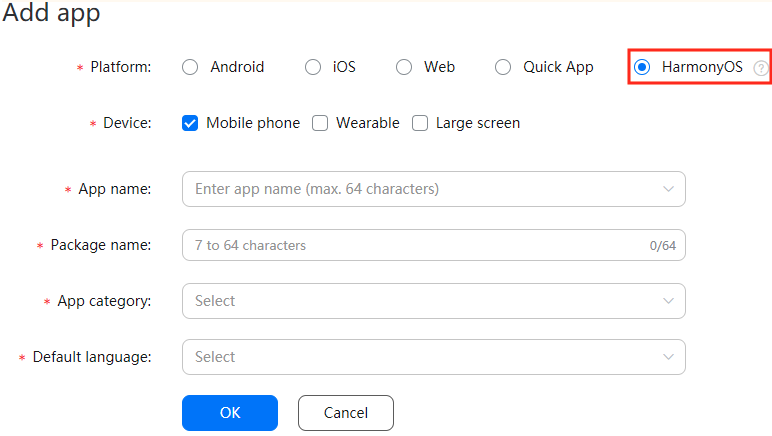
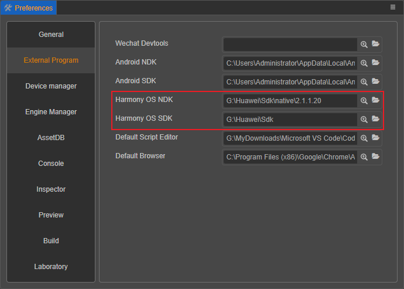
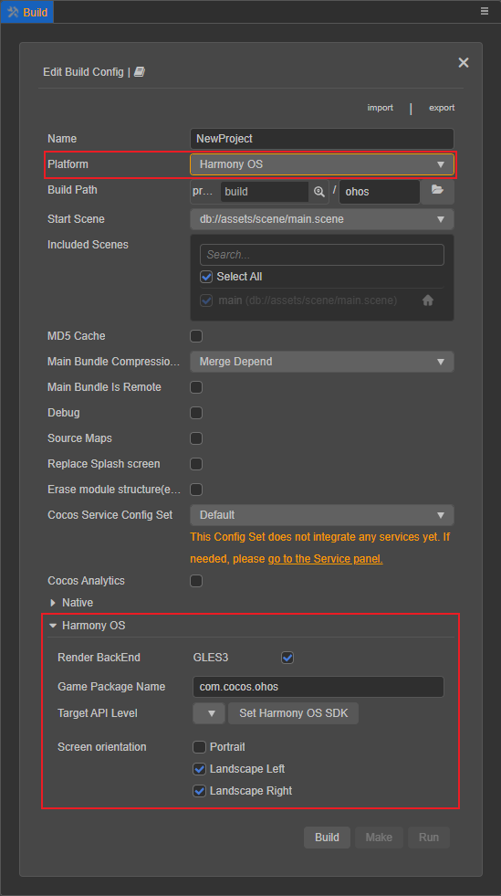
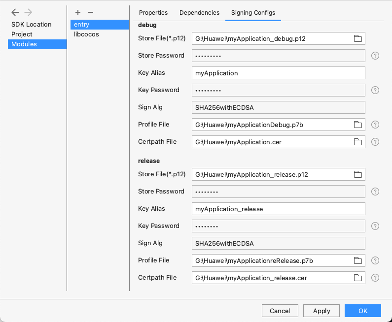
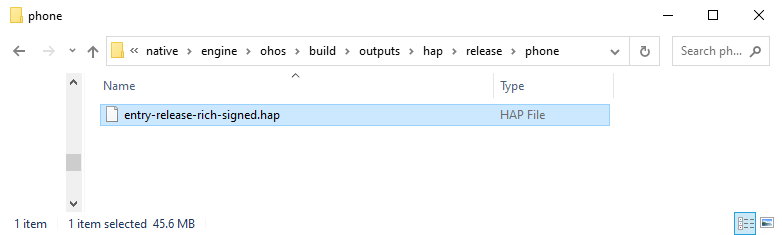
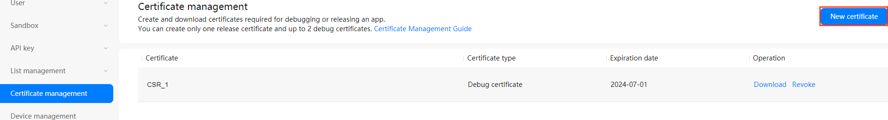

# Publish for the Huawei HarmonyOS

Starting with v3.2, Cocos Creator supports packaging games as Huawei **HarmonyOS** (`.hap`) applications.

## Preparations

- Enter [AppGallery Connect website](https://developer.huawei.com/consumer/en/service/josp/agc/index.html#/) to register for a [HUAWEI ID](https://developer.huawei.com/consumer/en/doc/start/registration-and-verification-0000001053628148).

- After logging in, select [Create Project](https://developer.huawei.com/consumer/en/doc/distribution/app/agc-harmonyapp-createproject) and [Add HarmonyOS App](https://developer.huawei.com/consumer/en/doc/distribution/app/agc-harmonyapp-createharmonyapp), select the **Platform** as **HarmonyOS**.

  

  > **Note**: the **Package name** needs to be consistent with the **Game Package Name** in the **Build** panel of Cocos Creator.

- Download and install [HUAWEI DevEco Studio](https://developer.harmonyos.com/en/develop/deveco-studio#download). After the installation is complete [Configure Development Environment](https://developer.harmonyos.com/en/docs/documentation/doc-guides/environment_config-0000001052902427), download the HarmonyOS SDK, please check **Java** and **Native** for the SDK packages in the **SDK Platforms** page.

  

  Remember the directory indicated by **HarmonyOS SDK Location** shown at the top of the window, fill in the path of this SDK in the **Preferences** panel of Cocos Creator later.

## Release process

### Building with Cocos Creator

1. Use Cocos Creator to open the project, click **Cocos Creator -> Preferences -> External Programs** in the upper menu bar, configure **HarmonyOS NDK** and **HarmonyOS SDK** path:

    

2. Open the **Build** panel from **Project -> Build** in the menu bar. Select **HarmonyOS** in **Platform** in the **Build** panel, and configure [Build Options](./native-options.md#build-options) as needed. Next, click the **Build** button at the bottom right.

    

    > **Note**: 
    > 1. **Game Package Name** in the expanded option of **HarmonyOS** needs to be consistent with the **Package name** when adding the HarmonyOS application in the AppGallery Connect.
    > 2. We deprecated the GLES2 option in **Render Backend** since v3.4.2 due to **HarmonyOS** offering full support to GLES3.

3. Open the project directory after the build is complete, notice that the `ohos` folder is generated under the `native\engine` directory, which contains the HarmonyOS project generated by the build.

    

    > **Note**: currently, HarmonyOS does not support multi-directory builds, so the generated HarmonyOS project is in the `native\engine` directory, unlike other platforms that generate in the `build` directory of the project.

    Next, open the `ohos` folder with HUAWEI DevEco Studio to perform further compilation, as described below.

### Compile and run through HUAWEI DevEco Studio

1. Open HUAWEI DevEco Studio, click **Open Project** and select the HarmonyOS project (`ohos` folder) generated after the build in the previous step.

    

2. Prepare the signature file. For the method of obtaining the signature file, please refer to the contents of the **Signature File** section below.

3. Configure the signature file. Click **File -> Project Structure** in the DevEco Studio menu bar, then select **Modules -> entry -> Signing Configs** and configure the signature information. For details, please refer to the [Configure Signature Information](https://developer.harmonyos.com/en/docs/documentation/doc-guides/ide_debug_device-0000001053822404#EN-US_TOPIC_0000001154985555__section19238119191816) documentation.

    

    Then proceed to configure the signature information in **Project -> Signing Configs**.

    After setting and saving, the configured signature information can be viewed in the project directory in the `native\engine\ohos\entry\build.gradle` file in the project directory.

    Depending on the build type (Debug/Release) and whether the generated `.hap` contains signature information, the developer can configure in combination as needed, please refer to the [Building and Creating HAPs](https://developer.harmonyos.com/en/docs/documentation/doc-guides/build_hap-0000001053342418) documentation for details.

    

4. Then click on the **Build -> Build Hap(s)/APP(s) -> Build Hap(s)** in the menu bar to execute the compilation process and generate the `.hap` file.

    

    After compiling, the `.hap` file with signature information is generated in the `native\engine\ohos\build\outputs\hap` directory of the project directory.

    

    All `.hap` files with/without signature information are generated in the `native\engine\ohos\entry\build\outputs\hap` directory of the project directory.

    

5. Connect Huawei devices with HarmonyOS system using USB, then click **Run -> Run ‘entry’** in the menu bar or click the Run button above to run the HarmonyOS app to your device. Please refer to the [Running Your App](https://developer.harmonyos.com/en/docs/documentation/doc-guides/run_phone_tablat-0000001064774652) documentation for details.

    

    > **Note**: if the app icon is not found when running on the device, check if there is an `installationFree` field with `true` in the `native\engine\ohos\entry\src\main\config.json` file in the project directory, change it to `false`.

6. If need to upload and publish HarmonyOS apps to Huawei AppGallery Connect, please refer to the official [Release HarmonyOS Application Guide](https://developer.huawei.com/consumer/en/doc/distribution/app/agc-harmonyapp-releaseharmonyapp) documentation for the specific process.

### Signature file

HarmonyOS applications use digital certificates (`.cer` files) and HarmonyAppProvision files (`.p7b` files) to ensure the integrity of the application. First, use **DevEco Studio** to generate a key and certificate request file, and then use the certificate request file to apply for a digital certificate and profile file for publishing/debugging in AppGallery Connect.

#### Generate key and certificate request file

In **DevEco Studio**, click **Build -> Generate Key and CSR** in the upper menu bar to generate a key (`.p12` file), and then generate a certificate request file (`.csr`). For details, please refer to the [Generating a Key Store and CSR](https://developer.harmonyos.com/en/docs/documentation/doc-guides/publish_app-0000001053223745#EN-US_TOPIC_0000001154985553__section7209054153620) documentation.

#### Generate and download a digital certificate (`.cer` file)

- Visit the [AppGallery Connect website](https://developer.huawei.com/consumer/en/service/josp/agc/index.html), select **Users and permissions -> Certificate management**, click the **New certificate** button in the upper right corner.

    

- Enter the required certificate information in the New certificate dialog box that is displayed. **Certificate type** Choose **Release certificate**/**Debug certificate** as required. The certificate request file is the `.csr` file generated in **DevEco Studio** in the previous step.

    

    - **Certificate name**: Enter up to 100 characters.
    - **Certificate type**: Select **Release certificate**/**Debug certificate** as required.
    - **CSR certificate request file**: Select the `.csr` file generated in **DevEco Studio** in the previous step.

- After filling in the information, click **Submit**, a release/debugging certificate (`.cer` file) will be generated, and click the **Download** button behind the certificate to download it to the local.

For more information, please refer to the [Apply for Digital Certificate](https://developer.huawei.com/consumer/en/doc/distribution/app/agc-harmonyapp-debugharmonyapp#h1-1598336089667) documentation.

#### Generate and download HarmonyAppProvision Profile file (`.p7b` file)

- Enter [AppGallery Connect website](https://developer.huawei.com/consumer/en/service/josp/agc/index.html), select **My Project**, select the HarmonyOS project and application created before.

- Click the **HarmonyOS app services -> HAP Provision Profile management** item on the left, and then click the **Add** button at the top right of the page to create a `.p7b` file.

    

- Enter the required information in the HarmonyAppProvision information dialog box that is displayed.

    

    - **HarmonyAppProvision file**: Enter the file name, which contains up to 100 characters.
    - **Type**: Select **Release** or **certificate** as required.
    - **Certificate**: Select the `.cer` file generated in the previous step.
    - **Device**: Please refer to the [Registering Debugging Devices](https://developer.huawei.com/consumer/en/doc/distribution/app/agc-harmonyapp-debugharmonyapp#h1-1598520099105) documentation for configuration. It is not necessary to configure this item when the **Type** is set to **Release**.

- After setting, click **Submit** to download the generated `.p7b` file to the local.

For more information, please refer to the [Application Profile](https://developer.huawei.com/consumer/en/doc/distribution/app/agc-harmonyapp-debugharmonyapp#h1-1598336409517) documentation.

## Known issues

- WebView does not support `touch` events, touch is not responsive.
- VideoPlayer does not support dragging video when playing remote video.
- EditBox is not zoomed out when full screen, and does not re-layout after keyboard retraction.
- Gravity/acceleration sensor delay around 500ms, poor followability.

## Reference documentation

- [AppGallery Connect Website](https://developer.huawei.com/consumer/en/service/josp/agc/index.html#/)
- [HUAWEI DevEco Studio User Guide](https://developer.harmonyos.com/en/docs/documentation/doc-guides/tools_overview-0000001053582387)
- [Debugging the HarmonyOS App](https://developer.harmonyos.com/en/docs/documentation/doc-guides/ide_debug_device-0000001053822404)
- [Releasing the HarmonyOS App](https://developer.harmonyos.com/en/docs/documentation/doc-guides/publish_app-0000001053223745)
