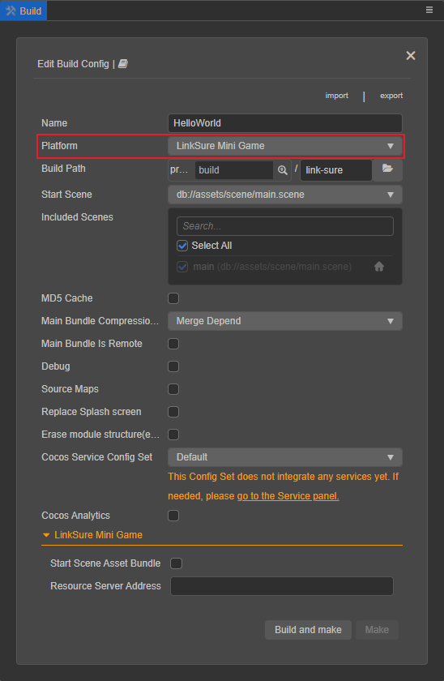
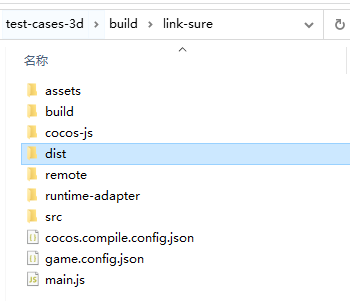

# Publish to LinkSure Mini Games

> **Note**: some platforms only have Chinese documentation available when visiting the platform's website. It may be necessary to use Google Translate in-order to review the documentation.

LinkSure Mini Game is a mini game application platform of WiFi Master Key, which is convenient, lightweight and without installation.

The LinkSure Mini Game runs as a **cpk** game package in the mini game environment, which is similar to the WeChat Mini Game. The game package is hosted in the cloud, put and run in the APP, safe, reliable and experience smooth, users can tap to play, without installation.

## Environment Configuration

- Download and install [LinkSure Mini Game Debugger](https://www.wjminiapp.com/docs/minigame/guide/download_apk.html) on your Android device (Recommended Android Phone 6.0 or above).

## Release Process

Use Cocos Creator to open the project that needs to be released. Open the **Build** panel from the **Menu bar -> Project**, select **LinkSure Mini Game** in the **Platform** dropdown of the **Build** panel.

  

### Configuration Options

The specific filling rules for the relevant options configuration are as follows:

- **Main Bundle Compression Type**

  Set the compression type of the main package, please refer to the [built-in Asset Bundle — `main`](../../asset/bundle.md#the-built-in-asset-bundle) documentation for details.

- **Main Bundle Is Remote**

  This option is optional and needs to be used with the **Resource Server Address** option. 
  If set, the main package is configured as a remote package, and along with its related dependent resources are built into a built-in Asset Bundle — [main](../../asset/bundle.md#the-built-in-asset-bundle) under the **remote** folder of the release package directory. You need to upload the entire **remote** folder to the remote server, so that the main package is not packaged into the **cpk**.

- **Start Scene Asset Bundle**

  This option is optional. 
  If set, the start scene and its related dependent resources are built into the built-in Asset Bundle — [start-scene](../../asset/bundle.md#the-built-in-asset-bundle) to speed up the resource loading of the start scene. Please refer to the [Start Scene Loading](publish-wechatgame.md#speed-up-the-loading-of-the-start-scene) for details.

- **Resource Server Address**

  This option is optional and used to fill in the address of the remote server where the resources are stored.

  - If this option is left blank, the `build/link-sure/remote` folder in the release package directory will be packaged into the **cpk** package.

  - If this option is filled in, the `remote` folder will not be packaged into the built **cpk** package. You need to manually upload the `remote` folder to the filled in Resource Server Address after build.

  Refer to the Resource Management section at the bottom of the document for more details.

### Build

After the relevant options of the **Build** panel are set, click **Build**. 
After the build is complete, click the **Open** button behind the **Build Path** to open the release package directory. You can see that the `link-sure/dist` folder is generated under the default release path `build` directory, which is the exported LinkSure Mini Game project directory and **cpk**.

### Run the built cpk to the phone

- You need to first contact the [LinkSure Mini Game business [cn]](https://www.wjminiapp.com/docs/minigame/guide/flow.html) to become a mini game developer.

- Enter LinkSure Mini Program Management Platform, click **Mini Program Management -> My Mini Program -> Create Mini Program**, fill in the relevant information, submit and wait for review.

- After the review is approved, click the **Version Management** on the back of the mini program.

  

- Then click **Upload Developer Version** to upload the built cpk, which will only save the latest upload. The cpk that is uploaded later will overwrite the version that was uploaded earlier.

  

- Click the **View QR Code** after uploaded, then open the LinkSure Mini Game Debugger already installed on your phone to scan the code. You can now preview the game on the physical device. If you need to debug the game, refer to the official documentation [LinkSure Mini Game debugging [cn]](https://www.wjminiapp.com/docs/minigame/guide/debug.html).

For more information, please refer to the [LinkSure Mini Game Development Process [cn]](https://www.wjminiapp.com/docs/minigame/guide/flow.html) documentation.

## Resource Management for the LinkSure Mini Game

LinkSure Mini Game is similar to the WeChat Mini Game. There are restrictions on the package size. The main package size limit for LinkSure Mini Game is **10MB**, more than that must be downloaded via a network request.

Cocos Creator already helps developers with downloading, caching and version management of remote resources. The specific implementation logic and operation steps are similar to the WeChat Mini Game. Please refer to the [Resource Management for the WeChat Mini Game](./publish-wechatgame.md#resource-management-for-the-wechat-mini-games) documentation for details.

## Related Reference Links

- [LinkSure Mini Game Guide [cn]](https://www.wjminiapp.com/docs/minigame/guide/)
- [LinkSure Mini Game Development Process [cn]](https://www.wjminiapp.com/docs/minigame/guide/flow.html)
- [LinkSure Mini Game Debugging Documentation [cn]](https://www.wjminiapp.com/docs/minigame/guide/debug.html)
- [LinkSure Mini Game API Documentation [cn]](https://www.wjminiapp.com/docs/minigame/api/)
- [LinkSure Mini Game Debugger Download [cn]](https://www.wjminiapp.com/docs/minigame/guide/download_apk.html)
