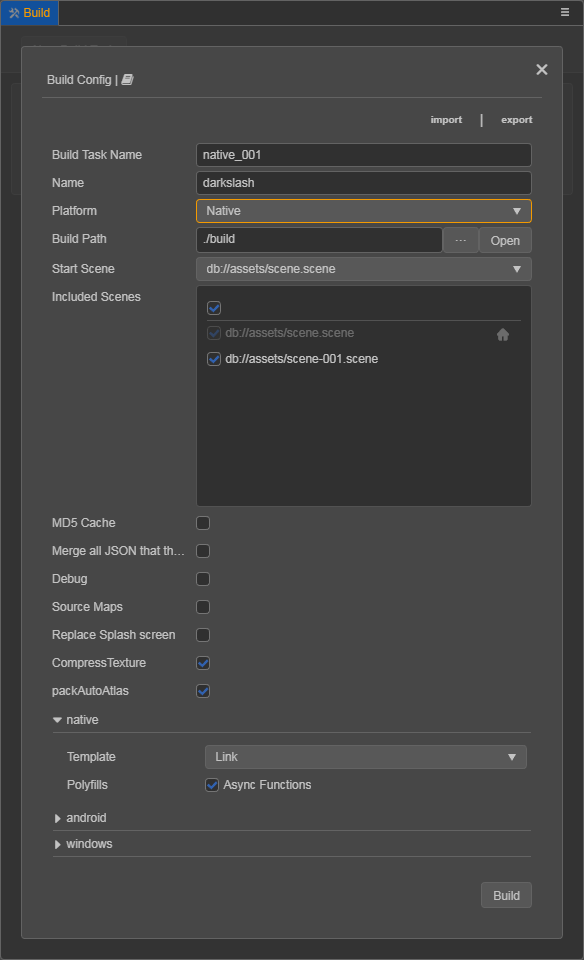
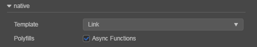
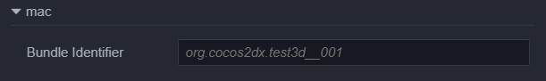
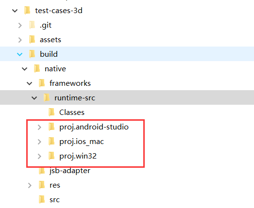

# Publishing to native

**Cocos Creator 3.0** officially supports the native platform, click the **Project -> Build** in the main menu to open the **Build** panel.

There are four native platforms, which include **Android**, **iOS**, **Mac** and **Windows**. The options to release games on iOS, Mac and Windows will only appear on those operating systems. This means it isn't possible to publish, for example, a game to iOS from a Windows computer. Currently, all native platforms are packaged together, you can configure the parameters of each native platform in the **Build** panel, and all native platform release packages can be generated in one build.

## Environment Configuration

Please refer to the [Setup Native Development Environment](setup-native-development.md) documentation for details.

## Build Options

For some general build options of platforms, please refer to the [General Build Options](build-options.md) documentation for details.



The following are specific build options for individual platforms and considerations for general build options.

### MD5 Cache

**MD5 Cache** is used as a generic option, mainly to add MD5 information to all asset file names after the build, solving **the CDN asset cache problem** during **hot update**.

When enabled, if any asset fails to load, it is because after renaming the new file, it cannot be found. This is usually because some third party assets used in C++ was not loaded by `loader`. At this point, you can convert the URL before loading with the following method, to fix the loading problem:

```cpp
auto cx = ScriptingCore::getInstance()->getGlobalContext();
JS::RootedValue returnParam(cx);
ScriptingCore::getInstance()->evalString("loader.md5Pipe.transformURL('url')", &returnParam);

string url;
jsval_to_string(cx, returnParam, &url);
```

### Native Build Options

Due to the adjustments made to the build mechanism, the processing of the different platforms is provided in the form of **plugins**. When you select **Native** in the **Platform** section of the **Build** panel, you will see that there is a **native** option in addition to the build options of a specific platform, and the configuration of native related options will affect all native platforms.



#### Template

There are two types of available engine templates in the dropdown menu of **Template**, from which we can choose one:

- **Default** - build the project with the **Cocos2d-x** source-code version engine.

- **Link** - unlike the **Default** template, the **Link** template does not copy the **Cocos2d-x** source-code to the `build` directory. Instead, the shared **Cocos2d-x** source-code is used. This can effectively reduce the footprint of the `build` directory, and modifications to the **Cocos2d-x** source-code can also be shared.

Let's review the concept of the source-code engine:

> The **Cocos2d-x** engine includes the source-code engine. Remember:
> - The first time the source-code engine builds and compiles a project, it takes a long time to compile C++ code, depending on the configuration of the computer, which may take 5~20 minutes. After the same project has been compiled once, the time required for the next recompile is greatly shortened.
> - The projects built by the source-code engine, compiled and run using native development environment (such as Android Studio, Xcode, etc. IDE), and also can be debugged and error captured.

The **Cocos Creator** installation directory under `resources/3d/cocos2d-x-lite` already contains the **Cocos2d-x** source-code engine.

#### Polyfills

**Polyfills** is a new feature option supported by the script system. If this option is checked at build time, the resulting release package will have the corresponding **polyfills** in it, and will also increase the size of the package. Developers can choose **polyfills** on demand, but only `Async Functions` are currently available, and more will be opened later.

### Android Build Options


#### Package Name (Bundle Identifier)

Usually in descending order by product site URL, e.g. `com.mycompany.myproduct`.

> **Note**: only numbers, letters and underscores can be included in the **Package Name**. In addition, the last part of the **Package Name** must begin with a letter, not with an underscore or a number.

#### Target API Level

Set the **Target API Level** required to compile the Android platform. Click the `Set Android SDK` button next to it to quickly jump to the **Android SDK** configuration page. You can refer to the [Setup Native Development Environment](setup-native-development.md) documentation for details.

#### APP ABI

Set the CPU types that Android needs to support, including **armeabi-v7a**、**arm64-v8a** and **x86**. You can choose one or more options.

> **Note**: when you select an ABI to build and then build another ABI without `Clean`, both ABI's `so` will be packaged into the APK, which is the default behavior of Android Studio. If you import a project with Android Studio, after selecting an ABI to build, run **Build -> Clean Project**, then build another ABI, only the latter ABI will be packaged into the APK.

> **Note**: after the project is imported with Android Studio, it is an independent existence and does not depend on the **Build** panel. If you need to modify the ABI, you can directly modify the `PROP_APP_ABI` property in `gradle.properties` as shown below:

  

#### Keystore

Android requires that all APKs be digitally signed with a certificate before they can be installed. A default keystore is provided, check the **Use Debug Keystore** to use the `default keystore`. If you need to customize the keystore, you can remove the **Use Debug Keystore** checkbox. Please refer to the official [Android Documentation](https://developer.android.com/studio/publish/app-signing) for details.

#### Orientation

The orientation of the device includes three types **Portrait**, **Landscape Left**, and **Landscape Right**.

#### Generate App Bundle (Google Play)

Check this option to package the game in App Bundle format for uploading to the **Google Play** store. Please refer to the official [Android Documentation](https://developer.android.com/guide/app-bundle/) for details.

### Mac Build Options



#### Bundle Identifier

Please refer to the **Package Name** option for **Android**.

### iOS Build Options


#### Bundle Identifier

Please refer to the **Package Name** option for **Android**.

#### Orientation

Please refer to the **Orientation** option for **Android**.

## Build

After selecting the **Platform**, setting the initial scene and the platform configuration options in **Build** panel, then click the **Build** button in the bottom right corner, and you can start the building process.

When the build is complete, what we get is a standard **Cocos2d-x** project that has the same structure as a new one built using the **Cocos Console**. Then clicking the **Open** button next to the **Build Path** opens the build release path in the operating system's file manager, where the release package for all native platforms is included in the `native -> frameworks -> runtime-src` directory of this path.



## Compile

Currently, the editor has not integrated compilation functions. You need to manually open the built native project in the IDE of the corresponding platform (e.g. **Xcode**, **Android Studio**, **Visual Studio**) for further preview, debugging and releasing.

The following are manual compilations for each native platform:

- **iOS**: Use **Xcode** to open the `native\frameworks\runtime-src\proj.ios_mac\.xcodeproj` file in the `build` directory, set the signature in the `General -> Signing` of the **Xcode** panel, and then click the compile button after selecting the connected device in the top left of **Xcode** to compile and run.

- **Android**: Open the project using **Android Studio**, download the missing tool (if prompted), and then compile and run it.

- **Mac**: Use **Xcode** to open the `native\frameworks\runtime-src\proj.ios_mac` folder in the `build` directory to compile and run.

- **Windows**: Use **Visual Studio** (**Visual Studio 2017 is recommended**) to open the `native\frameworks\runtime-src\proj.win32\.sln` file in the `build` directory, or just double-click it to compile and run the project. When installing **Visual Studio**, please note that you need to check the box to install the SDK for **Windows 8.1 version**.

> **Note**: when running a project built in debug mode on the **MIUI 10** system, the `Detected problems with API compatibility` prompt may pop up, which is a problem introduced by the **MIUI 10** system itself, just use the **release mode** to build.
