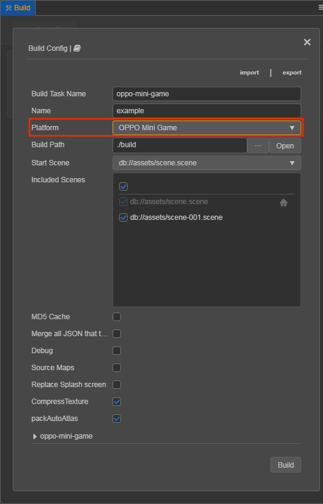
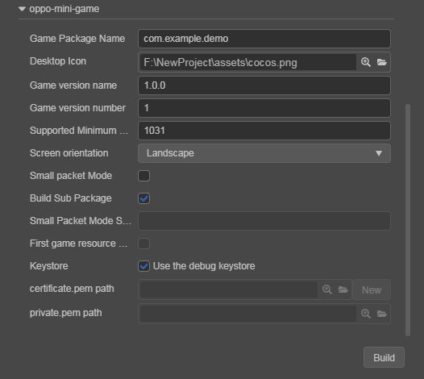

# Publishing to OPPO Mini Games

> **Note**: some platforms only have Chinese documentation available when visiting the platforms website. It may be necessary to use Google Translate in-order to review the documentation.

__Cocos Creator__ officially supports the release of games to the **OPPO Mini Games**.

## Environment Configuration

- Download [OPPO Mini Game Debugger](https://cdofs.oppomobile.com/cdo-activity/static/201810/26/quickgame/documentation/#/games/use) and install it on your Android device (Android Phone 6.0 or above is recommended)

- Install [nodejs-8.1.4](https://nodejs.org/en/download/) or above, globally

- Determine whether you need to install the [Debugging Tools](https://cdofs.oppomobile.com/cdo-activity/static/201810/26/quickgame/documentation/games/use.html) according to your own development needs.

## Release Process

1. Use **Cocos Creator 3.0** to open the project that needs to be released. Select **OPPO Mini Game** in the **Platform** dropdown of the **Build** panel.

    

    Click on the **oppo-mini-game** below to expand the parameter configuration of OPPO Mini Game.

    

The specific filling rules for the relevant parameter configuration are as follows:

- **Game Package Name**: is filled in according to the user's needs. It's required.

- **Desktop Icon**: is required. Click the **search icon** button at the back of the input box to select the icon you want. When building, the Desktop Icon will be built into the **OPPO Mini Game** project. It is suggested to use **PNG** images for the **Desktop Icon**.

- **Game Version Name**: is required. **Game Version Name** is the real version, such as: 1.0.0.

- **Game Version Number**: is required. **Game Version Number** is different from the **Game Version Name**, and the **Game Version Number** is mainly used to distinguish the version update. Each time when you submit audit, the game version number is at least 1 higher than the value of the last submitted audit. It must not be equal to or less than the value of the last submitted audit, and it is recommended that the **Game Version Number** be recursively incremented by 1 each time when the audit is submitted.

  > **Note**: the **Game Version Number** must be a positive integer.

- **Supported Minimum Platform Version Number**: is required. According to the requirements for OPPO Mini Games, this value must be greater than or equal to **1031**.

- **Small Packet Mode**: is optional. The in-package volume of the mini-game contains code and assets that cannot exceed 10M, and assets can be loaded via network requests. **Small Packet Mode** is to help users keep the script files in the mini game package, other assets are uploaded to the remote server, and downloaded from the remote server as needed. And the download, cache and version management of remote assets, **Cocos Creator** has already helped the developer. What the developer needs to do is the following steps:

  1. When building, check the **Small Packet Mode** and fill in the **Small Packet Mode Server Path**.

  2. **First game asset package into the game package**, this item is optional.

      In the **Small Packet Mode**, due to too many assets on the launch scene, downloading and loading assets for a long time may result in a short black screen when entering the game for the first time. If **First game asset package into the game package** is checked, you can reduce the black screen time when you first enter the game. However, it should be noted that the `res/import` asset does not support split asset downloading at this time, and the entire `import` directory is also packaged into the first package.

      Developers can choose whether to check this item according to their needs. Then click on **Build**.

  3. After the build is complete, click the **Open** button after the **Build Path** to upload the `res` directory under the release path to the small packet mode server. For example, if the default release path is `build`, the **Build Task Name** is `oppo-mini-game`, you need to upload the `/build/oppo-mini-game/res` directory.

  At this point, the `res` directory will no longer be included in the built-up rpk, and the assets in the `res` directory will be downloaded from the filled **Small Packet Mode Server Path** through the network request.

- **Build Sub Package**: this option is enabled by default. For details, please refer to **Subpackage** at the end of this document.

- **Keystore**: when you check the **Keystore**, the default is to build the rpk package with a certificate that comes with Creator, which is used only for **debugging**. 

  > **Note**: when the rpk package is to be used to submit an audit, do not check the **Keystore** to build it.
  
  If you don't check the **Keystore**, you need to configure the signature files **certificate.pem path** and **private.pem path**, where you build a rpk package that you can **publish directly**. The user can configure two signature files by using the **search icon** button to the right of the input box.

  There are two ways to generate a signature files:

    - Generated by the **New** button after the **certificate.pem path** in the **Build** panel.

    - Generated by the command line.

      The user needs to generate the signature file **private.pem**, **certificate.pem** through tools such as **openssl**.

      ```bash
      # Generate a signature file with the openssl command tool
      openssl req -newkey rsa:2048 -nodes -keyout private.pem   -x509 -days 3650 -out certificate.pem
      ```

      > **Note**: **openssl** can be used directly in the terminal in **Linux** or **Mac** environment, and in the **Windows** environment you need to install `openssl` and configure system environment variables. Restart **Cocos Creator** after the configuration is complete.

**2. Build**

After the relevant parameters of the **Build** panel are set, click **Build**. When the build is complete, click the **folder icon** button below the corresponding build task to open the build release path, you can see that a directory with the same name as the **Build Task Name** is generated in the default release path `build` directory, which is the exported OPPO Mini Game project directory and **rpk**, **rpk** package are in the `dist` directory.


**3. Run the built rpk to the phone**

Copy the generated mini-game **rpk** file to the `/sdcard/games/` directory on your phone's SD card. Then open the **Mini Game Debugger** that has been installed before on the Android device, click the **OPPO Mini Game** section, and then find the icon corresponding to the game name. If not found, click on the **More -> Refresh** button in the upper right corner to refresh.

  > **Note**: if the OPPO Mini Game Debugger version is `V3.2.0` and above,you need to copy the mini-game **rpk** file to the `Android/data/com.nearme.instant.platform/files/games` directory on your phone's SD card.If there is no `games` directory, you need to create a new one.


**4. Subpackage rpk**

Subpackage loading, that is, splitting the game content into several packages according to certain rules, only downloading the necessary packages when starting up for the first time. This necessary package is called **main package**, and the developer can trigger in the main package to download other sub-packages, which can effectively reduce the time spent on the first boot. To use this function, you need to set [Subpackage Configuration](../../asset/subpackage.md) in **Cocos Creator**, and the package will be automatically subpackaged when the setting is completed.

After the build is complete, the subpackage directory is in the `dist` directory. <br>
In this case, you need to create a new **subPkg** directory in the **sdcard** directory of the Android device, and then copy the **.rpk** file in the `dist` directory to the **subPkg** directory.

Then switch to the **Package Load** section of OPPO **Mini Game Debugger**, click **Refresh** at the top right to see the game name of the subpackage, click **Second Open** to use the same as the normal packaged **rpk**.


> **Note**: subpackage rpk needs to be copied to the `/sdcard/subPkg/` directory of Android devices, and non-subpackage rpk needs to be copied to the `/sdcard/games/` directory of Android devices, both of which cannot be mixed.

> **Note**: if the OPPO Mini Game Debugger version is `V3.2.0` and above,you need to copy the mini-game **rpk** file to the `Android/data/com.nearme.instant.platform/files/subPkg` directory on your phone's SD card.If there is no `subPkg` directory, you need to create a new one.

## Reference documentation

> **Note**: some platforms only have Chinese documentation available when visiting the platforms website. It may be necessary to use Google Translate in-order to review the documentation.

- [OPPO Mini Game Tutorial](https://cdofs.oppomobile.com/cdo-activity/static/201810/26/quickgame/documentation/games/quickgame.html)
- [OPPO Mini Game API Documentation](https://cdofs.oppomobile.com/cdo-activity/static/201810/26/quickgame/documentation/feature/account.html)
- [OPPO Mini Game Tool Download](https://cdofs.oppomobile.com/cdo-activity/static/201810/26/quickgame/documentation/games/use.html)
- [OPPO Mini Game Debugging](https://cdofs.oppomobile.com/cdo-activity/static/201810/26/quickgame/documentation/games/debug.html)
