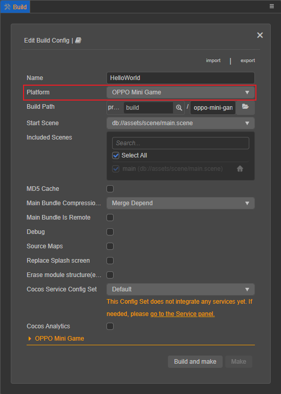
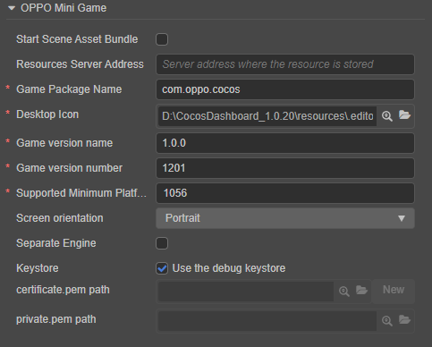
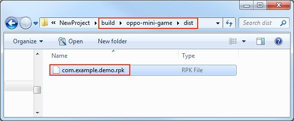

# Publish to OPPO Mini Games

> **Note**: some platforms only have Chinese documentation available when visiting the platform's website. It may be necessary to use Google Translate in-order to review the documentation.

__Cocos Creator__ officially supports the release of games to the **OPPO Mini Games**.

## Environment Configuration

- Download [OPPO Mini Game Debugger [cn]](https://cdofs.oppomobile.com/cdo-activity/static/201810/26/quickgame/documentation/#/games/use?id=_2-%e5%ae%89%e8%a3%85-runtimeapk-%e5%8c%85%e5%88%b0-oppo-%e6%89%8b%e6%9c%ba%e4%b8%8a) and install it on your OPPO phone (Android 6.0 or above is recommended)

- Install [nodejs-8.1.4](https://nodejs.org/en/download/) or above, globally

## Release Process

1. Use **Cocos Creator 3.0** to open the project that needs to be released. Select **OPPO Mini Game** in the **Platform** dropdown of the **Build** panel.

    

    Click on the **oppo-mini-game** below to expand the build options configuration of OPPO Mini Game.

    

For the general build options for each platform, please refer to [General Build Options](build-options.md) for details. OPPO Mini Game related build options filling rules are as follows:

- **Start Scene Asset Bundle**

  This option is optional.<br>
  If set, the start scene and its related dependent resources are built into the built-in Asset Bundle - [start-scene](../../asset/bundle.md#the-built-in-asset-bundle) to speed up the resource loading of the start scene.

- **Resource Server Address**

  This option is optional and used to fill in the address of the remote server where the resources are stored.

  - If this option is left blank, the `remote` folder in the release package directory will be packaged into the **rpk** package.

  - If this option is filled in, the `remote` folder will not be packaged into the built **rpk** package. You need to manually upload the `remote` folder to the filled in Resource Server Address after build.

  Refer to the Resource Management section at the bottom of the document for more details.

- **Game Package Name**: is filled in according to the user's needs. It's required.

- **Desktop Icon**: is required. Click the **search icon** button at the back of the input box to select the icon you want. When building, the Desktop Icon will be built into the **OPPO Mini Game** project. It is suggested to use **PNG** images for the **Desktop Icon**.

- **Game Version Name**: is required. **Game Version Name** is the real version, such as: 1.0.0.

- **Game Version Number**: is required. **Game Version Number** is different from the **Game Version Name**, and the **Game Version Number** is mainly used to distinguish the version update. Each time when you submit audit, the game version number is at least 1 higher than the value of the last submitted audit. It must not be equal to or less than the value of the last submitted audit, and it is recommended that the **Game Version Number** be recursively incremented by 1 each time when the audit is submitted.

  > **Note**: the **Game Version Number** must be a positive integer.

- **Supported Minimum Platform Version Number**: is required. According to the requirements for OPPO Mini Games, this value must be greater than or equal to **1031**, and **1060** is recommended. Refer to the [Instructions [cn]](https://cdofs.oppomobile.com/cdo-activity/static/201810/26/quickgame/documentation/#/games/use) for details.

- **Keystore**: when you check the **Keystore**, the default is to build the rpk package with a certificate that comes with Creator, which is used only for **debugging**.

  > **Note**: when the rpk package is to be used to submit an audit, do not check the **Keystore** to build it.

  If you don't check the **Keystore**, you need to configure the signature files **certificate.pem path** and **private.pem path**, where you build a rpk package that you can **publish directly**. The user can configure two signature files by using the **search icon** button to the right of the input box.

  There are two ways to generate a signature files:

  - Generated by the **New** button after the **certificate.pem path** in the **Build** panel.

  - Generated by the command line.

      The user needs to generate the signature file **private.pem**, **certificate.pem** through tools such as **openssl**.

      ```bash
      # Generate a signature file with the openssl command tool
      openssl req -newkey rsa:2048 -nodes -keyout private.pem   -x509 -days 3650 -out certificate.pem
      ```

      > **Note**: **openssl** can be used directly in the terminal in **Linux** or **Mac** environment, and in the **Windows** environment you need to install **openssl** and configure system environment variables. Restart **Cocos Creator** after the configuration is complete.

**2. Build**

After the relevant parameters of the **Build** panel are set, click **Build**. When the build is complete, click the **folder icon** button below the corresponding build task to open the build release path, you can see that a directory with the same name as the **Build Task Name** is generated in the default release path `build` directory, which is the exported OPPO Mini Game project directory and **rpk**, **rpk** package is in the `dist` directory.



**3. Run the built rpk to the phone**

Copy the generated mini-game **rpk** file to the `games` directory on the phone's internal storage. Then open the **Mini Game Debugger** that has been installed before on the OPPO phone, click the **OPPO Mini Game** section, and then find the icon corresponding to the game name. If not found, click on the **More -> Refresh** button in the upper right corner to refresh.

  > **Note**: if the OPPO Mini Game Debugger version is `v3.2.0` and above, copy the mini-game **rpk** file to the `Android/data/com.nearme.instant.platform/files/games` directory on the OPPO phone's internal storage. If there is no `games` directory, create a new one. Please refer to the [Instructions -- New Directory [cn]](https://cdofs.oppomobile.com/cdo-activity/static/201810/26/quickgame/documentation/#/games/use?id=_3-%e6%96%b0%e5%bb%ba%e7%9b%ae%e5%bd%95) for details.


## Subpackage rpk

Subpackage **rpk** can be used according to your needs.

Subpackage loading, which is, splitting the game content into several packages according to certain rules, only downloading the necessary packages when starting up for the first time. This necessary package is called **main package**, The developer can trigger in the main package to download other sub-packages, which can effectively reduce the time spent on the first boot.

To use this function, set the [Bundle Configuration](subpackage.md) in **Cocos Creator**, and the package will be automatically subpackaged when the setting is completed.

After the build is complete, the subpackage directory is in the `dist` directory. In this case, create a new `subPkg` directory in the internal storage directory of the OPPO phone, and then copy the **.rpk** file in the `dist` directory to the `subPkg` directory.

Then switch to the **Package Load** section of OPPO **Mini Game Debugger**, click **Refresh** at the top right to see the game name of the subpackage, click **Second Open** to use the same as the normal packaged **rpk**.


Subpackage rpk needs to be copied to the `subPkg` directory of OPPO phone's internal storage, and non-subpackaged rpk needs to be copied to the `games` directory of OPPO phone's internal storage, both of which cannot be mixed.

> **Note**: if the OPPO Mini Game Debugger version is **v3.2.0** and above, copy the mini game subpackaged **rpk** file to the `Android/data/com.nearme.instant.platform/files/subPkg` directory on the OPPO phone's internal storage, or create a new one if there is no `subPkg` directory. The non-subpackaged rpk is copied to the `Android/data/com.nearme.instant.platform/files/games` directory on the OPPO phone's internal storage, and the two cannot be mixed.

For more information, please refer to the [OPPO Mini Game - Subpackage [cn]](https://activity-cdo.heytapimage.com/cdo-activity/static/201810/26/quickgame/documentation/#/subpackage/subpackage) documentation.

## Resource Management for OPPO Mini Game Environment

**OPPO Mini Game** is similar to **WeChat Mini Game**. There are restrictions on the package size. The main package size limit for OPPO Mini Game is **4MB**, more than that must be downloaded via a network request.

Cocos Creator already helps developers with downloading, caching and version management of remote resources. Please refer to the [Cache Manager](../../asset/cache-manager.md#resource-download-process) documentation for details.

## Reference documentation

- [OPPO Developer Guides](https://developers.oppomobile.com/wiki/doc/index#id=88)
- [OPPO Mini Game Tutorial [cn]](https://activity-cdo.heytapimage.com/cdo-activity/static/201810/26/quickgame/documentation/#/games/quickgame)
- [OPPO Mini Game API Documentation [cn]](https://activity-cdo.heytapimage.com/cdo-activity/static/201810/26/quickgame/documentation/#/feature/account)
- [OPPO Mini Game Tool Download [cn]](https://activity-cdo.heytapimage.com/cdo-activity/static/201810/26/quickgame/documentation/#/games/use)
- [OPPO Mini Game Instructions -- New Directory [cn]](https://activity-cdo.heytapimage.com/cdo-activity/static/201810/26/quickgame/documentation/#/games/use?id=_3-%e6%96%b0%e5%bb%ba%e7%9b%ae%e5%bd%95)
