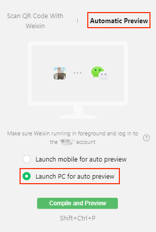

# Access to WeChat PC Mini Games

> **Note**: some platforms only have Chinese documentation available when visiting the platform's website. It may be necessary to use Google Translate in-order to review the documentation.

WeChat PC Mini Game supports running WeChat mini games in WeChat for PC. The WeChat PC Mini Game will have most of the Mobile capabilities, including but not limited to virtual payment, open data context, touch events, etc. (ads are not currently supported). It also provides keyboard events, mouse events, window customization and other features.

Cocos Creator supports publishing games to WeChat PC Mini Games, and completes the adaptation of mouse and keyboard related interfaces. Let's see how to publish the game to WeChat PC Mini Games by Cocos Creator.

## Use Cocos Creator to Access to WeChat PC Mini Games

### Preparation

Download and install the latest version of [WeChat for PC](https://windows.weixin.qq.com/?lang=en_US) and login to it with the WeChat account bound to the WeChat DevTools.

### Process of Publising

1. Refer to the process of [Publish to WeChat Mini Games](./publish-wechatgame.md) and publish the game project to the WeChat Mini Game.

2. In the **WeChat DevTools**, click the **Preview** button in the upper toolbar, select the **Automatic Preview** tab, check the **Launch PC for auto preview** option, and then click the **Compile and Remote Debug** button to preview and debug the mini game on the WeChat for PC.

    

## FAQ

Q: How to distinguish the **Mobile** and **PC** of WeChat through the engine interface? 
A: You can determine by `sys.isMobile` that the PC side returns `false` and the mobile side returns `true`. 
> **Note**: the simulator on the WeChat DevTools simulates a environment on the mobile, so it returns `true`.

Q: Does the WeChat PC Mini Game support Mac? 
A: Not yet supported. By 2021-01-19, WeChat PC Mini Game has been officially launched, and it only supports Windows currently. Later on, we will actively cooperate with the engineers of WeChat PC Mini Game to adapt the Mac system at the first time.

## Related Reference Links

- [WeChat PC Mini Game Access Guide [cn]](https://developers.weixin.qq.com/minigame/dev/guide/open-ability/pc-game.html)
- [Download WeChat for PC](https://windows.weixin.qq.com/?lang=en_US)
