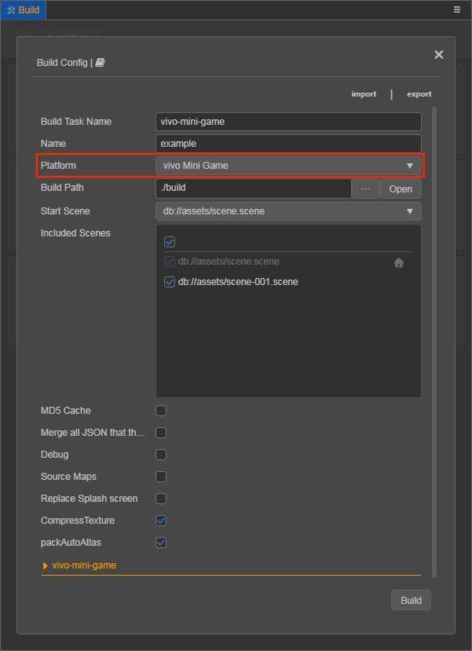

# Publishing to vivo Mini Games

> **Note**: some platforms only have Chinese documentation available when visiting the platforms website. It may be necessary to use Google Translate in-order to review the documentation.

## Environment Configuration

- Download the [Quick App & vivo Mini Game Debugger](https://minigame.vivo.com.cn/documents/#/lesson/base/environment?id=%E5%AE%89%E8%A3%85vivo%E5%B0%8F%E6%B8%B8%E6%88%8F%E8%B0%83%E8%AF%95%E5%99%A8) and [vivo Mini Game Engine](https://minigame.vivo.com.cn/documents/#/lesson/base/environment?id=%E5%AE%89%E8%A3%85vivo%E5%B0%8F%E6%B8%B8%E6%88%8F%E5%BC%95%E6%93%8E) and install it on your Android device (recommended Android Phone 6.0 or above)

- Install [nodejs-8.9.0](https://nodejs.org/en/download/) or above, globally:

    > **Note**: after installing nodejs, you need to note whether the npm source address is <https://registry.npmjs.org/>

    ```bash
    # View current npm source address
    npm config get registry

    # If not, reset the npm source address
    npm config set registry https://registry.npmjs.org/
    ```

- Install `vivo-minigame/cli` globally:

    ```bash
    npm install -g @vivo-minigame/cli
    ```

    If `vivo-minigame/cli` installation fails, it may be caused by too low version of **nodejs**. Please check the version of **node** and upgrade.

## Release Process

1. Use **Cocos Creator 3.0** to open the project that needs to be released. Select **vivo Mini Game** in the **Platform** dropdown of the **Build** panel.

    

    Click on the **vivo-mini-game** below to expand the parameter configuration of vivo Mini Game.

    

The specific filling rules for the relevant parameter configuration are as follows:

- **Game Package Name**: is required. it is filled in according to the developer's needs.

- **Desktop Icon**: is required. Click the **search icon** button at the back of the input box to select the icon you want. When building, the **Desktop Icon** will be built into the vivo Mini Game project. It is suggested to use `PNG` images for the **Desktop Icon**.

- **Game Version Name**: is required. **Game Version Name** is the real version, such as: **1.0.0**.

- **Game Version Number**: is required. **Game Version Number** is different from the **Game Version Name**, and the **Game Version Number** is mainly used to distinguish the version update. Each time when you submit audit, the game version number is at least 1 higher than the value of the last submitted audit. It must not be equal to or less than the value of the last submitted audit, and it is recommended that the **Game Version Number** be recursively incremented by 1 each time when the audit is submitted. 

  > **Note**: the **Game Version Number** must be a positive integer.

- **Supported Minimum Platform Version Number**: is required. Please refer to [Official Documentation](https://minigame.vivo.com.cn/documents/#/download/engine?id=%E6%9B%B4%E6%96%B0%E8%AE%B0%E5%BD%95%EF%BC%9A) to check the latest version number of vivo engine.

- **Build Sub Package**: is enabled by **default**. For details, please refer to **Subpackage Loading** at the end of this document.

- **Small Packet Mode**: is optional. The in-package volume of the mini-game contains code and assets that cannot exceed 10M, and assets can be loaded via network requests. **Small Packet Mode** is to help developers keep the script files in the mini game package, other assets are uploaded to the remote server, and downloaded from the remote server as needed. And the download, cache and version management of remote assets, **Cocos Creator** has already helped the developer. What the developer needs to do is the following steps:

  1. When building, check the **Small Packet Mode** and fill in the **Small Packet Mode Server Path**.

  2. **First game asset package into the game package**, this item is optional.

      In the **Small Packet Mode**, due to too many assets on the launch scene, downloading and loading assets for a long time may result in a short black screen when entering the game for the first time. If **First game asset package into the game package** is checked, you can reduce the black screen time when you first enter the game. However, it should be noted that the `res/import` asset does not support split asset downloading at this time, and the entire `import` directory is also packaged into the first package.

      Developers can choose whether to check this item according to their needs and then click **Build**.

  3. After the build is complete, click the **Open** button after the **Build Path** to upload the `res` directory under the release path to the small packet mode server. For example, if the default release path is `build`, the **Build Task Name** is `vivo-mini-game`, you need to upload the `/build/vivo-mini-game/res` directory.

      > **Note**: if you are using the command line to compile **small packet mode**, remember to backup the `build/vivo-mini-game/res` directory, then delete the `build/vivo-mini-game/res` directory, and then perform command line compilation (`npm run build`).

  At this point, the `res` directory will no longer be included in the built-up rpk, and the assets in the `res` directory will be downloaded from the filled **Small Packet Mode Server Path** through the network request.

- **Keystore**: when you check the **Keystore**, the default is to build the rpk package with a certificate that comes with Creator, which is used only for **debugging**. 

  > **Note**: when the rpk package is to be used to submit an audit, do not check the **Keystore** to build it.
  
  If you don't check the **Keystore**, you need to configure the signature files **certificate.pem path** and **private.pem path**, where you build a rpk package that you can **publish directly**. The developer can configure two signature files by using the **search icon** button to the right of the input box.

  There are two ways to generate a signature files:

    - Generated by the **New** button after the **certificate.pem path** in the **Build** panel.

    - Generated by the command line.

      The developer needs to generate the signature file **private.pem**, **certificate.pem** through tools such as **openssl**.

      ```bash
      # Generate a signature file with the openssl command tool
      openssl req -newkey rsa:2048 -nodes -keyout private.pem   -x509 -days 3650 -out certificate.pem
      ```

      > **Note**: **openssl** can be used directly in the terminal in Linux or Mac environment, and in the Windows environment you need to install `openssl` and configure system environment variables. Restart Creator after the configuration is complete.

**2. Build**

After the relevant parameters of the **Build** panel are set, click **Build**. When the build is complete, click the **folder icon** button below the corresponding build task to open the build release path, you can see that a directory with the same name as the Build Task Name is generated in the default release path `build` directory, which is the exported vivo Mini Game project directory and **rpk**, **rpk** package are in the `dist` directory.


**3. Run the built rpk to the phone**

There are three ways to run rpk on your phone:

- **Method One**

    Click the **Run** button at the bottom right of the `vivo-mini-game` build task in the **Build** panel and wait for the QR Code interface to be generated:

    

    Then open the **Quick App & vivo Mini Game Debugger** that was installed before on your Android device. Click the **Scan code install** button to scan the QR Code to open the **rpk**.

    

- **Method Two**

    Copy the generated mini game **rpk** file (located in the `dist` directory) to the `sdcard` directory of the mobile phone.

    Open the **Quick App & vivo Mini Game Debugger** that has been installed before on your Android device, click **Local Install**, then find the **rpk** file from the `sdcard` directory of your mobile phone and select Open.

    

- **Method Three**

    Specify to the editor installation directory `resources/tools/vivo-pack-tools` in the command line, and execute the command `npm run server` to generate URL and QR code using the vivo Mini Game Packer Commands.

    ```bash
    # Specify to the editor installation directory.
    cd F:/CocosCreator/resources/tools/vivo-pack-tools

    # Generate URL and QR code
    npm run server
    ```

    Then open the **Quick App & vivo Mini Game Debugger** that was installed before on your Android device.

    Finally, click the **Scan code install** button to copy the URL generated in the first step to the browser, and then directly scan the QR code on the web page to open the **rpk**.

## Subpackage Loading

The subpackage loading of __vivo Mini Games__, is similar to __WeChat Mini Games__. Please refer to the [Subpackage Loading](../../asset/subpackage.md) documentation for details.

## Reference documentation

> **Note**: some platforms only have Chinese documentation available when visiting the platforms website. It may be necessary to use Google Translate in-order to review the documentation.

- [vivo Mini Games Development Documentation](https://minigame.vivo.com.cn/documents/#/lesson/base/start)
- [vivo Mini Games API Documentation](https://minigame.vivo.com.cn/documents/#/api/system/life-cycle)
- [Quick App & vivo Mini Game Debugger Download](https://minigame.vivo.com.cn/documents/#/download/debugger)
