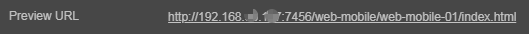

# Publish to Web Platforms

Open main menu's **Project -> Build** to open the **Build** panel.

**Cocos Creator** provides page templates for two kinds of Web platforms. From the pop up menu of **Platform**, you can choose **Web Mobile** or **Web Desktop**. The major difference is that in **Web Mobile**, the image will cover the whole browser window by default, while in **Web Desktop**, you are allowed to designate the resolution of image, which doesn't change when you zoom on the browser window.

## Build Options

For some general build options of platforms, please refer to the [General Build Options](build-options.md) documentation.

### Web Desktop

| Option | Explanation | Field Name |
| :-- | :-- | :-- |
| **Resource Server Address** | The server address used to download remote resources, see [General Build Options](build-options.md#resource-server-address) for details. | `remoteServerAddress` |
| **Preview Resolution** | Resolution width and height of the game view, default is **(1280, 960)**. | `resolution` |
| **Polyfills** | In Creator 3.0, the Build supports some new feature of `polyfills`, mainly when the script is packaged, and the corresponding processing will be done. developer can choose `polyfills` according to their needs. This option currently only supports `Async Functions`, and more functions will be opened in the future. | `polyfills` |

### Web Mobile

| Option | Explanation | Field Name |
| :-- | :-- | :-- |
| **Resource Server Address** | The server address used to download remote resources, see [General Build Options](build-options.md#resource-server-address) for details. | `remoteServerAddress` |
| **Orientation** | Device orientation, including `Auto`, `Landscape`, `Portrait`. | `orientation` |
| **Polyfills** | In Creator 3.0, the Build supports some new feature of `polyfills`, mainly when the script is packaged, and the corresponding processing will be done. This option currently supports `Async Functions` and `coreJs`, the developer can choose according to their needs. | `polyfills` |
| **VConsole** | Whether to use vConsole. vConsole is similar to the mini version of DevTools and is used to aid debugging. | `embedWebDebugger` |
| Preview QRCode | For scanning previews, see the description below for details. | - |
| Preview URL | The link for the preview, see the description below for details. | - |

- **Preview URL**

  Multiple Web projects can be previewed at the same time, so instead of a uniform **Preview URL** for the build, each build task will have a separate **Preview URL** that does not interfere with each other. Clicking on the URL will automatically open the browser for previewing, and the specific preview URL splicing rule is **${The Preview IP in Preferences panel}:${Editor preview port number}/${Build platform}/${Build task name}/index.html**.

  

## Build and Preview

After configuring the build options, click the **Build** button, then a progress bar will appear on the top of the panel. When the progress bar reaches 100%, the build is finished.

The image above shows the preview of Web Mobile, you can see that the game view covers the whole browser window, while the game view of Web Desktop is fixed resolution and does not cover the screen.

### Browser Compatibility

The desktop browsers tested during the Cocos Creator development process include: **Chrome**, **Firefox** and **QQ browser**. Other browsers as long as the kernel version is high enough to work properly, for some browsers do not open IE compatibility mode.

Browsers tested on mobile devices include: **Safari (iOS)**, **Chrome (Android)**, **QQ browser (Android)** and **UC browser (Android)**.

## Retina Setting

You can use `view.enableRetina(true)` to set the high resolution in the script, and the Retina display will be turned on by default when you build to the Web platform. Refer to the API [enableRetina](__APIDOC__/en/#/docs/3.3/en/core/Class/View?id=enableretina) for details.

## Release a game on Web server

Click the folder icon button in the bottom left corner of the **build task** window,

If you want to release or share your games on the Internet, click the folder icon button in the bottom left corner of the **Build Task** window. After opening the release path, according to the current build task name, copy the entire contents of the corresponding folder generated by the build to your Web server. Then you can see the game later there.

For information on setting up a Web server, please search for solutions, such as: **Apache**, **Nginx**, **IIS** and **Express**.
