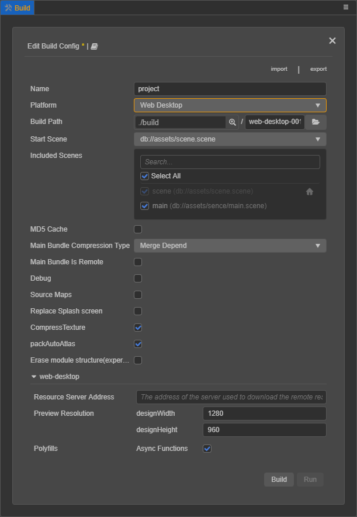
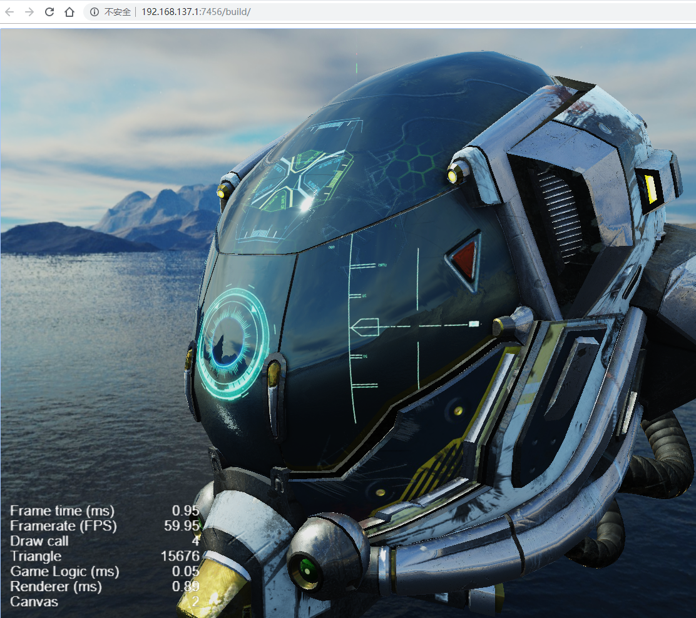
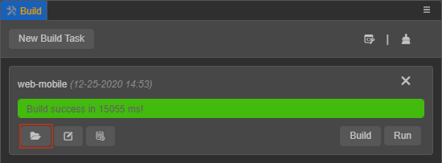

# Publish to Web platforms

Select **Project -> Build** from the main menu, and open the [Build](build-panel.md) panel.

Cocos Creator provides two web platform page templates. Select **Web Mobile** or **Web Desktop** through the drop-down menu of **Platform**. The main differences between them are:

- **Web Mobile** will fill the entire browser window with the game view by default.
- **Web Desktop** allows you to specify the resolution of a game view when publishing, and the game view will not change with the browser window size afterwards.

## Introduction to build options

For the general build options of each platform, please refer to the [General Build Parameters Introduction](build-options.md) documentation for details.

### Web Desktop

| Build options | Description | Field name (for command line publishing) |
| :--- | :--- | :--- |
| Resource Server Address | The server address used to download remote resources. For details, please refer to the content of the **Resource Server Address** section below. | `remoteServerAddress` |
| Preview resolution | Game view resolution, the default is **(1280, 960)** | `resolution` |
| Polyfills | Build polyfills that support some new features of scripts. Corresponding processing will be done when scripts are packaged. Developers can choose the polyfills needed according to actual needs. For the time being, only **asynchronous functions** are supported, and more functions will be opened in the future. | `polyfills` |

### Web Mobile

| Build options | Description | Field name (for command line publishing) |
| :--- | :--- | :--- |
| Resource Server Address | The server address used to download remote resources. For details, please refer to the content of the **Resource Server Address** section below. | `remoteServerAddress` |
| Device orientation | Optional values ​​include **Auto**, **Landscape**, **Portrait** | `orientation` |
| Polyfills | Build polyfills that support some new features of scripts. Corresponding processing will be done when scripts are packaged. Currently, there are **async Functions** and **coreJs**. Developers can choose the polyfills needed according to actual needs. | `polyfills` |
| vConsole | Insert the vConsole debugging plug-in. vConsole is similar to the mini version of DevTools for assisting debugging. | `embedWebDebugger` |
| Preview the QR code | Used to scan and preview, see the introduction below for details |-|
| Preview URL | Link for preview, see the introduction below for details |-|

- **Resource server address**

  This item is optional and used to fill in the address where the resource is stored on the server.

    - If **do not fill in** this item, the `remote` folder in the release package directory will be packaged into the built game package.
    - If **fill in** this item, it will not be packaged into the game package. Developers need to manually upload the `remote` folder in the release package directory to the resource server address filled in after the build. For details, please refer to [Upload resources to remote server](../../asset/cache-manager.md).

- **Preview URL**

  The build supports simultaneous previewing of multiple Web projects, so the preview URL to be built is no longer uniform, but each build task will have a separate preview URL, which does not interfere with each other. Click the URL to automatically open the browser for preview. The specific preview URL splicing rule is **${Preview IP address in preferences}:${Editor preview port number}/${Build platform}/${Build task First name}/index.html**.

  

## Build and preview

After configuring the build options, click the **Build** button to start the web platform version build. A progress bar will appear on the panel. When the progress bar shows **Build success**, the build is complete.

Next, click the **Run** button to open the built game version in the browser for preview and debugging.

The picture above is the preview of the Web Mobile platform. Notice that the game view occupies the entire browser window, while the game view of Web Desktop has a fixed resolution and will not fill the screen.

### Browser compatibility

The desktop browsers tested during the development of Cocos Creator include: **Chrome**, **Firefox** and **QQ Browser**. Other browsers can be used normally as long as the kernel version is high enough. For the browser, please do not enable IE compatibility mode.

Browsers tested on mobile devices include: **Safari (iOS)**, **Chrome (Android)**, **QQ Browser (Android)** and **UC Browser (Android)**.

## Retina settings

Set whether to use high resolution through `view.enableRetina(true)` in the script. Retina display will be turned on by default when it is built on the Web platform. For details, please refer to the [enableRetina](__APIDOC__/en/classes/core.view-2.html#enableretina) API.

## Publish to Web Server

To publish or share the game on the Internet, just click the **folder icon** button at the bottom left of the **Build Task**, and after opening the release path, follow the name of the current build task to build the corresponding folder in the the entire content is copied to the Web server and can be accessed through the corresponding address.

Regarding the establishment of the Web server, search for related solutions such as Apache, Nginx, IIS, Express, etc.
