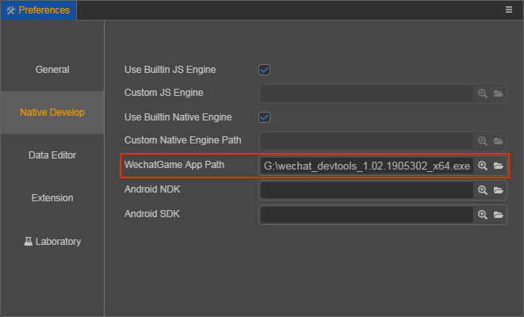
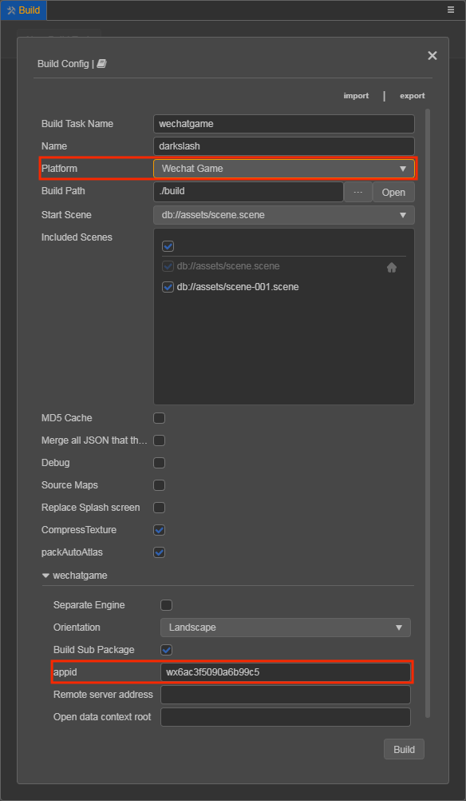
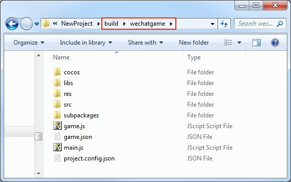
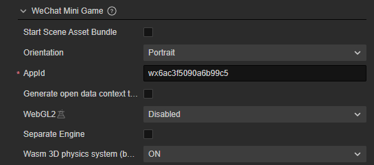

# Publish to WeChat Mini Games

> **Note**: some platforms only have Chinese documentation available when visiting the platform's website. It may be necessary to use Google Translate in-order to review the documentation.

The runtime environment of the **WeChat Mini Game** is an extension of the **WeChat Mini Program**, providing a WebGL interface encapsulation based on the mini program environment, greatly improving rendering capabilities and performance. However, since these interfaces are encapsulated by the WeChat team, they are not equivalent to the browser environment.

On the engine side, in order to make the developers' workload as easy as possible, our main tasks for developers include the following:

- The engine framework adapts to the WeChat Mini Game API, pure game logic level, developers do not need any additional modifications.
- The **Cocos Creator** editor provides a fast packaging process, released directly as a **WeChat Mini Game**, and automatically evokes the **WeChat DevTools**.
- Automatically load remote assets, cache assets, and cache asset version control.

In addition, the game submission, review and release process of the **WeChat Mini Game** is no different from the **WeChat Mini Program**. Please refer to the [WeChat Mini Game Developer](https://developers.weixin.qq.com/minigame/en/dev/guide/) documentation.

## Publish WeChat Mini Games with Cocos Creator

1. Download the **WeChat DevTools** on [WeChat Official Document](https://developers.weixin.qq.com/miniprogram/en/dev/devtools/download.html)

2. Set the **WeChatGame App Path** in **Cocos Creator -> Preferences -> [Native Develop](../../editor/preferences/index.md)**.

    

3. Log in to the WeChat public platform and find the appid

    

4. Select the **WeChat Game** in the **Platform** of the **Build** panel, fill in the `mini game appid`, and then click **Build**

    

5. Click **Play** to open the **WeChat DevTools**

    

    > **Note**: the **WeChat DevTools**, if it has not been run on a Mac before, will show an error that states: `Please ensure that the IDE has been properly installed`. You need to manually open the **WeChat DevTools** once, before you can click **Run**.

6. Preview deployment

    Following this process, a `wechatgame` folder will be generated in the project's **build** directory (the name of the folder is based on the **Build Task Name**), which already contains the configuration files `game.json` and `project.config.json` of the WeChat Mini Games environment.

    

### Build Options

| Options | Optional or not | Default | Explanation |
| :-- | :-- | :-- | :-- |
| **appid** | Required | `wx6ac3f5090a6b99c5` | The appid of the WeChat Mini Games, it will be written to `project.config.json` file.|
| **Start Scene Asset Bundle** | Optional | false | If set, the start scene and its related dependent resources are built into the built-in Asset Bundle — [start-scene](../../asset/bundle.md#the-built-in-asset-bundle) to speed up the resource loading of the start scene.|
| **Remote server address** | Optional | Empty | The remote server address. assets will then be obtained from this address.|
| **Open data context root** | Optional | Empty | If an Open Data Context exists, use this root to specify the relative path of the Open Data Context folder in the build directory so that the directory is not overwritten or modified during the build.|
| **Orientation** | Required | `landscape` | Device orientation, it will be written to `game.json` file.|
| **Separate Engine** | Optional | Empty | Whether to use WeChat Mini Games engine plugin, please refer to [WeChat Mini Games Engine Plugin Instructions](./wechatgame-plugin.md) for details. |
| **Wasm 3D physics system (based on `ammo.js`)** | Optional | Enabled | This option is used to select whether to enable **Wasm**, which takes effect when using **bullet（ammo.js）** physics. Please refer to the **WebAssembly Support** section below for more details. |
| **Whether to enabled WebGL2** (Experimental feature) | - | Forced Off | In order to allow WebGL 2.0 to be enabled on WeChat Mini Games in the future, we have added this option in **v3.4.1** to support to enable WebGL 2.0 following the configuration in the **Project Settings** panel, and to turn off to reduce the package by default. If this option is set to **Consistent with project settings** and **WebGL 2.0** is checked in **Project Settings -> Feature Cropping**, it will be successfully enabled in the future if the WeChat environment supports WebGL 2.0. |

## Asset Management for WeChat Mini Game Environment

In a **WeChat Mini Game** environment, asset management is the most special part. It differs from the browser in the following four points:

1. The size of the **WeChat Mini Game** package cannot exceed **4MB**, including all the code and assets. Additional assets must be downloaded via web request.

2. For files downloaded from a remote server, the **WeChat Mini Game** environment does not have the browser's caching and outdated update mechanism.

3. For the assets in the **WeChat Mini Game** package, they are not loaded on demand in the mini game environment, but rather all the assets in the package are loaded at once, and then the game page is launched.

4. You cannot download script files from a remote server.

This brings up two key issues, home page loading speed and remote asset caching and version management. For the home page loading speed, we recommend that developers only save the script file in the **WeChat Mini Game** package, and all other assets are downloaded from the remote server. As for downloading, caching and version management of remote assets, **Cocos Creator** has done the job for developers.

In the **WeChat Mini Game** environment, we provide a `wxDownloader` object, and after setting the `REMOTE_SERVER_ROOT` property to it, the logic of the engine to download assets becomes:

1. Check that assets are in the mini game package.
2. If not present, query local cache assets.
3. If no local cache assets are available, download from a remote server.
4. Download and save them to the mini game application cache in backstage for re-access.
5. Local cache storage has space limitation, if total space of cache exceeds the limit, there will be no more caching without disturbing game process.

It should be noted that once the cache space is full, all the assets that need to be downloaded cannot be saved, only the temporary files for save download assets can be used, and WeChat will automatically clean up all temporary files after the mini game is exited. So the next time you run the mini game again, those assets are downloaded again and the process keeps looping. 
In addition, the problem of file saving failure due to cache space exceeding the limit does not occur on the **WeChat DevTools**, because the **WeChat DevTools** does not limit the cache size, so testing the cache needs to be done in a real WeChat environment.

At the same time, when the **MD5 Cache** feature of the engine is enabled, the URL of the file will change as the content of the file changes, so that when a new version of the game is released, the assets of the old version will naturally become invalid in the cache, and only the new assets can be requested from the server, which achieves the effect of version control.

Specifically, developers need to do:

1. When building, check the **MD5 Cache** in the **Build** panel.
2. Set the **Remote service address**, and then click **Build**.
3. When the build is complete, upload the **res** folder in the mini game release package to the server.
4. Delete the **res** folder inside the local release package.
5. For the test phase, you may not be able to deploy to the official server, you need to use the local server to test, then open the details page in the WeChat DevTools, check the `Does not verify valid domain names, web-view (business domain names), TLS versions and HTTPS certificates` option in the **Local Settings**.

    

> **Note**: if the cache asset exceeds the WeChat environment limit, you need to manually clear the asset. Use `wx.downloader.cleanAllAssets()` and `wx.downloader.cleanOldAssets()` to clear the cache in **WeChat Mini Games**. The former clears all the cache assets in the cache directory, please use it carefully. While the latter clears cache assets that are currently unused in the cache directory in the application.

## WeChat Mini Game Subpackage Loading

To achieve subpackage loading with **WeChat Mini Game**, please refer to [Mini Game Subpackage](subpackage.md) documentation.

## Platform SDK Access

In addition to pure game content, the **WeChat Mini Game** environment actually provides a very powerful native SDK interface, the most important of which are user, social, payment, etc. These interfaces are only available in the **WeChat Mini Game** environment, equivalent to third-party SDK interfaces for other platforms. The porting of such SDK interfaces still needs to be handled by developers at this stage. Here are some of the powerful SDK capabilities provided by WeChat Mini Games:

1. User interface: login, authorization, user information, etc.
2. WeChat payment
3. Forward and get forwarding information
4. File upload and download
5. Media: pictures, recordings, cameras, etc.
6. Other: location, device information, scan code, NFC, etc.

## WeChat Mini Games Known issues

Cocos Creator's adaptation of **WeChat Mini Games** has not been completely implemented. The following modules are still not supported:

- VideoPlayer
- WebView

It is possible to use the missing functionality by calling the **WeChat's** API directly.

## WebAssembly Support

> **Note**: this section has been significantly changed in v3.3.1. For v3.3.0, please switch to the previous version documentation (e.g., v3.2) in the upper right corner of the page to view the content.

As of 3.0, the **Wasm 3D physics system (based on `ammo.js`)** option has been added to the build options of WeChat Mini Game, which takes effect when **Projects -> Project Settings -> Feature Cropping -> 3D -> Physics System** in the editor's main menu is set to **bullet（ammo.js）**.

The **Wasm 3D physics system** option is enabled by default, and the engine will automatically package codes in `wasm` mode when building.  If disabled, `js` mode is used.

> **Notes**:
> 1. The WeChat Mini Games Separation Engine Plugin currently only supports **js** mode.
> 2. WebAssembly required WeChat v7.0.17 and above.
> 3. The WeChat WebAssembly debugging base library needs to be v2.12.0 and above.

## Reference documentation

- [WeChat Mini Game Developer Document](https://developers.weixin.qq.com/minigame/en/dev/guide/)
- [WeChat Public Platform](https://mp.weixin.qq.com/?lang=en_US)
- [WeChat Mini Game API Documentation](https://developers.weixin.qq.com/minigame/en/dev/api/)
- [WeChat DevTools](https://developers.weixin.qq.com/miniprogram/en/dev/devtools/devtools.html)
- [WeChat DevTools Download](https://mp.weixin.qq.com/debug/wxagame/en/dev/devtools/download.html)
- [WeChat Cache Space Overflow Case](https://github.com/cocos-creator/WeChatMiniGameTest)
