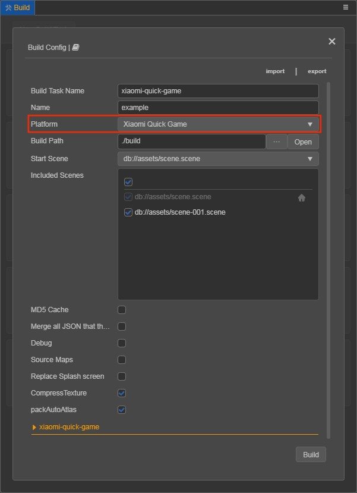
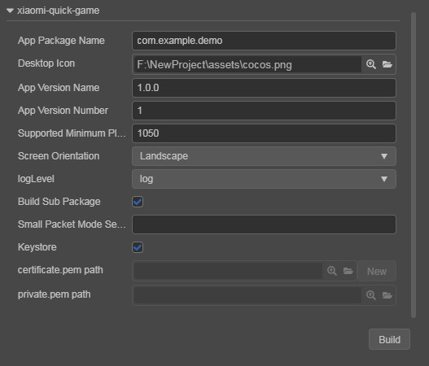

# Publish to Xiaomi Quick Games

> **Note**: some platforms only have Chinese documentation available when visiting the platform's website. It may be necessary to use Google Translate in-order to review the documentation.

__Cocos Creator__ officially supports the release of games to the **Xiaomi Quick Games**.

## Environment Configuration

- Install [Node.js](https://nodejs.org/en/download/) 8.1.4 or above, globally.

- Make sure the **npm** version that **Node.js** comes with is **5.2.0** minimum. Upgrade the **npm** command as follows:

  ```bash
  # View the npm version
  npm -v
  # If the lowest version of npm is below 5.2.0, you can upgrade npm using the following command.
  npm install npm@latest -g
  ```

- Download [Xiaomi Quick Game Debugger and Xiaomi Quick Game Runtime Environment](https://forum.cocos.org/t/topic/81887), and install it on your Xiaomi device (recommended MIUI 8.5.0 or above).

## Release Process

1. Use **Cocos Creator** to open the project that needs to be released. Select **Xiaomi Quick Game** in the **Platform** dropdown of the **Build** panel.

    

    Click on the **xiaomi-quick-game** below to expand the parameter configuration of **Xiaomi Quick Game**.

    

The specific filling rules for the relevant parameter configuration are as follows:

- **App Package Name**: the format of the **App Package Name** is `com.yourcompany.projectname`. This option is required and will be filled in according to the developer's needs.

    > **Note**: starting from the platform version number **1062**, Xiaomi Quick Game needs to use the official **App Package Name**, otherwise the error of `Data loading exception, please click retry` will be reported during debugging. You can refer to the [Xiaomi Quick Game App Package Name Application](https://forum.cocos.org/t/topic/81887) documentation for details.

- **Desktop Icon**: is required. Click the **search icon** button at the back of the input box to select the icon you want. When building, the Desktop Icon will be built into the Xiaomi Quick Game project. It is suggested to use a `PNG` image for the **Desktop Icon**.

- **App Version Name**: is required. **App Version Name** is the real version, such as: **1.0.0**.

- **App Version Number**: is required. **App Version Number** is different from the **App Version Name**, and the **App Version Number** is mainly used to distinguish the version update. Each time when you submit audit, the **App Version Number** is at least 1 higher than the value of the last submitted audit. It must not be equal to or less than the value of the last submitted audit, and it is recommended that the **App Version Number** be recursively incremented by 1 each time when the audit is submitted.

    > **Note**: the **App Version Number** must be a positive integer.

- **Supported Minimum Platform Version Number**: is required. According to the requirements of Xiaomi Quick Games, this value must be greater than or equal to **1050**.

- **Small Packet Mode**: is optional. The in-package volume of the quick-game contains code and assets that cannot exceed 10M, and assets can be loaded via network requests. **Small Packet Mode** is to help developers keep the script files in the quick game package, other assets are uploaded to the remote server, and downloaded from the remote server as needed. Cocos Creator has already helped the developer with the download, cache, and version management of remote assets. The developer needs to do is the following steps:

    1. When building, check the **Small Packet Mode** and fill in the **Small Packet Mode Server Path**.

    2. **First game asset package into the game package**, this item is optional.

        In the Small Packet Mode, due to too many assets on the launch scene, downloading and loading assets for a long time may result in a short black screen when entering the game for the first time. If **First game asset package into the game package** is checked, you can reduce the black screen time when you first enter the game. However, it should be noted that the `res/import` asset does not support split asset downloading at this time, and the entire `import` directory is also packaged into the first package.

        Developers can choose whether to check this item according to their needs. Then click on **Build**.

    3. After the build is complete, click the **Open** button after the **Build Path** to upload the `res` directory under the release path to the small packet mode server. For example, if the default release path is `build`, the **Build Task Name** is `xiaomi-quick-game`, you need to upload the `/build/xiaomi-quick-game/res` directory.

        > **Note**: if you are using the command line to compile small packet mode, remember to backup the `build/xiaomi-pack-tools/res` directory, then delete the `build/xiaomi-pack-tools/res` directory, and then perform command line compilation (`npm run build`).

    At this point, the `res` directory will no longer be included in the built-up rpk, and the assets in the `res` directory will be downloaded from the filled **Small Packet Mode Server Path** through the network request.

- **Keystore**: when you check the **Keystore**, the default is to build the rpk package with a certificate that comes with __Cocos Creator__, which is used only for **debugging**.

    > **Note**: when the rpk package is to be used to submit an audit, do not check the **Keystore** to build it.

    If you don't check the **Keystore**, you need to configure the signature files **certificate.pem path** and **private.pem path**, where you build a rpk package that you can **publish directly**. The developer can configure two signature files by using the **search icon** button to the right of the input box.

    > **Note**: these two signature files are not recommended to be placed in the `build/xiaomi-quick-game` directory of the release package, otherwise the build directory will be emptied each time when it is built, resulting in file loss.

  There are two ways to generate a signature file:

  - Generated by the **New** button after the **certificate.pem path** in the **Build** panel. After clicking the **New** button, fill in the information in the **Packages** panel that pops up. After the information is filled in, click **Generate** button, the log `Generate certificate is complete!` will be output in the **Console** panel, indicating that the signature file is generated.

      

  - Generated by the command line.

      The developer needs to generate the signature file `private.pem`, `certificate.pem` through tools such as **openssl**.

      ```bash
      # Generate a signature file with the openssl command tool
      openssl req -newkey rsa:2048 -nodes -keyout private.pem   -x509 -days 3650 -out certificate.pem
      ```

      > **Note**: **openssl** can be used directly in the terminal in Linux or Mac environment, and in the Windows environment you need to install `openssl` and configure system environment variables. Restart __Cocos Creator__ after the configuration is complete.

**2. Build**

After the relevant parameters of the **Build** panel are set, click **Build**. When the build is complete, click the **folder icon** button below the corresponding build task to open the build release path, you can see that a directory with the same name as the **Build Task Name** (e.g `xiaomi-quick-game`) is generated in the default release path `build` directory, which is the exported Xiaomi Quick Game project directory and **rpk**, **rpk** package are in the `/build/xiaomi-quick-game/dist` directory.


**3. Run the built rpk to the phone**

There are three ways to run rpk on your phone:

- **Method One**

  Click the **Run** button at the bottom right of the `xiaomi-quick-game` build task in the **Build** panel and wait for the QR Code interface to be generated:

  

  Then open the **Xiaomi Quick Game Debugger** that was installed before on your Xiaomi device. Click the **Scan code install** button to scan the QR Code to open the **rpk**.

  

- **Method Two**

  - First open **Settings-> Additional settings-> Developer options** on Xiaomi device, turn on Developer options and USB debugging.
  - Use a USB cable to connect your computer to your Xiaomi device.
  - Copy the generated quick game **rpk** file (located in the `build/xiaomi-quick-game/dist` directory) to the internal storage directory of the Xiaomi device.
  - Open the **Xiaomi Quick Game Debugger** that has been installed before on your Xiaomi device, click **Local Install**, then find the **rpk** file from the internal storage directory of your Xiaomi device and select **Open**.

    

## Debugging

The debugging must be based on the physical device and must follow the strict **run the game first and start the debugging function** sequence. After starting the game, leave Xiaomi device in the interface where the game is open to run. Then use the USB cable to connect your computer to the Xiaomi device, and the Xiaomi device needs to enable Developer options and USB Debugging.

Debugging can currently be initiated from the command line.

- Specify to the editor installation directory `resources/tools/xiaomi-pack-tools` in the command line, and execute the command `npm run debug`. And the debugging interface will start automatically in Chrome.

- If you want to open the debug interface manually, execute the command `npm run debug -- --print-only` and copy the generated URL address into Chrome to enable the debugging interface.

    ```bash
    # Specify to the editor installation directory.
    cd ${CocosCreator}/resources/tools/xiaomi-pack-tools
    # Automatically opens the debug interface on Chrome.
    npm run debug
    # manually opens the debug interface on Chrome.
    npm run debug -- --print-only
    ```

**4. Subpackage rpk**

Subpackage rpk can be used according to your needs.

Subpackage loading, which is, splitting the game content into several packages according to certain rules, only downloading the necessary packages when starting up for the first time. This necessary package is called **main package**. The developer can trigger in the main package to download other sub-packages, which can effectively reduce the time spent on the first boot.

To use this function, set the [Bundle Configuration](subpackage.md) in __Cocos Creator__, and the package will be automatically subpackaged when the setting is completed.

When the build is complete, an `.rpk` file is generated in the `build/xiaomi-quick-game/dist` directory.

The package size limitations for single subpackage/main package, please refer to the [Xiaomi Quick Game Subpackage Rules [cn]](https://forum.cocos.org/t/topic/81887) documentation for details.

## Reference documentation

- [Xiaomi Quick Game Reference documentation [cn]](https://forum.cocos.org/t/topic/81887)
